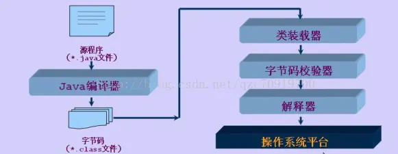

# JVM

## JDK是什么

- JDK 是用于支持 Java 程序开发的最小环境。

- 是功能齐全的JavaSDK，拥有JRE所拥有的一切，还有编译器（javac）和工具。能够创建和编译程序。

## JRE是什么

- JRE是Java运行时环境。
- 运行已编译Java程序所需要的所有内容的集合。
- 包括JVM，Java类库，Java命令和其他的一些基础构建。
- 不能创建新程序。

## JVM

- JVM是运行Java字节码的虚拟机。
- JVM有针对不同系统的实现，使得使用相同字节码，都会给出相同的结果。

## 字节码

- JVM可以理解的代码叫字节码（.class文件），只面向虚拟机。

## 编译型语言

- 执行之前，需要编译过程，把源码编译成机器语言的文件。

- 以后运行不需要编译，执行效率高。

  

## 解释型语言

- 使用专门解释器对源程序逐行解释成特定平台的机器码并立即执行。

- 在执行时才被解释器一行行动态翻译和执行。

- 不需要事先编译，需要解释器。

- 每次将源代码解释成机器码并执行，效率低。

- Java需要编译，但编译后不能直接运行。

  

## 永久代和元空间

- 字符串存在永久代中，容易出现性能问题和内存溢出。
- 类及方法的信息等比较难确定其大小，因此对于永久代的大小指定比较困难，太小容易出现永久代溢出，太大则容易导致老年代溢出。
- 永久代会为 GC 带来不必要的复杂度，并且回收效率偏低。

## 常量池

- 在 jdk1.6（含）之前**运行时常量池逻辑包含字符串常量池**存放在方法区, 此时**hotspot**虚拟机对方法区的实现为**永久代**
- 常量池在 jdk1.7（含）之后字符串常量池被从**方法区拿到了堆**中, 这里没有提到运行时常量池,也就是说字符串常量池被单独拿到堆,**运行时常量池剩下的东西还在方法区**, 也就是hotspot中的永久代 
- jdk1.8 移除了**永久代**用**元空间(Metaspace)**取而代之, 这时候**字符串常量池还在堆**, **运行时常量池还在方法区**, 只不过方法区的实现从永久代变成了元空间(Metaspace) 

## JVM调优总结

### 数据类型

- 基本类型：byte,short,int,long,char,float,double,Boolean,returnAddress
- 引用类型：类类型，接口类型和引用类型（数组）。

### 栈与堆

栈解决程序的运行问题，即程序如何执行，或者说如何处理数据；堆解决的是数据存储的问题，即数据怎么放、放在哪儿。

- 栈：
  - java中一个线程对应一个线程栈，栈是运行单位，里边存储的信息都与当前线程对应，包括局部变量表、程序运行状态、方法返回值等。
  - Main函数是栈的起始点，也是程序的起始点。
  - 栈中存的是**基本数据类型和堆中对象引用**。因为基本类型不会出现动态增长的情况，长度固定。

- 堆：
  - 所有线程共享，只存储对象信息。

### Java参数传递（值传递）

- Java没有指针，所以都是进行传值调用。
- 在运行栈中，基本类型和引用的处理是一样的，都是传值，所以，如果是传引用的方法调用，也同时可以理解为“传引用值”的传值调用，即引用的处理跟基本类型是完全一样的。但是当进入被调用方法时，被传递的这个引用的值，被程序解释（或者查找）到堆中的对象，这个时候才对应到真正的对象。如果此时进行修改，修改的是引用对应的对象，而不是引用本身，即：修改的是堆中的数据。所以这个修改是可以保持的了。