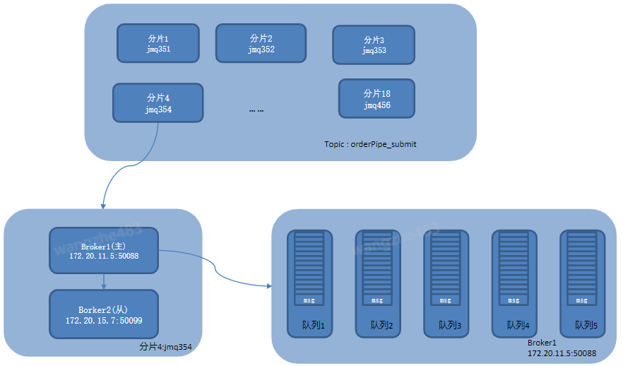

# JMQ（MQ）的基本概念

## 简介

- JMQ是京东自研的消息中间件，支持发布订阅模式，可用于系统间解藕及削峰平谷。
- 消息队列就是基础数据结构中的“先进先出”的一种数据机构。

### 基本结构图

## 使用参数

- 主题（topic）:消息的识别串，代表消息类型，全局唯一。
- 分片（存储数据的单元）：每个分片包含一主一从两个broker实例,主从自动同步,保存一份相同的数据。
- 服务端实例（broker）：主实例提供消息收发服务，从实例备份数据。
- 队列：基本的消息服务单元，JMQ一个broker默认分配5个队列。
- 应用/app：发送或接收消息的应用名称，全局唯一。
- businessId/业务ID：一条业务ID，用于归档查询。
- message/消息体：业务方通过JMQ传递的消息内容，在发送时客户端会对消息进行压缩。
- 消费者以topic，app维度接收一份完整的数据。
- 生产者向主题中发送10条消息，有3个应用消费这个主题。这种情况就是1个topic，3个app，所以每个应用会各自收到10条消息。
- 生产者向主题中发送10条消息。一个应用启动多个实例，来消费这个主题。这种情况就是1个topic，1个app，所以多个实例总共会收到10条消息。

## 消费方式

* 默认消费方式（批量消费）：
  - 客户端消费时，选择一个没有被占用的队列，从队列头部拉取10条消息。如果队列中积压消息小于10条，有多少拉取多少。
  - 服务端队列上锁，保证这个队列内的消息先进先出。
  - 消费完成后，服务端收到客户端的ack确认，队列解锁。
  - 客户端可以继续向后消费。消费确认命令队列客户端返回消息集合拉取消息命令消费返回ack上锁解锁

- 并行消费方式：
  - 开启并行消费后，队列是否上锁，由单队列最大并行数来控制。当客户端拉取消息时，服务端计算此队列上没有ack的消息总数，如果总数没有超过单队列最大并行数，可以从后续位置继续拉取消息。从而提高客户端拉取消息的效率。

## 消费性能

- 服务端最大出队能力
  * 影响因素：分片数（broker数量），单分片列队数，批量条数，单列对最大并行数，tpavg（一个批次消息的平均处理时长ms）
  * 不并行：最大出队tps：分片数 x 队列数 x 批量条数 x（1000/tpavg）x 损耗系数。
  * 并行：最大出队tps：分片数 x 队列数 x 单队列最大并行数 x (1000/tpavg) x 损耗系数

- 客户端的消费能力
  * 常见影响因素：客户端数量，客户端负载，业务复杂度，数据库瓶颈，依赖接口的性能最终体现在tpavg这个监控指标上

## 运维处理

- 加队列：可以提高客户端的并发数，在每个broker上增加queue的数量，但只对新增的消息有用，如果消息已经大量积压，即使调整队列数，之前积压的消息也不会转移到新创建的队列中来。队列数是针对主题的调整，也就是说调整队列数会对所有本主题的所有消费者都产生影响。如果消费者没有显式设置最大线程数量，则该值默认等于队列数。如果客户端负载已经很高，再增加队列数会造成客户端因线程增多而挂掉。所以不可以无限制增大队列数。

- 加分片：加分片是直接对topic增加分片，默认包含一主一从两个broker.因为物理资源有限，分片数量根据日常吞吐量来分配。用户在业务增长后，吞吐量增加后，可向jmq管理员申请加分片。

  

## 拓展

- 为什么使用消息队列？
  
- 解耦、异步、削峰
  
- 消息队列的缺点？
  - 系统可用性降低
  - 系统复杂度增加

- 消息队列类型：

  | 特性       | ActiveMQ                                                     | RabbitMQ                                                     | RocketMQ                 | kafka                                                        |
  | ---------- | ------------------------------------------------------------ | ------------------------------------------------------------ | ------------------------ | ------------------------------------------------------------ |
  | 开发语言   | java                                                         | erlang                                                       | java                     | scala                                                        |
  | 单机吞吐量 | 万级                                                         | 万级                                                         | 10万级                   | 10万级                                                       |
  | 时效性     | ms级                                                         | us级                                                         | ms级                     | ms级以内                                                     |
  | 可用性     | 高(主从架构)                                                 | 高(主从架构)                                                 | 非常高(分布式架构)       | 非常高(分布式架构)                                           |
  | 功能特性   | 成熟的产品，在很多公司得到应用；有较多的文档；各种协议支持较好 | 基于erlang开发，所以并发能力很强，性能极其好，延时很低;管理界面较丰富 | MQ功能比较完备，扩展性佳 | 只支持主要的MQ功能，像一些消息查询，消息回溯等功能没有提供，毕竟是为大数据准备的，在大数据领域应用广。 |

- 如何保证消息队列是高可用的

  - JMQ2(主从备份,一主一从):
    - 生产端：JMQ2的客户端会自动将发送失败的消息重发给同主题处于Broker的队列，切换过程中有可能短时出现**发送时延**升高，**极小概率会出现发送失败**的情况，切换完成后上述问题都会**自动恢复**。
    - 每个Broker都是一主一备的热备模式，备用Broker与主用Broker采用异步方式同步数据。主用Broker宕机后，消费端会自动切换到备用Broker，备用Broker上拥有主用Broker上绝大部分消息。可能存在少量新消息没来得及同步到备用Broker上，这部分消息暂时无法消费，但可以在主用Broker恢复后继续消费，不会丢失。
    - 在消费者端，Broker宕机后，仍然可以在备用Broker上继续消费，切换过程中有可能短时间出现**消费性能下降**，**消息被重复消费**，**消息乱序**，切换完成后上述问题都会**自动恢复**。
  - JMQ4:[raft一致性](https://raft.github.io/) [raft详解](https://www.cnblogs.com/likehua/p/5845575.html)（Leader、Follower、Candidate）**日志复制**。

- 如何保证消息不被重复消费
  - 成功消费后发送ack。
  - 拿到这个消息做数据库的insert操作，那就容易了，给这个消息做一个唯一的主键，那么就算出现重复消费的情况，就会导致主键冲突，避免数据库出现脏数据。
  - 拿到这个消息做redis的set的操作，那就容易了，不用解决，因为你无论set几次结果都是一样的，set操作本来就算幂等操作。
  - 第三方介质查询（ ？）

- 保证消费的可靠性传输（JMQ2会发生丢失）
  - 主用Broker磁盘损坏，无法读取数据。（JMQ2绝大部分服务器采用的是RAID5磁盘阵列，单盘损坏不会丢数据）
  - 数据没有来得及将消息复制到备用Broker上。
  - 消费者没有来得及消费这些消息。

- 重复性：提供 **至少一次（At-least-once）** 的消息投递保证。通俗的说就是**保证消息不丢，但不保证不重复**
- 有序性：普通不保证严格有序。严格有序只能有一个队列提供服务。

## 结构（网络消息，非内部资料，只做了解）

整体结构，系统包括服务端、客户端、管理端与其他支撑模块。

详细架构如下：

