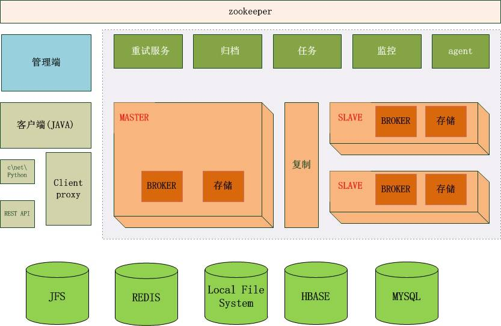
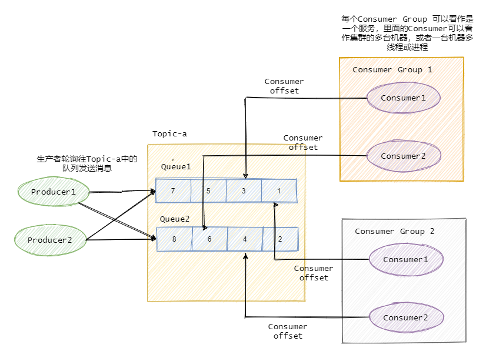

# JMQ（MQ）的基本概念

## 简介

- JMQ是京东自研的消息中间件，支持发布订阅模式，可用于系统间解藕及削峰平谷。
- 消息队列就是基础数据结构中的“先进先出”的一种数据机构。

### 基本结构图


## 使用参数

- 主题（topic）:消息的识别串，代表消息类型，全局唯一。
- 分片（存储数据的单元）：每个分片包含一主一从两个broker实例,主从自动同步,保存一份相同的数据。
- 服务端实例（broker）：主实例提供消息收发服务，从实例备份数据。
- 队列：基本的消息服务单元，JMQ一个broker默认分配5个队列。
- 应用/app：发送或接收消息的应用名称，全局唯一。
- businessId/业务ID：一条业务ID，用于归档查询。
- message/消息体：业务方通过JMQ传递的消息内容，在发送时客户端会对消息进行压缩。
- 消费者以topic，app维度接收一份完整的数据。
- 生产者向主题中发送10条消息，有3个应用消费这个主题。这种情况就是1个topic，3个app，所以每个应用会各自收到10条消息。
- 生产者向主题中发送10条消息。一个应用启动多个实例，来消费这个主题。这种情况就是1个topic，1个app，所以多个实例总共会收到10条消息。

## 消费方式

* 默认消费方式（批量消费）：
  - 客户端消费时，选择一个没有被占用的队列，从队列头部拉取10条消息。如果队列中积压消息小于10条，有多少拉取多少。
  - 服务端队列上锁，保证这个队列内的消息先进先出。
  - 消费完成后，服务端收到客户端的ack确认，队列解锁。
  - 客户端可以继续向后消费。消费确认命令队列客户端返回消息集合拉取消息命令消费返回ack上锁解锁

- 并行消费方式：
  - 开启并行消费后，队列是否上锁，由单队列最大并行数来控制。当客户端拉取消息时，服务端计算此队列上没有ack的消息总数，如果总数没有超过单队列最大并行数，可以从后续位置继续拉取消息。从而提高客户端拉取消息的效率。

## 消费性能

- 服务端最大出队能力
  * 影响因素：分片数（broker数量），单分片列队数，批量条数，单列对最大并行数，tpavg（一个批次消息的平均处理时长ms）
  * 不并行：最大出队tps：分片数 x 队列数 x 批量条数 x（1000/tpavg）x 损耗系数。
  * 并行：最大出队tps：分片数 x 队列数 x 单队列最大并行数 x (1000/tpavg) x 损耗系数

- 客户端的消费能力
  * 常见影响因素：客户端数量，客户端负载，业务复杂度，数据库瓶颈，依赖接口的性能最终体现在tpavg这个监控指标上

## 运维处理

- 加队列：可以提高客户端的并发数，在每个broker上增加queue的数量，但只对新增的消息有用，如果消息已经大量积压，即使调整队列数，之前积压的消息也不会转移到新创建的队列中来。队列数是针对主题的调整，也就是说调整队列数会对所有本主题的所有消费者都产生影响。如果消费者没有显式设置最大线程数量，则该值默认等于队列数。如果客户端负载已经很高，再增加队列数会造成客户端因线程增多而挂掉。所以不可以无限制增大队列数。

- 加分片：加分片是直接对topic增加分片，默认包含一主一从两个broker.因为物理资源有限，分片数量根据日常吞吐量来分配。用户在业务增长后，吞吐量增加后，可向jmq管理员申请加分片。

  


## 拓展

- 为什么使用消息队列？
  
- 解耦、异步、削峰
  
- 消息队列的缺点？
  - 系统可用性降低
  - 系统复杂度增加

- 消息队列类型：

  | 特性       | ActiveMQ                                                     | RabbitMQ                                                     | RocketMQ                 | kafka                                                        |
  | ---------- | ------------------------------------------------------------ | ------------------------------------------------------------ | ------------------------ | ------------------------------------------------------------ |
  | 开发语言   | java                                                         | erlang                                                       | java                     | scala                                                        |
  | 单机吞吐量 | 万级                                                         | 万级                                                         | 10万级                   | 10万级                                                       |
  | 时效性     | ms级                                                         | us级                                                         | ms级                     | ms级以内                                                     |
  | 可用性     | 高(主从架构)                                                 | 高(主从架构)                                                 | 非常高(分布式架构)       | 非常高(分布式架构)                                           |
  | 功能特性   | 成熟的产品，在很多公司得到应用；有较多的文档；各种协议支持较好 | 基于erlang开发，所以并发能力很强，性能极其好，延时很低;管理界面较丰富 | MQ功能比较完备，扩展性佳 | 只支持主要的MQ功能，像一些消息查询，消息回溯等功能没有提供，毕竟是为大数据准备的，在大数据领域应用广。 |

- 如何保证消息队列是高可用的

  - JMQ2(主从备份,一主一从):
    - 生产端：JMQ2的客户端会自动将发送失败的消息重发给同主题处于Broker的队列，切换过程中有可能短时出现**发送时延**升高，**极小概率会出现发送失败**的情况，切换完成后上述问题都会**自动恢复**。
    - 每个Broker都是一主一备的热备模式，备用Broker与主用Broker采用异步方式同步数据。主用Broker宕机后，消费端会自动切换到备用Broker，备用Broker上拥有主用Broker上绝大部分消息。可能存在少量新消息没来得及同步到备用Broker上，这部分消息暂时无法消费，但可以在主用Broker恢复后继续消费，不会丢失。
    - 在消费者端，Broker宕机后，仍然可以在备用Broker上继续消费，切换过程中有可能短时间出现**消费性能下降**，**消息被重复消费**，**消息乱序**，切换完成后上述问题都会**自动恢复**。
  - JMQ4:[raft一致性](https://raft.github.io/) [raft详解](https://www.cnblogs.com/likehua/p/5845575.html)（Leader、Follower、Candidate）**日志复制**。

- 如何保证消息不被重复消费
  - 成功消费后发送ack。
  - 拿到这个消息做数据库的insert操作，那就容易了，给这个消息做一个唯一的主键，那么就算出现重复消费的情况，就会导致主键冲突，避免数据库出现脏数据。
  - 拿到这个消息做redis的set的操作，那就容易了，不用解决，因为你无论set几次结果都是一样的，set操作本来就算幂等操作。
  - 第三方介质查询（ ？）

- 保证消费的可靠性传输（JMQ2会发生丢失）
  - 主用Broker磁盘损坏，无法读取数据。（JMQ2绝大部分服务器采用的是RAID5磁盘阵列，单盘损坏不会丢数据）
  - 数据没有来得及将消息复制到备用Broker上。
  - 消费者没有来得及消费这些消息。

- 重复性：提供 **至少一次（At-least-once）** 的消息投递保证。通俗的说就是**保证消息不丢，但不保证不重复**
- 有序性：普通不保证严格有序。严格有序只能有一个队列提供服务。

## 结构（网络消息，非内部资料，只做了解）

整体结构，系统包括服务端、客户端、管理端与其他支撑模块。



详细架构如下：


# Zookeeper

功能：

- 分布式协调：zookeeper 就可以实现分布式系统之间的协调工作。A 系统发送请求之后可以在 zookeeper 上**对某个节点的值注册个监听器**，一旦 B 系统处理完了就修改 zookeeper 那个节点的值，A 系统立马就可以收到通知
- 分布式锁：一个机器接收到了请求之后先获取 zookeeper 上的一把分布式锁，就是可以去创建一个 znode，接着执行操作；然后另外一个机器也**尝试去创建**那个 znode，结果发现自己创建不了，因为被别人创建了，那只能等着，等第一个机器执行完了自己再执行。
- 元数据/配置信息管理：zookeeper 可以用作很多系统的配置信息的管理，比如 kafka、storm 等等很多分布式系统都会选用 zookeeper 来做一些元数据、配置信息的管理，包括 dubbo 注册中心不也支持 zookeeper 么？
- HA 高可用性：这个应该是很常见的，比如 hadoop、hdfs、yarn 等很多大数据系统，都选择基于 zookeeper 来开发 HA 高可用机制，就是一个**重要进程一般会做主备**两个，主进程挂了立马通过 zookeeper 感知到切换到备用进程。

缺点：

- 不能无限动态扩展，随着规模增大 需要同步到更多机器 tps 会下降 ，那么这就意味zk的集群不能很大，这就陷入了一个死循环，导致集群整体qps tps 都是有上限的大概5w到顶啦。
- 本身不是为高可用性设计，master撑不住高流量容易导致系统crash。当然，对网络隔离的敏感也导致Zookeeper的脆弱。
- Paxos算法的复杂性，选举过程或许缓慢，结合上一点，动辄需要重新选举master导致耗时过长。

# 消息队列

参考：[消息队列面试连环问：如何保证消息不丢失？处理重复消息？消息有序性？消息堆积处理？](https://www.cnblogs.com/linwenbin/p/13382753.html)

## 什么是消息队列

在计算机科学领域，消息队列和邮箱都是软件工程组件，通常用于进程间或同一进程内的线程通信。它们通过队列来传递消息-传递控制信息或内容，群组通信系统提供类似的功能。

简单的概括下上面的定义：**消息队列就是一个使用队列来通信的组件**。（见进程间的通信）

上面的定义没有错，但就现在而言我们日常所说的**消息队列常常指代的是消息中间件**，它的存在不仅仅只是为了通信这个问题。

## 为什么需要消息队列

异步、解耦、流量控制

## 消费队列基本概念

### 队列模型

生产者往某个队列里面发送消息，一个队列可以存储多少个生产者的消息，一个队列也可以有多少个消费者，但是消费者之间是竞争关系，即每条消息只能被一个消费者消费。


### 发布/订阅模型

**为了解决一条消息能被多个消费者消费的问题**，发布/订阅模型就来了。该模型是将消息发往一个`Topic`即主题中，所有订阅了这个 `Topic` 的订阅者都能消费这条消息。

其实可以这么理解，发布/订阅模型等于我们都加入了一个群聊中，我发一条消息，加入了这个群聊的人都能收到这条消息。那么队列模型就是一对一聊天，我发给你的消息，只能在你的聊天窗口弹出，是不可能弹出到别人的聊天窗口中的。

讲到这有人说，那我一对一聊天对每个人都发同样的消息不就也实现了一条消息被多个人消费了嘛。

是的，通过多队列全量存储相同的消息，即数据的冗余可以实现一条消息被多个消费者消费。`RabbitMQ` 就是采用队列模型，通过 `Exchange` 模块来将消息发送至多个队列，解决一条消息需要被多个消费者消费问题。

这里还能看到假设群聊里除我之外只有一个人，那么此时的发布/订阅模型和队列模型其实就一样了。


`RabbitMQ` 采用队列模型，`RocketMQ`和`Kafka` 采用发布/订阅模型。

### 常用术语

一般我们称发送消息方为生产者 `Producer`，接受消费消息方为消费者`Consumer`，消息队列服务端为`Broker`。

消息从`Producer`发往`Broker`，`Broker`将消息存储至本地，然后`Consumer`从`Broker`拉取消息，或者`Broker`推送消息至`Consumer`，最后消费。


为了提高并发度，往往**发布/订阅模型**还会引入**队列**或者**分区**的概念。即消息是发往一个主题下的某个队列或者某个分区中。`RocketMQ`中叫队列，`Kafka`叫分区，本质一样。

例如某个主题下有 5 个队列，那么这个主题的并发度就提高为 5 ，同时可以有 5 个消费者**并行消费**该主题的消息。一般可以采用轮询或者 `key hash` 取余等策略来将同一个主题的消息分配到不同的队列中。

与之对应的消费者一般都有组的概念 `Consumer Group`, 即消费者都是属于某个消费组的。一条消息会发往多个订阅了这个主题的消费组。

假设现在有两个消费组分别是`Group 1` 和 `Group 2`，它们都订阅了`Topic-a`。此时有一条消息发往`Topic-a`，那么这两个消费组都能接收到这条消息。

然后这条消息实际是写入`Topic`某个队列中，消费组中的某个消费者对应消费一个队列的消息。

在物理上除了副本拷贝之外，一条消息在`Broker`中只会有一份，每个消费组会有自己的`offset`即消费点位来标识消费到的位置。在消费点位之前的消息表明已经消费过了。当然这个`offset`是队列级别的。每个消费组都会维护订阅的`Topic`下的每个队列的`offset`。

## 如何保证消息不丢失


### 生产消息

生产者发送消息至`Broker`，需要处理`Broker`的响应，不论是同步还是异步发送消息，同步和异步回调都需要做好`try-catch`，妥善的处理响应，如果`Broker`返回写入失败等错误消息，需要重试发送。当多次发送失败需要作报警，日志记录等。

这样就能保证在生产消息阶段消息不会丢失。

### 存储消息

存储消息阶段需要在**消息刷盘之后**再给生产者响应，假设消息写入缓存中就返回响应，那么机器突然断电这消息就没了，而生产者以为已经发送成功了。

如果`Broker`是集群部署，有多副本机制，即消息不仅仅要写入当前`Broker`,还需要写入副本机中。那配置成至少写入两台机子后再给生产者响应。这样基本上就能保证存储的可靠了。一台挂了还有一台还在呢（假如怕两台都挂了..那就再多些）。

异地多活。

### 消费消息

这里经常会有同学犯错，有些同学当消费者拿到消息之后直接存入内存队列中就直接返回给`Broker`消费成功，这是不对的。

你需要考虑拿到消息放在内存之后消费者就宕机了怎么办。所以我们应该在**消费者真正执行完业务逻辑之后，再发送给`Broker`消费成功**，这才是真正的消费了。

所以只要我们在消息业务逻辑处理完成之后再给`Broker`响应，那么消费阶段消息就不会丢失。

## 处理重复消息

我们先来看看能不能避免消息的重复。

假设我们发送消息，就管发，不管`Broker`的响应，那么我们发往`Broker`是不会重复的。

但是一般情况我们是不允许这样的，这样消息就完全不可靠了，我们的基本需求是消息至少得发到`Broker`上，那就得等`Broker`的响应，那么就可能存在`Broker`已经写入了，当时响应由于网络原因生产者没有收到，然后生产者又重发了一次，此时消息就重复了。

再看消费者消费的时候，假设我们消费者拿到消息消费了，业务逻辑已经走完了，事务提交了，此时需要更新`Consumer offset`了，然后这个消费者挂了，另一个消费者顶上，此时`Consumer offset`还没更新，于是又拿到刚才那条消息，业务又被执行了一遍。于是消息又重复了。

可以看到正常业务而言**消息重复是不可避免的**，因此我们只能从**另一个角度**来解决重复消息的问题。

关键点就是**幂等**。既然我们不能防止重复消息的产生，那么我们只能在业务上处理重复消息所带来的影响。

### 幂等处理消息

幂等是数学上的概念，我们就理解为同样的参数多次调用同一个接口和调用一次产生的结果是一致的。

例如这条 SQL`update t1 set money = 150 where id = 1 and money = 100;` 执行多少遍`money`都是150，这就叫幂等。

因此需要改造业务处理逻辑，使得在重复消息的情况下也不会影响最终的结果。

可以通过上面我那条 SQL 一样，做了个**前置条件判断**，即`money = 100`情况，并且直接修改，更通用的是做个`version`即版本号控制，对比消息中的版本号和数据库中的版本号。

或者通过**数据库的约束例如唯一键**，例如`insert into update on duplicate key...`。

或者**记录关键的key**，比如处理订单这种，记录订单ID，假如有重复的消息过来，先判断下这个ID是否已经被处理过了，如果没处理再进行下一步。当然也可以用全局唯一ID等等。

基本上就这么几个套路，**真正应用到实际中还是得看具体业务细节**。

## 保证有序性

### 全局有序

如果要保证消息的全局有序，首先只能由一个生产者往`Topic`发送消息，并且一个`Topic`内部只能有一个队列（分区）。消费者也必须是单线程消费这个队列。这样的消息就是全局有序的！

不过一般情况下我们都不需要全局有序，即使是同步`MySQL Binlog`也只需要保证单表消息有序即可。


### 部分有序

因此绝大部分的有序需求是部分有序，部分有序我们就可以将`Topic`内部划分成我们需要的队列数，把消息通过特定的策略发往固定的队列中，然后每个队列对应一个单线程处理的消费者。这样即完成了部分有序的需求，又可以通过队列数量的并发来提高消息处理效率。

## 消息堆积

消息的堆积往往是因为**生产者的生产速度与消费者的消费速度不匹配**。有可能是因为消息消费失败反复重试造成的，也有可能就是消费者消费能力弱，渐渐地消息就积压了。

因此我们需要**先定位消费慢的原因**，如果是`bug`则处理 `bug` ，如果是因为本身消费能力较弱，我们可以优化下消费逻辑，比如之前是一条一条消息消费处理的，这次我们批量处理，比如数据库的插入，一条一条插和批量插效率是不一样的。

假如逻辑我们已经都优化了，但还是慢，那就得考虑水平扩容了，增加`Topic`的队列数和消费者数量，**注意队列数一定要增加**，不然新增加的消费者是没东西消费的。**一个Topic中，一个队列只会分配给一个消费者**。

当然你消费者内部是单线程还是多线程消费那看具体场景。不过要注意上面提高的消息丢失的问题，如果你是将接受到的消息写入**内存队列**之后，然后就返回响应给`Broker`，然后多线程向内存队列消费消息，假设此时消费者宕机了，内存队列里面还未消费的消息也就丢了。

# RabbitMQ

RabbitMQ基于主从（非分布式）做高可用性，三种模式：单机模式、普通集群模式、镜像集群模式。

## 普通集群模式（无高可用）

普通集群模式，意思就是在多台机器上启动多个 RabbitMQ 实例，每个机器启动一个。你**创建的 queue，只会放在一个 RabbitMQ 实例上**，但是每个实例都同步 queue 的元数据（元数据可以认为是 queue 的一些配置信息，通过元数据，可以找到 queue 所在实例）。你消费的时候，实际上如果连接到了另外一个实例，那么那个实例会从 queue 所在实例上拉取数据过来。

这中方式**没有什么所谓的高可用性**，**这方案主要是提高吞吐量的**，就是说让集群中多个节点来服务某个 queue 的读写操作。

## 镜像集群模式（高可用性）

在镜像集群模式下，你创建的 queue，无论元数据还是 queue 里的消息都会**存在于多个实例上**，就是说，每个 RabbitMQ 节点都有这个 queue 的一个**完整镜像**，包含 queue 的全部数据的意思。然后每次你写消息到 queue 的时候，都会自动把**消息同步**到多个实例的 queue 上。

- 优点：你任何一个机器宕机了，没事儿，其它机器（节点）还包含了这个 queue 的完整数据，别的 consumer 都可以到其它节点上去消费数据。
- 缺点：性能开销也太大，消息需要同步到所有机器上，导致网络带宽压力和消耗很重；不是分布式，没有拓展性，如果某个 queue 负载很重，你加机器，新增的机器也包含了这个 queue 的所有数据，并**没有办法线性扩展**你的 queue。

# Kafka

Kafka 由多个 broker 组成，每个 broker 是一个节点；你创建一个 topic，这个 topic 可以划分为多个 partition，每个 partition 可以存在于不同的 broker 上，每个 partition 就放一部分数据。

这就是**天然的分布式消息队列**，就是说一个 topic 的数据，是**分散放在多个机器上的，每个机器就放一部分数据**。

## 高可用

每个 partition 的数据都会同步到其它机器上，形成自己的多个 replica 副本。所有 replica 会选举一个 leader 出来，那么生产和消费都跟这个 leader 打交道，然后其他 replica 就是 follower。写的时候，leader 会负责把数据同步到所有 follower 上去，读的时候就直接读 leader 上的数据即可。只能读写 leader？很简单，**要是你可以随意读写每个 follower，那么就要 care 数据一致性的问题**，系统复杂度太高，很容易出问题。Kafka 会均匀地将一个 partition 的所有 replica 分布在不同的机器上，这样才可以提高容错性。

如果某个 broker 宕机了，没事儿，那个 broker 上面的 partition 在其他机器上都有副本的。如果这个宕机的 broker 上面有某个 partition 的 leader，那么此时会从 follower 中**重新选举**一个新的 leader 出来，大家继续读写那个新的 leader 即可。

**写数据**的时候，生产者就写 leader，然后 leader 将数据落地写本地磁盘，接着其他 follower 自己主动从 leader 来 pull 数据。一旦所有 follower 同步好数据了，就会发送 ack 给 leader，leader 收到所有 follower 的 ack 之后，就会返回写成功的消息给生产者。（当然，这只是其中一种模式，还可以适当调整这个行为）

**消费**的时候，只会从 leader 去读，但是只有当一个消息已经被所有 follower 都同步成功返回 ack 的时候，这个消息才会被消费者读到。

## 顺序

- 一个 topic，一个 partition，一个 consumer，内部单线程消费，单线程吞吐量太低，一般不会用这个。
- 写 N 个内存 queue，具有相同 key 的数据都到同一个内存 queue；然后对于 N 个线程，每个线程分别消费一个内存 queue 即可，这样就能保证顺序性。

# ElasticSearch

Lucene 是最先进、功能最强大的搜索库。如果直接基于 Lucene 开发，非常复杂，即便写一些简单的功能，也要写大量的 Java 代码，需要深入理解原理。

ElasticSearch 基于 Lucene，隐藏了 lucene 的复杂性，提供了简单易用的 RESTful api / Java api 接口（另外还有其他语言的 api 接口）。

- 分布式的文档存储引擎
- 分布式的搜索引擎和分析引擎
- 分布式，支持 PB 级数据

## 基本结构

### Near Realtime

近实时，有两层意思：

- 从写入数据到数据可以被搜索到有一个小延迟（大概是 1s）
- 基于 ES 执行搜索和分析可以达到秒级

### Cluster 集群

集群包含多个节点，每个节点属于哪个集群都是通过一个配置来决定的，对于中小型应用来说，刚开始一个集群就一个节点很正常。

### Node 节点

Node 是集群中的一个节点，节点也有一个名称，默认是随机分配的。默认节点会去加入一个名称为 `elasticsearch` 的集群。如果直接启动一堆节点，那么它们会自动组成一个 elasticsearch 集群，当然一个节点也可以组成 elasticsearch 集群。

### Document & field

文档是 ES 中最小的数据单元，一个 document 可以是一条客户数据、一条商品分类数据、一条订单数据，通常用 json 数据结构来表示。每个 index 下的 type，都可以存储多条 document。一个 document 里面有多个 field，每个 field 就是一个数据字段。

```json
{
  "product_id": "1",
  "product_name": "iPhone X",
  "product_desc": "苹果手机",
  "category_id": "2",
  "category_name": "电子产品"
}Copy to clipboardErrorCopied
```

### Type

类型，每个索引里可以有一个或者多个 type，type 是 index 的一个逻辑分类，比如商品 index 下有多个 type：日化商品 type、电器商品 type、生鲜商品 type。每个 type 下的 document 的 field 可能不太一样。

### Index

索引包含了一堆有相似结构的文档数据，比如商品索引。一个索引包含很多 document，一个索引就代表了一类相似或者相同的 ducument。

### shard

单台机器无法存储大量数据，ES 可以将一个索引中的数据切分为多个 shard，分布在多台服务器上存储。有了 shard 就可以横向扩展，存储更多数据，让搜索和分析等操作分布到多台服务器上去执行，提升吞吐量和性能。每个 shard 都是一个 lucene index。

- **支持横向扩展**，比如你数据量是 3T，3 个 shard，每个 shard 就 1T 的数据，若现在数据量增加到 4T，怎么扩展，很简单，重新建一个有 4 个 shard 的索引，将数据导进去；
- **提高性能**，数据分布在多个 shard，即多台服务器上，所有的操作，都会在多台机器上并行分布式执行，提高了吞吐量和性能。

## 集群

 shard 的数据实际是有多个备份，就是说每个 shard 都有一个 `primary shard` ，负责写入数据，但是还有几个 `replica shard` 。 `primary shard` 写入数据之后，会将数据同步到其他几个 `replica shard` 上去。如果某个机器宕机了，还有别的数据副本在别的机器上呢，这就实现了高可用。

ES 集群多个节点，会自动选举一个节点为 master 节点，这个 master 节点其实就是干一些管理的工作的，比如维护索引元数据、负责切换 primary shard 和 replica shard 身份等。要是 master 节点宕机了，那么会重新选举一个节点为 master 节点。

如果某个非 master 节点宕机了。那么此节点上的 primary shard 不就没了。那好，master 会让 primary shard 对应的 replica shard（在其他机器上）切换为 primary shard。如果宕机的机器修复了，修复后的节点也不再是 primary shard，而是 replica shard。

## ES写数据

- 客户端选择一个 node 发送请求过去，这个 node 就是 `coordinating node` （协调节点）。
- `coordinating node` 对 document 进行**路由**，将请求转发给对应的 node（有 primary shard）。
- 实际的 node 上的 `primary shard` 处理请求，然后将数据同步到 `replica node` 。
- `coordinating node` 如果发现 `primary node` 和所有 `replica node` 都搞定之后，就返回响应结果给客户端。

## ES读数据

可以通过 `doc id` 来查询，会根据 `doc id` 进行 hash，判断出来当时把 `doc id` 分配到了哪个 shard 上面去，从那个 shard 去查询。

- 客户端发送请求到**任意**一个 node，成为 `coordinate node` 。
- `coordinate node` 对 `doc id` 进行哈希路由，将请求转发到对应的 node，此时会使用 `round-robin` **随机轮询算法**，在 `primary shard` 以及其所有 replica 中随机选择一个，让读请求负载均衡。
- 接收请求的 node 返回 document 给 `coordinate node` 。
- `coordinate node` 返回 document 给客户端。

## ES搜索数据

- 客户端发送请求到一个 `coordinate node` 。
- 协调节点将搜索请求转发到**所有**的 shard 对应的 `primary shard` 或 `replica shard` ，都可以。
- query phase：每个 shard 将自己的搜索结果（其实就是一些 `doc id` ）返回给协调节点，由协调节点进行数据的合并、排序、分页等操作，产出最终结果。
- fetch phase：接着由协调节点根据 `doc id` 去各个节点上**拉取实际**的 `document` 数据，最终返回给客户端。

> 写请求是写入 primary shard，然后同步给所有的 replica shard；读请求可以从 primary shard 或 replica shard 读取，采用的是随机轮询算法。

## ES写数据

1. 先写入内存 buffer，在 buffer 里的时候数据是搜索不到的；同时将数据写入 translog 日志文件。
2. 如果 buffer 快满了，或者到一定时间，就会将内存 buffer 数据 `refresh` 到一个新的 `segment file` 中，但是此时数据不是直接进入 `segment file` 磁盘文件，而是先进入 `os cache` 。这个过程就是 `refresh` 。
3. 每隔 1 秒钟，es 将 buffer 中的数据写入一个**新的** `segment file` ，每秒钟会产生一个**新的磁盘文件** `segment file` ，这个 `segment file` 中就存储最近 1 秒内 buffer 中写入的数据。
4. 但是如果 buffer 里面此时没有数据，那当然不会执行 refresh 操作，如果 buffer 里面有数据，默认 1 秒钟执行一次 refresh 操作，刷入一个新的 segment file 中。
5. 操作系统里面，磁盘文件其实都有一个东西，叫做 `os cache` ，即操作系统缓存，就是说数据写入磁盘文件之前，会先进入 `os cache` ，先进入操作系统级别的一个内存缓存中去。只要 `buffer` 中的数据被 refresh 操作刷入 `os cache` 中，这个数据就可以被搜索到了。
6. translog 其实也是先写入 os cache 的，默认每隔 5 秒刷一次到磁盘中去，所以默认情况下，可能有 5 秒的数据会仅仅停留在 buffer 或者 translog 文件的 os cache 中，如果此时机器挂了，会**丢失** 5 秒钟的数据。但是这样性能比较好，最多丢 5 秒的数据。也可以将 translog 设置成每次写操作必须是直接 `fsync` 到磁盘，但是性能会差很多。
7. 重复上面的步骤，新的数据不断进入 buffer 和 translog，不断将 `buffer` 数据写入一个又一个新的 `segment file` 中去，每次 `refresh` 完 buffer 清空，translog 保留。随着这个过程推进，translog 会变得越来越大。当 translog 达到一定长度的时候，就会触发 `commit` 操作。
8. commit 操作发生第一步，就是将 buffer 中现有数据 `refresh` 到 `os cache` 中去，清空 buffer。然后，将一个 `commit point` 写入磁盘文件，里面标识着这个 `commit point` 对应的所有 `segment file` ，同时强行将 `os cache` 中目前所有的数据都 `fsync` 到磁盘文件中去。最后**清空** 现有 translog 日志文件，重启一个 translog，此时 commit 操作完成。


## 删除更新数据底层原理

如果是删除操作，commit 的时候会生成一个 `.del` 文件，里面将某个 doc 标识为 `deleted` 状态，那么搜索的时候根据 `.del` 文件就知道这个 doc 是否被删除了。

如果是更新操作，就是将原来的 doc 标识为 `deleted` 状态，然后新写入一条数据。

buffer 每 refresh 一次，就会产生一个 `segment file` ，所以默认情况下是 1 秒钟一个 `segment file` ，这样下来 `segment file` 会越来越多，此时会定期执行 merge。每次 merge 的时候，会将多个 `segment file` 合并成一个，同时这里会将标识为 `deleted` 的 doc 给**物理删除掉**，然后将新的 `segment file` 写入磁盘，这里会写一个 `commit point` ，标识所有新的 `segment file` ，然后打开 `segment file` 供搜索使用，同时删除旧的 `segment file` 。

## 提升ES性能

### filesystem cache

你往 es 里写的数据，实际上都写到磁盘文件里去了，**查询的时候**，操作系统会将磁盘文件里的数据自动缓存到 `filesystem cache` 里面去。

es 的搜索引擎严重依赖于底层的 `filesystem cache` ，你如果给 `filesystem cache` 更多的内存，尽量让内存可以容纳所有的 `idx segment file ` 索引数据文件，那么你搜索的时候就基本都是走内存的，性能会非常高。

- 多留内存给filesystem cache
- 减少索引大小，仅仅写入 es 中要用来检索的**少数几个字段**就可以了，比如说就写入 es `id,name,age` 三个字段，然后你可以把其他的字段数据存在 mysql/hbase 里，一般是建议用 `es + hbase` 这么一个架构。

### 数据预热

对于那些比较热的、经常会有人访问的数据，最好**做一个专门的缓存预热子系统**，就是对热数据每隔一段时间，就提前访问一下，让数据进入 `filesystem cache` 里面去。

### 冷热分离

es 可以做类似于 mysql 的水平拆分，就是说将大量的访问很少、频率很低的数据，单独写一个索引，然后将访问很频繁的热数据单独写一个索引。最好是将**冷数据写入一个索引中，然后热数据写入另外一个索引中**，这样可以确保热数据在被预热之后，尽量都让他们留在 `filesystem os cache` 里，**别让冷数据给冲刷掉**。

### document 模型设计

document 模型设计是非常重要的，很多操作，不要在搜索的时候才想去执行各种复杂的乱七八糟的操作。es 能支持的操作就那么多，不要考虑用 es 做一些它不好操作的事情。如果真的有那种操作，尽量在 document 模型设计的时候，写入的时候就完成。另外对于一些太复杂的操作，比如 join/nested/parent-child 搜索都要尽量避免，性能都很差的。

### 分页性能优化

在分布式情况下，要查第 100 页的 10 条数据，**必须**得从每个 shard 都查 1000 条数据过来，然后根据你的需求进行排序、筛选等等操作，最后再次分页，拿到里面第 100 页的数据。你翻页的时候，翻的越深，每个 shard 返回的数据就越多，而且协调节点处理的时间越长，非常坑爹。所以用 es 做分页的时候，你会发现越翻到后面，就越是慢。

### 不允许深度翻页

类似于微博中，下拉刷微博，刷出来一页一页的，你可以用 `scroll api`，scroll 会一次性给你生成**所有数据的一个快照**，然后每次滑动向后翻页就是通过**游标** `scroll_id` 移动，获取下一页下一页这样子，性能会比上面说的那种分页性能要高很多很多，基本上都是毫秒级的。

# 缓存

## Redis与Memcached区别

- Redis 相比 Memcached 来说，拥有[更多的数据结构](https://doocs.gitee.io/advanced-java/#/docs/high-concurrency/redis-data-types)，能支持更丰富的数据操作。如果需要缓存能够支持更复杂的结构和操作， Redis 会是不错的选择。
- memcache还可用于缓存其他东西，例如图片、视频等等。
- Redis原生支持集群
-  Redis 只使用**单核**，而 Memcached 可以使用**多核**，所以平均每一个核上 Redis 在存储小数据时比 Memcached 性能更高。而在 100k 以上的数据中，Memcached 性能要高于 Redis。
- Redis支持持久化

## Redis线程模型

Redis 内部使用文件事件处理器 `file event handler` ，这个文件事件处理器是单线程的，所以 Redis 才叫做单线程的模型。它采用 IO 多路复用机制同时监听多个 socket，将产生事件的 socket 压入内存队列中，事件分派器根据 socket 上的事件类型来选择对应的事件处理器进行处理。

文件事件处理器的结构包含 4 个部分：

- 多个 socket
- IO 多路复用程序
- 文件事件分派器
- 事件处理器（连接应答处理器、命令请求处理器、命令回复处理器）

## Redis主从架构

对于缓存来说，一般都是用来支撑**读高并发**的。因此架构做成主从(master-slave)架构，一主多从，主负责写，并且将数据复制到其它的 slave 节点，从节点负责读。所有的**读请求全部走从节点**。这样也可以很轻松实现水平扩容，**支撑读高并发**。

## Redis基于哨兵集群

sentinel，中文名是哨兵。哨兵是 Redis 集群架构中非常重要的一个组件，主要有以下功能：

- 集群监控：负责监控 Redis master 和 slave 进程是否正常工作。
- 消息通知：如果某个 Redis 实例有故障，那么哨兵负责发送消息作为报警通知给管理员。
- 故障转移：如果 master node 挂掉了，会自动转移到 slave node 上。
- 配置中心：如果故障转移发生了，通知 client 客户端新的 master 地址。

哨兵用于实现 Redis 集群的高可用，本身也是分布式的，作为一个哨兵集群去运行，互相协同工作。

- 故障转移时，判断一个 master node 是否宕机了，需要大部分的哨兵都同意才行，涉及到了分布式选举的问题。
- 即使部分哨兵节点挂掉了，哨兵集群还是能正常工作的，因为如果一个作为高可用机制重要组成部分的故障转移系统本身是单点的，那就很坑爹了。

哨兵的知识：

- 哨兵至少需要 3 个实例，来保证自己的健壮性。
- 哨兵 + Redis 主从的部署架构，是**不保证数据零丢失**的，只能保证 Redis 集群的高可用性。
- 对于哨兵 + Redis 主从这种复杂的部署架构，尽量在测试环境和生产环境，都进行充足的测试和演练。

### 数据切换丢失问题

- 异步复制导致的数据丢失：因为 master->slave 的复制是异步的，所以可能有部分数据还没复制到 slave，master 就宕机了，此时这部分数据就丢失了。
- 脑裂导致的数据丢失：某个 master 所在机器突然**脱离了正常的网络**，跟其他 slave 机器不能连接，但是实际上 master 还运行着。此时哨兵可能就会**认为** master 宕机了，然后开启选举，将其他 slave 切换成了 master。这个时候，集群里就会有两个 master ，也就是所谓的**脑裂**。此时虽然某个 slave 被切换成了 master，但是可能 client 还没来得及切换到新的 master，还继续向旧 master 写数据。因此旧 master 再次恢复的时候，会被作为一个 slave 挂到新的 master 上去，自己的数据会清空，重新从新的 master 复制数据。而新的 master 并没有后来 client 写入的数据，因此，这部分数据也就丢失了。

解决方法：

进行如下配置：

```bash
min-slaves-to-write 1
min-slaves-max-lag 10
```

- 减少异步复制数据的丢失：有了 `min-slaves-max-lag` 这个配置，就可以确保说，一旦 slave 复制数据和 ack 延时太长，就认为可能 master 宕机后损失的数据太多了，那么就拒绝写请求，这样可以把 master 宕机时由于部分数据未同步到 slave 导致的数据丢失降低的可控范围内。

- 减少脑裂的数据丢失：如果一个 master 出现了脑裂，跟其他 slave 丢了连接，那么上面两个配置可以确保说，如果不能继续给指定数量的 slave 发送数据，而且 slave 超过 10 秒没有给自己 ack 消息，那么就直接拒绝客户端的写请求。因此在脑裂场景下，最多就丢失 10 秒的数据。

### sdown 和 odown 转换机制

- sdown 是主观宕机，就一个哨兵如果自己觉得一个 master 宕机了，那么就是主观宕机
- odown 是客观宕机，如果 quorum 数量的哨兵都觉得一个 master 宕机了，那么就是客观宕机

sdown 达成的条件很简单，如果一个哨兵 ping 一个 master，超过了 `is-master-down-after-milliseconds` 指定的毫秒数之后，就主观认为 master 宕机了；如果一个哨兵在指定时间内，收到了 quorum 数量的其它哨兵也认为那个 master 是 sdown 的，那么就认为是 odown 了。

### slave->master 选举算法

如果一个 master 被认为 odown 了，而且 majority 数量的哨兵都允许主备切换，那么某个哨兵就会执行主备切换操作，此时首先要选举一个 slave 来，会考虑 slave 的一些信息：

- 跟 master 断开连接的时长
- slave 优先级
- 复制 offset
- run id

如果一个 slave 跟 master 断开连接的时间已经超过了 `down-after-milliseconds` 的 10 倍，外加 master 宕机的时长，那么 slave 就被认为不适合选举为 master。

```
(down-after-milliseconds * 10) + milliseconds_since_master_is_in_SDOWN_stateCopy to clipboardErrorCopied
```

接下来会对 slave 进行排序：

- 按照 slave 优先级进行排序，slave priority 越低，优先级就越高。
- 如果 slave priority 相同，那么看 replica offset，哪个 slave 复制了越多的数据，offset 越靠后，优先级就越高。
- 如果上面两个条件都相同，那么选择一个 run id 比较小的那个 slave。

## Redis集群模式

- 自动将数据进行分片，每个 master 上放一部分数据
- 提供内置的高可用支持，部分 master 不可用时，还是可以继续工作的

在 Redis cluster 架构下，每个 Redis 要放开两个端口号，比如一个是 6379，另外一个就是 加 1w 的端口号，比如 16379。

16379 端口号是用来进行节点间通信的，也就是 cluster bus 的东西，cluster bus 的通信，用来进行故障检测、配置更新、故障转移授权。cluster bus 用了另外一种二进制的协议， `gossip` 协议，用于节点间进行高效的数据交换，占用更少的网络带宽和处理时间。

### 基本通信原理

集群元数据的维护有两种方式：集中式、Gossip 协议。Redis cluster 节点间采用 gossip 协议进行通信。

**集中式**是将集群元数据（节点信息、故障等等）几种存储在某个节点上。集中式元数据集中存储的一个典型代表，就是大数据领域的 `storm` 。它是分布式的大数据实时计算引擎，是集中式的元数据存储的结构，底层基于 zookeeper（分布式协调的中间件）对所有元数据进行存储维护。

Redis 维护集群元数据采用另一个方式， `gossip` 协议，所有节点都持有一份元数据，不同的节点如果出现了元数据的变更，就不断将元数据发送给其它的节点，让其它节点也进行元数据的变更。

**集中式**的**好处**在于，元数据的读取和更新，时效性非常好，一旦元数据出现了变更，就立即更新到集中式的存储中，其它节点读取的时候就可以感知到；**不好**在于，所有的元数据的更新压力全部集中在一个地方，可能会导致元数据的存储有压力。

gossip 好处在于，元数据的更新比较分散，不是集中在一个地方，更新请求会陆陆续续打到所有节点上去更新，降低了压力；不好在于，元数据的更新有延时，可能导致集群中的一些操作会有一些滞后。

### 分布式寻址算法

- hash 算法（大量缓存重建）：来了一个 key，首先计算 hash 值，然后对节点数取模。然后打在不同的 master 节点上。一旦某一个 master 节点宕机，所有请求过来，都会基于最新的剩余 master 节点数去取模，尝试去取数据。这会导致**大部分的请求过来，全部无法拿到有效的缓存**，导致大量的流量涌入数据库。
- 一致性 hash 算法（自动缓存迁移）+ 虚拟节点（自动负载均衡）
- Redis cluster 的 hash slot 算法：Redis cluster 有固定的 `16384` 个 hash slot，对每个 `key` 计算 `CRC16` 值，然后对 `16384` 取模，可以获取 key 对应的 hash slot。Redis cluster 中每个 master 都会持有部分 slot，比如有 3 个 master，那么可能每个 master 持有 5000 多个 hash slot。hash slot 让 node 的增加和移除很简单，增加一个 master，就将其他 master 的 hash slot 移动部分过去，减少一个 master，就将它的 hash slot 移动到其他 master 上去。移动 hash slot 的成本是非常低的。客户端的 api，可以对指定的数据，让他们走同一个 hash slot，通过 `hash tag` 来实现。任何一台机器宕机，另外两个节点，不影响的。因为 key 找的是 hash slot，不是机器。

# Dubbo

- 第一层：service 层，接口层，给服务提供者和消费者来实现的
- 第二层：config 层，配置层，主要是对 dubbo 进行各种配置的
- 第三层：proxy 层，服务代理层，无论是 consumer 还是 provider，dubbo 都会给你生成代理，代理之间进行网络通信
- 第四层：registry 层，服务注册层，负责服务的注册与发现
- 第五层：cluster 层，集群层，封装多个服务提供者的路由以及负载均衡，将多个实例组合成一个服务
- 第六层：monitor 层，监控层，对 rpc 接口的调用次数和调用时间进行监控
- 第七层：protocal 层，远程调用层，封装 rpc 调用
- 第八层：exchange 层，信息交换层，封装请求响应模式，同步转异步
- 第九层：transport 层，网络传输层，抽象 mina 和 netty 为统一接口
- 第十层：serialize 层，数据序列化层

## 工作流程

- 第一步：provider 向注册中心去注册
- 第二步：consumer 从注册中心订阅服务，注册中心会通知 consumer 注册好的服务
- 第三步：consumer 调用 provider
- 第四步：consumer 和 provider 都异步通知监控中心

