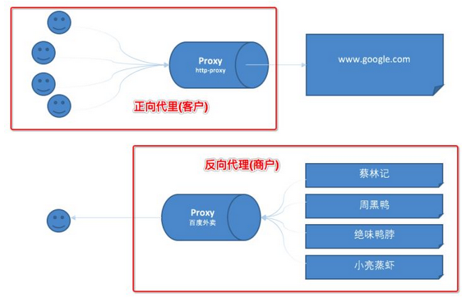

# nginx

## 什么是nginx

Nginx ("engine x")是一个高性能的HTTP和反向代理服务器，特点是占有内存少，并发能力强，事实上nginx的并发能力确实在同类型的网页服务器中表现较好    Nginx专为性能优化而开发，性能是其最重要的考量，实现上非常注重效率，能经受高负载的考验，有报告表明能支持高达50000个并发连接数。

## 正向代理与反向代理

- 正向代理即是客户端代理, 代理客户端, 服务端不知道实际发起请求的客户端.

- 反向代理即是服务端代理, 代理服务端, 客户端不知道实际提供服务的服务端

## 负责均衡

### 轮询

每个请求按时间顺序逐一分配到不 同的后端服务器，如果后端服务器down掉，能自动剔除

### weight

weight代表权重默认为1,权重越高被分配的客户端越多。
指定轮询几率，weight和访问比率成正比，用于后端服务器性能不均的情况。

### ip hash

每个请求按访问ip的hash结果分配, 这样每个访客固定访问一个后端服务器,可以解诀session的问题。

### least_conn

把请求转发给连接数较少的后端服务器。轮询算法是把请求平均的转发给各个后端，使它们的负载大致相同；但是，有些请求占用的时间很长，会导致其所在的后端负载较高。这种情况下，least_conn这种方式就可以达到更好的负载均衡效果。

### fair(第三方)

按后端服务器的响应时间来分配请求，响应时间短的优先分配

## 动静分离

Nginx 动静分离简单来说就是把动态跟静态请求分开，不能理解成只是单纯的把动态页面和静态页面物理分离。严格意义上说应该是动态请求跟静态请求分开，可以理解成使用Nginx 处理静态页面，Tomcat、 Resin 出来动态页面。动静分离从目前实现角度来讲大致分为两种，

一种是纯粹把静态文件独立成单独的域名，放在独立的服务器上，也是目前主流推崇的方案；

另外一种方法就是动态跟静态文件混合在一起发布，通过 nginx 来分开。这样也是本次课程要讲解的，具体怎么来实现呢，

通过 location 指定不同的后缀名实现不同的请求转发。通过 expires 参数设置，可以使浏览器缓存过期时间，减少与服务器之前的请求和流量。具体 Expires 定义：是给一个资源设定一个过期时间，也就是说无需去服务端验证，直接通过浏览器自身确认是否过期即可，所以不会产生额外的流量。此种方法非常适合不经常变动的资源。（如果经常更新的文件，不建议使用 Expires 来缓存），我这里设置 3d，表示在这 3 天之内访问这个 URL，发送一个请求，比对服务器该文件最后更新时间没有变化，则不会从服务器抓取，返回状态码 304，如果有修改，则直接从服务器重新下载，返回状态码 200。

## 高可用

主、备份nginx服务器，使用**keepalived**虚拟出来一台 虚拟网关vip（不真实存在，自然不存在宕机问题），

此vip由两台机器共同协商生成。当有一台机器宕机时，另一台机器一样能维持vip。这保证了，只要两台机器不同时宕机，vip就存在

## nginx工作原理

Nginx 采用的是多进程（单线程） & 多路IO复用模型。使用了 I/O 多路复用技术的 Nginx，就成了”并发事件驱动“的服务器。

### 多进程的工作模式

- 1、Nginx 在启动后，会有一个 master 进程和多个相互独立的 worker 进程。
- 2、接收来自外界的信号，向各worker进程发送信号，每个进程都有可能来处理这个连接。
- 3、 master 进程能监控 worker 进程的运行状态，当 worker 进程退出后(异常情况下)，会自动启动新的 worker 进程。

### 惊群现象

- 主进程（master 进程）首先通过 socket() 来创建一个 sock 文件描述符用来监听，然后fork生成子进程（workers 进程），子进程将继承父进程的 sockfd（socket 文件描述符），之后子进程 accept() 后将创建已连接描述符（connected descriptor）），然后通过已连接描述符来与客户端通信。
- 那么，由于所有子进程都继承了父进程的 sockfd，那么当连接进来时，所有子进程都将收到通知并“争着”与它建立连接，这就叫“惊群现象”。大量的进程被激活又挂起，只有一个进程可以accept() 到这个连接，这当然会消耗系统资源。

### Nginx对惊群现象的处理：

Nginx 提供了一个 accept_mutex 这个东西，这是一个加在accept上的一把互斥锁。即每个 worker 进程在执行 accept 之前都需要先获取锁，获取不到就放弃执行 accept()。有了这把锁之后，同一时刻，就只会有一个进程去 accpet()，这样就不会有惊群问题了。accept_mutex 是一个可控选项，我们可以显示地关掉，默认是打开的。

### worker进程工作流程

当一个 worker 进程在 accept() 这个连接之后，就开始读取请求，解析请求，处理请求，产生数据后，再返回给客户端，最后才断开连接，一个完整的请求。一个请求，完全由 worker 进程来处理，而且只能在一个 worker 进程中处理。

- 1、节省锁带来的开销。每个 worker 进程都是独立的进程，不共享资源，不需要加锁。同时在编程以及问题查上时，也会方便很多。
- 2、独立进程，减少风险。采用独立的进程，可以让互相之间不会影响，一个进程退出后，其它进程还在工作，服务不会中断，master 进程则很快重新启动新的 worker 进程。当然，worker 进程的也能发生意外退出。

### 多进程模型每个进程/线程只能处理一路IO，那么 Nginx是如何处理多路IO呢？

1. 如果不使用 IO 多路复用，那么在一个进程中，同时只能处理一个请求，比如执行 accept()，如果没有连接过来，那么程序会阻塞在这里，直到有一个连接过来，才能继续向下执行。
2. 而多路复用，允许我们只在事件发生时才将控制返回给程序，而其他时候内核都挂起进程，随时待命。

　　**核心：Nginx采用的 IO多路复用模型epoll**
　　epoll通过在Linux内核中申请一个简易的文件系统（文件系统一般用什么数据结构实现？B+树），其工作流程分为三部分：

- 1、调用 int epoll_create(int size)建立一个epoll对象，内核会创建一个eventpoll结构体，用于存放通过epoll_ctl()向epoll对象中添加进来的事件，这些事件都会挂载在红黑树中。
- 2、调用 int epoll_ctl(int epfd, int op, int fd, struct epoll_event *event) 在 epoll 对象中为 fd 注册事件，所有添加到epoll中的事件都会与设备驱动程序建立回调关系，也就是说，当相应的事件发生时会调用这个sockfd的回调方法，将sockfd添加到eventpoll 中的双链表。
- 3、调用 int epoll_wait(int epfd, struct epoll_event * events, int maxevents, int timeout) 来等待事件的发生，timeout 为 -1 时，该调用会阻塞知道有事件发生
  　　

这样，注册好事件之后，只要有 fd 上事件发生，epoll_wait() 就能检测到并返回给用户，用户就能”非阻塞“地进行 I/O 了。

　　epoll() 中内核则维护一个链表，epoll_wait 直接检查链表是不是空就知道是否有文件描述符准备好了。（epoll 与 select 相比最大的优点是不会随着 sockfd 数目增长而降低效率，使用 select() 时，内核采用轮训的方法来查看是否有fd 准备好，其中的保存 sockfd 的是类似数组的数据结构 fd_set，key 为 fd，value 为 0 或者 1。）

　　能达到这种效果，是因为在内核实现中 epoll 是根据每个 sockfd 上面的与设备驱动程序建立起来的回调函数实现的。那么，某个 sockfd 上的事件发生时，与它对应的回调函数就会被调用，来把这个 sockfd 加入链表，其他处于“空闲的”状态的则不会。在这点上，epoll 实现了一个”伪”AIO。但是如果绝大部分的 I/O 都是“活跃的”，每个 socket 使用率很高的话，epoll效率不一定比 select 高（可能是要维护队列复杂）。

可以看出，因为一个进程里只有一个线程，所以一个进程同时只能做一件事，但是可以通过不断地切换来“同时”处理多个请求。

### epoll库

 epoll库是Nginx服务器支持的高性能事件驱动库之一。它是公认的最好的事件驱动模型。和poll库及select库有很大的区别。

  poll和select都是创建一个待处理事件列表，然后把这个列表发给内核，返回的时候，再去轮询检查这个列表。以判断这个事件是否发生。在描述符太多的情况下，就会明显效率低下了。

  epoll是这么做的，它把事件描述符列表的管理交给内核复制。一旦有某个事件发生，内核将发生事件的事件描述符交给Nginx的进程，而不是将整个事件描述符列表交给进程，让进程去轮询具体是哪个描述符。epoll()避免了轮询整个事件描述符列表。所以显得更高效。

  epoll库的基本步骤：

  首先:epoll库通过相关调用通知内核创建一个有N个描述符的事件列表。然后给这个事件列表设置自己关心的事件。并把它添加到内核中。在具体的代码中还可以实现对相关调用的事件描述符列表进行修改和删除。

  之后，一旦设置完成就一直等待内核通知事件发生了，某一事件发生后，内核就将发生事件的描述符给epoll库，epoll库去处理事件。

[epoll、poll、select](https://segmentfault.com/a/1190000003063859#item-3-13)