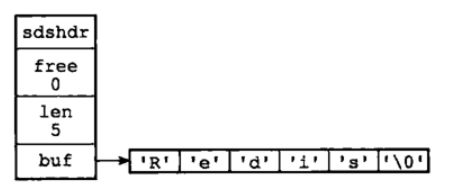
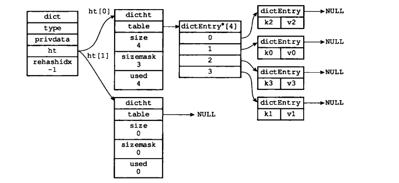
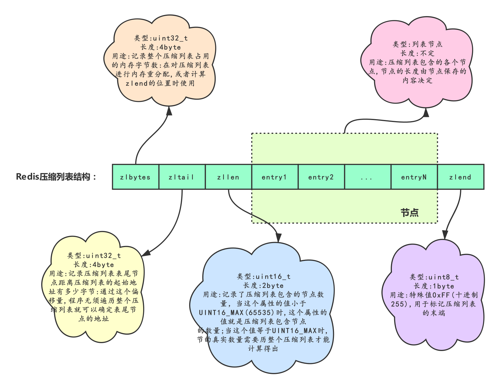

# 数据库

## MySql隔离机制

### 隔离级别

- 读未提交：脏读
- 读已提交：不可重复读
- 可重复读（Mysql默认级别）：幻读
- 串行化

### MySql解决可重复读

- 幻读：一次事务，多次查询后，结果集的个数不一致情况。
- mysql如何解决幻读：
  - 多版本并发机制（MVCC）（快照读）
  - next-key(当前读)

- MVCC： 通过 在 每 行 记录 后面 保存 两个 隐藏 的 列 来 实现 的。 这 两个 列， 一个 保存 了 行的 创建 时间， 一个 保存 行的 过期 时间（ 或 删除 时间）。 当然 存储 的 并不是 实际 的 时间 值， 而是 系统 版 本号。 每 开始 一个 新的 事务， 系统 版本 号 都会 自动 递增。 事务 开始时 刻 的 系统 版 本号 会 作为 事务 的 版 本号， 用来 和 查询 到 的 每 行 记录 的 版本 号 进行 比较。
- MVCC 只在 REPEATABLE READ 和 READ COMMITTED 两个 隔离 级别 下 工作。
- 快照读满足的条件：
  - InnoDB 只 查找 版本 早于 当前 事务 版本 的 数据 行（ 也就是， 行的 系统 版本 号 小于 或 等于 事务 的 系统 版 本号）， 这样 可以 确保 事务 读 取的 行， 要么 是在 事务 开始 前 已经 存在 的， 要么 是 事务 自身 插入 或者 修 改过 的。
  - 行的 删除 版本 要么 未定义， 要么 大于 当前 事务 版 本号。 这可 以 确保 事务 读取 到 的 行， 在 事务 开始 之前 未被 删除。

- 当前读（加了排它锁和共享锁）：mysql会给数据库加上行锁和间隙锁。
  - 行锁（记录锁）：位某行记录加锁，锁对象必须为唯一索引或主键，否则会变成临键锁。
  - 间隙锁：基于非唯一索引，锁住某一区间。
  - 临键锁：特殊的间隙锁，可解决幻读问题，在非唯一索引上。

## Rdis数据结构

### SDS

```c
struct sdshdr{
     //记录buf数组中已使用字节的数量
     //等于 SDS 保存字符串的长度
     int len;
     //记录 buf 数组中未使用字节的数量
     int free;
     //字节数组，用于保存字符串
     char buf[];
}
```



- **常数复杂度获取字符串长度**：由于 len 属性的存在，我们获取 SDS 字符串的长度只需要读取 len 属性，时间复杂度为 O(1)。而对于 C 语言，获取字符串的长度通常是经过遍历计数来实现的，时间复杂度为 O(n)。通过 strlen key 命令可以获取 key 的字符串长度。

- **杜绝缓冲区溢出**：在 C 语言中使用 strcat 函数来进行两个字符串的拼接，一旦没有分配足够长度的内存空间，就会造成缓冲区溢出。而对于 SDS 数据类型，在进行字符修改的时候，会首先根据记录的 len 属性检查内存空间是否满足需求，如果不满足，会进行相应的空间扩展，然后在进行修改操作，所以不会出现缓冲区溢出。

- **减少修改字符串的内存重新分配次数**：C语言由于不记录字符串的长度，所以如果要修改字符串，必须要重新分配内存（先释放再申请），因为如果没有重新分配，字符串长度增大时会造成内存缓冲区溢出，字符串长度减小时会造成内存泄露。而对于SDS，由于len属性和free属性的存在，对于修改字符串SDS实现了空间预分配和惰性空间释放两种策略：
- 空间预分配：对字符串进行空间扩展的时候，扩展的内存比实际需要的多，这样可以减少连续执行字符串增长操作所需的内存重分配次数。
  
- 惰性空间释放：对字符串进行缩短操作时，程序不立即使用内存重新分配来回收缩短后多余的字节，而是使用 free 属性将这些字节的数量记录下来，等待后续使用。（当然SDS也提供了相应的API，当我们有需要时，也可以手动释放这些未使用的空间。）
  
- **二进制安全**：因为C字符串以空字符作为字符串结束的标识，而对于一些二进制文件（如图片等），内容可能包括空字符串，因此C字符串无法正确存取；而所有 SDS 的API 都是以处理二进制的方式来处理 buf 里面的元素，并且 SDS 不是以空字符串来判断是否结束，而是以 len 属性表示的长度来判断字符串是否结束。

- **兼容部分 C 字符串函数**：虽然 SDS 是二进制安全的，但是一样遵从每个字符串都是以空字符串结尾的惯例，这样可以重用 C 语言库<string.h> 中的一部分函数。

- **SDS 数组动态分配策略**：

  - redis的内存分配策略：
    - 当SDS的len属性长度小于1MB，redis会分配和len相同长度的free空间。（上次用了len，下次也有可能用len）
    - 当SDS的len属性长度大于1MB时，程序将多分配1M的未使用空间。（多分配得不偿失）。redis将1MB设为一个风险值。

  - redis内存回收策略：
    - redis内存回收采用惰性回收，即字符串变短，多余的空间先不还给操作系统。

### 链表

C语言没有内置链表数据结构的实现。Redis自己构建的链表：

```c
typedef struct list{
     //表头节点
     listNode *head;
     //表尾节点
     listNode *tail;
     //链表所包含的节点数量
     unsigned long len;
     //节点值复制函数
     void *(*dup) (void *ptr);
     //节点值释放函数
     void *(*free) (void *ptr);
     //节点值对比函数
     int (*match) (void *ptr,void *key);
}list;
```

- 双向：链表节点有前驱、后继指针获取某个节点的前驱、后继节点的时间复杂度为O(1)。
- 无环：链表为非循环链表表头节点的前驱指针和表尾节点的后继指针都指向null，对链表的访问以null为终点。
- 带表头指针和表尾指针：通过list结构中的head和tail指针，获取表头表尾O(1)。
- 带链表长度计数器：通过list结构的len属性获取节点数量时间复杂度O(1)。
- 多态：链表节点使用void*指针保存节点的值，并且可以通过list结构的dup、free、match三个属性为节点值设置类型特定函数，所以链表可以用来保存各种不同类型的值。

### 字典

字典又称为符号表或者关联数组、映射(map)，是一种用于保存键值对的抽象数据结构。C语言没有，Redis自己构建。

```c
typedef struct dictht{
     //哈希表数组
     dictEntry **table;
     //哈希表大小
     unsigned long size;
     //哈希表大小掩码，用于计算索引值
     //总是等于 size-1
     unsigned long sizemask;
     //该哈希表已有节点的数量
     unsigned long used;
 
}dictht
```

　　哈希表是由数组 table 组成，table 中每个元素都是指向 dict.h/dictEntry 结构，dictEntry 结构定义如下：

```c
typedef struct dictEntry{
     //键
     void *key;
     //值
     union{
          void *val;
          uint64_tu64;
          int64_ts64;
     }v;
 
     //指向下一个哈希表节点，形成链表(链地址法解决冲突)
     struct dictEntry *next;
}dictEntry
```

- 扩容和收缩：
  - 服务器目前没有执行BGSAVE命令或BGREWRITEAOF命令，并且负载因子大于等于1.
  - 服务器目前正在执行 BGSAVE 命令或者 BGREWRITEAOF 命令，并且负载因子大于等于5。
  - 负载因子 = 哈希表已保存节点数量/哈希表大小。
  - 当哈希表的负载因子小于0.1执行收缩操作。

- 字典

  - ```c
    typedef struct dict {
        // 类型特定函数
        dictType *type;
        // 私有数据
        void *privedata;
        // 哈希表
        dictht  ht[2];
        // rehash 索引
        in trehashidx;
    
    }
    ```

  - type 属性 和privdata 属性是针对不同类型的键值对，为创建多态字典而设置的。

  - ht 属性是一个包含两个项（两个哈希表）的数组

  - 普通状态下的字典：


- Rehash:

  - 我们可以看到，哈希表中的每个节点都已经使用到了，这时候我们需要对哈希表进行拓展。

    

  - 数据转移：将ht[0]中数据转移到ht[1]中，重新计算hash值。

    

  - 释放ht[0],然后将ht[1]设置为ht[0]，最后为ht[1]分配一个空白哈希表。

- 渐进式rehash：
  - 为ht[1]分配空间，让字典同时持有两个hash表。
  - 设置计数器rehashidx，设为0，rehash开始。
  - 期间，每次对字典执行CRUD时，会将ht[0]中数据rehash到ht[1]中，rehashidx++
  - 当ht[0]中所有数据转移到ht[1]中时，将rehashidx设置为-1，表示rehash结束。

### 跳表

```c
typedef struct zskiplistNode {
     //层
     struct zskiplistLevel{
           //前进指针
           struct zskiplistNode *forward;
           //跨度
           unsigned int span;
     }level[];
 
     //后退指针
     struct zskiplistNode *backward;
     //分值
     double score;
     //成员对象
     robj *obj;
 
} zskiplistNode
```

```c
typedef struct zskiplist{
     //表头节点和表尾节点
     structz skiplistNode *header, *tail;
     //表中节点的数量
     unsigned long length;
     //表中层数最大的节点的层数
     int level;
 
}zskiplist;
```


### 整数集合

保证集合中不会出现重复元素，保存类型int16_t、int32_t 或者int64_t 

```c
typedef struct intset{
     //编码方式
     uint32_t encoding;
     //集合包含的元素数量
     uint32_t length;
     //保存元素的数组
     int8_t contents[];
 
}intset;
```

- 升级：
  - 根据新元素类型，扩展整数集合底层数组的大小，并为新元素分配空间。
  - 将底层数组现有的所有元素都转成与新元素相同类型的元素，并将转换后的元素放到正确的位置，维持元素顺序有序。
  - 将新元素添加到整数集合中。

- 不支持降级。升级后，编码一直保持升级后的状态。

### 压缩列表

ziplist是列表和哈希表的底层实现之一。



压缩列表的节点构成：


- previous_entry_ength：记录压缩列表前一个字节的长度。previous_entry_ength的长度可能是1个字节或者是5个字节，如果上一个节点的长度小于254，则该节点只需要一个字节就可以表示前一个节点的长度了，如果前一个节点的长度大于等于254，则previous length的第一个字节为254，后面用四个字节表示当前节点前一个节点的长度。利用此原理即当前节点位置减去上一个节点的长度即得到上一个节点的起始位置，压缩列表可以从尾部向头部遍历。这么做很有效地减少了内存的浪费。
- encoding：节点的encoding保存的是节点的content的内容类型以及长度，encoding类型一共有两种，一种字节数组一种是整数，encoding区域长度为1字节、2字节或者5字节长。00、01、10表示字节数组，后几位记录长度。11表示整数。
- content：content区域用于保存节点的内容，节点内容类型和长度由encoding决定。


## MySql语句练习

[在线SQL](https://www.liaoxuefeng.com/wiki/1177760294764384/1179611432985088)

```mysql
-- SELECT s.class_id,SUM(s.score) FROM students s,classes c where s.class_id=c.id group by s.id,s.name order by sum(s.score) desc limit 1;
--select * from students
--select * from classes
--insert into students(id,class_id,name,gender,score) VALUES (1,4,'小明','M',90)
--delete from students where id=11
SELECT c.name,SUM(s.score) FROM students s,classes c where s.class_id=c.id group by s.class_id,c.name order by sum(s.score) desc limit 0;

```

## 索引

### 索引类型

[MyISAM与InnoDB 的区别](https://blog.csdn.net/qq_35642036/article/details/82820178)

[mysql InnoDB引擎支持hash索引吗](https://blog.csdn.net/doctor_who2004/article/details/77414742)

### 数据库索引

唯一索引和普通索引使用的结构都是B-tree,执行时间复杂度都是O(log n)。

- 普通索引：普通索引（由关键字KEY或INDEX定义的索引）的唯一任务是加快对数据的访问速度。因此，应该只为那些最经常出现在查询条件（WHEREcolumn=）或排序条件（ORDERBYcolumn）中的数据列创建索引。只要有可能，就应该选择一个数据最整齐、最紧凑的数据列（如一个整数类型的数据列）来创建索引。
- 唯一索引：如果能确定某个数据列将只包含彼此各不相同的值，在为这个数据列创建索引的时候就应该用关键字UNIQUE把它定义为一个唯一索引。这么做的好处：一是简化了MySQL对这个索引的管理工作，这个索引也因此而变得更有效率；二是MySQL会在有新记录插入数据表时，自动检查新记录的这个字段的值是否已经在某个记录的这个字段里出现过了；如果是，MySQL将拒绝插入那条新记录。也就是说，唯一索引可以保证数据记录的唯一性。事实上，在许多场合，人们创建唯一索引的目的往往不是为了提高访问速度，而只是为了避免数据出现重复。
- 主索引：在前面已经反复多次强调过：必须为主键字段创建一个索引，这个索引就是所谓的"主索引"。主索引与唯一索引的唯一区别是：前者在定义时使用的关键字是PRIMARY而不是UNIQUE。 
- 外键索引：如果为某个外键字段定义了一个外键约束条件，MySQL就会定义一个内部索引来帮助自己以最有效率的方式去管理和使用外键约束条件。
- 复合索引：索引可以覆盖多个数据列，如像INDEX(columnA, columnB)索引。这种索引的特点是MySQL可以有选择地使用一个这样的索引。如果查询操作只需要用到columnA数据列上的一个索引，就可以使用复合索引INDEX(columnA, columnB)。不过，这种用法仅适用于在复合索引中排列在前的数据列组合。比如说，INDEX(A, B, C)可以当做A或(A, B)的索引来使用，但不能当做B、C或(B, C)的索引来使用。 
- 全文索引：文本字段上的普通索引只能加快对出现在字段内容最前面的字符串(也就是字段内容开头的字符)进行检索操作。如果字段里存放的是由几个、甚至是多个单词构成的较大段文字，普通索引就没什么作用了。这种检索往往以LIKE %word%的形式出现，这对MySQL来说很复杂，如果需要处理的数据量很大，响应时间就会很长。这类场合正是全文索引(full-text index)可以大显身手的地方。在生成这种类型的索引时，MySQL将把在文本中出现的所有单词创建为一份清单，查询操作将根据这份清单去检索有关的数据记录。

索引使用情况：

- 当用于排序或者分组时，尽量使用索引：如order by和group by。

- 当某个列的基数是1，即所有记录在该列中值一样，建立索引是没用的，因为所有值都一样无法排序，无法进行二分法查找。最好为列的基数大的建立索引。

- 索引列的类型尽量小。

- 尽量使用联合索引：如果我们的搜索条件中有多个列的话，最好为这些列建立一个`联合索引`， 而不是分别为每个列建立一个索引（因为每建一个索引都会维护一棵`B+`树），就像我们`person_info`表的`idx_name_age_birthday`索引，它是`name`、 `birthday`、 `phone_number`这三个列的联合索引，所以这个联合索引可以用于搜索下边几种列组合：

  ```sql
  name, birthday, phone_number
  name, birthday
  name 
  ```

- 让索引列在比较表达式中单独出现：
  假设表中有一个整数列`my_col`，我们为这个列建立了索引。下边的两个`WHERE`子句虽然语义是一致的，但是在效率上却有差别：

  ```sql
  WHERE my_col * 2 < 4
  WHERE my_col < 4/2
  ```

  第一个my_col列不是以单独列的形式出现的，而是以my_col*2出现的，会全表搜索，第二个子句中my_col列以单独列的形式出现的。

- 让主键具有`AUTO_INCREMENT`，让存储引擎自己为表生成主键，而不是我们手动插入 。

### 覆盖索引

[最左前缀原则](https://www.cnblogs.com/starry-skys/p/12921641.html)

(a)、(a，b)、(a，b，c)

(a、c)走联合索引可以。

比方说这个查询：

```
SELECT * FROM person_info WHERE name = 'Ashburn';
```

`person_info`表的`idx_name_age_birthday`的索引列只有3个，而表中一共有4个列，所以为了获得完整的用户记录，在通过`idx_name_age_birthday`索引得到对应的主键值后还得到`聚簇索引`中做一次`回表`操作。`回表`操作也是要性能损耗的啊，所以我们建议：最好在查询列表里只包含索引列，比如这样：

```
SELECT name, birthday, phone_number FROM person_info WHERE name = 'Ashburn';
```

因为我们只查询`name`, `birthday`, `phone_number`这三个索引列的值，所以在通过`idx_name_age_birthday`索引得到结果后就不必到`聚簇索引`中再查找记录的剩余列，也就是`country`列的值了。这样就省去了`回表`操作带来的性能损耗，我们把这种只需要用到索引的查询方式称为`索引覆盖`。

### 

