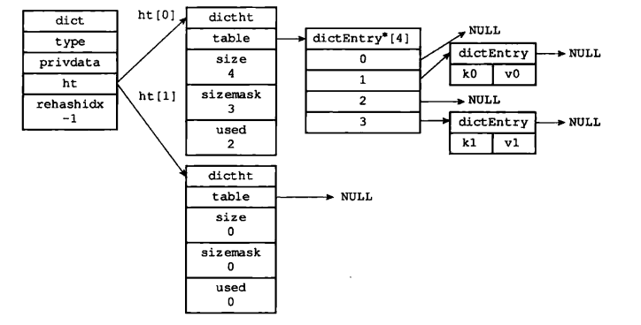
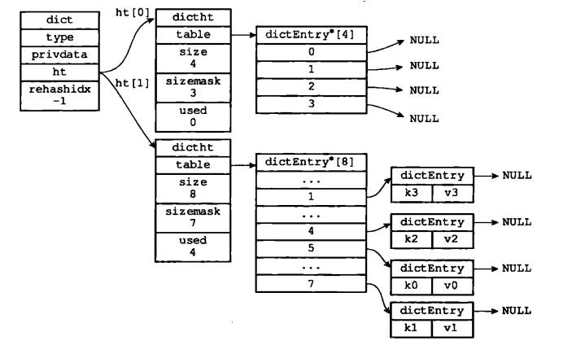
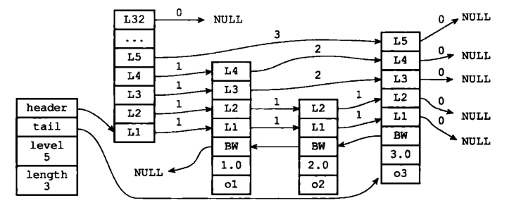

# 数据库

## MySql隔离机制

### 隔离级别

- 读未提交：脏读
- 读已提交：不可重复读，加写锁
- 可重复读（Mysql默认级别）：幻读，加读锁并保持。
- 串行化

### MySql解决可重复读

- 幻读：一次事务，多次查询后，结果集的个数不一致情况。
- mysql如何解决幻读：
  - 多版本并发机制（MVCC）（快照读）
  - next-key(当前读)

- MVCC： 通过 在 每 行 记录 后面 保存 两个 隐藏 的 列 来 实现 的。 这 两个 列， 一个 保存 了 行的 创建 时间， 一个 保存 行的 过期 时间（ 或 删除 时间）。 当然 存储 的 并不是 实际 的 时间 值， 而是 系统 版 本号。 每 开始 一个 新的 事务， 系统 版本 号 都会 自动 递增。 事务 开始时 刻 的 系统 版 本号 会 作为 事务 的 版 本号， 用来 和 查询 到 的 每 行 记录 的 版本 号 进行 比较。
- MVCC 只在 REPEATABLE READ 和 READ COMMITTED 两个 隔离 级别 下 工作。
- 快照读满足的条件：
  - InnoDB 只 查找 版本 早于 当前 事务 版本 的 数据 行（ 也就是， 行的 系统 版本 号 小于 或 等于 事务 的 系统 版 本号）， 这样 可以 确保 事务 读 取的 行， 要么 是在 事务 开始 前 已经 存在 的， 要么 是 事务 自身 插入 或者 修 改过 的。
  - 行的 删除 版本 要么 未定义， 要么 大于 当前 事务 版 本号。 这可 以 确保 事务 读取 到 的 行， 在 事务 开始 之前 未被 删除。

- 当前读（加了排它锁和共享锁）：mysql会给数据库加上行锁和间隙锁。`InnoDB` 中`行级锁`是基于索引实现的，**临键锁**只与`非唯一索引列`有关，在`唯一索引列`（包括`主键列`）上不存在**临键锁**。
  - 行锁（记录锁）：位某行记录加锁，锁对象必须为唯一索引或主键，否则会变成临键锁。
  - 间隙锁：基于非唯一索引，锁住某一区间。（不包含左右）。
  - 临键锁：特殊的间隙锁，可解决幻读问题，在非唯一索引上。（**左开右闭区间**）

## Rdis数据结构

### SDS

```c
struct sdshdr{
     //记录buf数组中已使用字节的数量
     //等于 SDS 保存字符串的长度
     int len;
     //记录 buf 数组中未使用字节的数量
     int free;
     //字节数组，用于保存字符串
     char buf[];
}
```


- **常数复杂度获取字符串长度**：由于 len 属性的存在，我们获取 SDS 字符串的长度只需要读取 len 属性，时间复杂度为 O(1)。而对于 C 语言，获取字符串的长度通常是经过遍历计数来实现的，时间复杂度为 O(n)。通过 strlen key 命令可以获取 key 的字符串长度。

- **杜绝缓冲区溢出**：在 C 语言中使用 strcat 函数来进行两个字符串的拼接，一旦没有分配足够长度的内存空间，就会造成缓冲区溢出。而对于 SDS 数据类型，在进行字符修改的时候，会首先根据记录的 len 属性检查内存空间是否满足需求，如果不满足，会进行相应的空间扩展，然后在进行修改操作，所以不会出现缓冲区溢出。

- **减少修改字符串的内存重新分配次数**：C语言由于不记录字符串的长度，所以如果要修改字符串，必须要重新分配内存（先释放再申请），因为如果没有重新分配，字符串长度增大时会造成内存缓冲区溢出，字符串长度减小时会造成内存泄露。而对于SDS，由于len属性和free属性的存在，对于修改字符串SDS实现了空间预分配和惰性空间释放两种策略：
- 空间预分配：对字符串进行空间扩展的时候，扩展的内存比实际需要的多，这样可以减少连续执行字符串增长操作所需的内存重分配次数。
  
- 惰性空间释放：对字符串进行缩短操作时，程序不立即使用内存重新分配来回收缩短后多余的字节，而是使用 free 属性将这些字节的数量记录下来，等待后续使用。（当然SDS也提供了相应的API，当我们有需要时，也可以手动释放这些未使用的空间。）
  
- **二进制安全**：因为C字符串以空字符作为字符串结束的标识，而对于一些二进制文件（如图片等），内容可能包括空字符串，因此C字符串无法正确存取；而所有 SDS 的API 都是以处理二进制的方式来处理 buf 里面的元素，并且 SDS 不是以空字符串来判断是否结束，而是以 len 属性表示的长度来判断字符串是否结束。

- **兼容部分 C 字符串函数**：虽然 SDS 是二进制安全的，但是一样遵从每个字符串都是以空字符串结尾的惯例，这样可以重用 C 语言库<string.h> 中的一部分函数。

- **SDS 数组动态分配策略**：
- redis的内存分配策略：
    - 当SDS的len属性长度小于1MB，redis会分配和len相同长度的free空间。（上次用了len，下次也有可能用len）
    - 当SDS的len属性长度大于1MB时，程序将多分配1M的未使用空间。（多分配得不偿失）。redis将1MB设为一个风险值。
  
- redis内存回收策略：
    - redis内存回收采用惰性回收，即字符串变短，多余的空间先不还给操作系统。

### 链表

C语言没有内置链表数据结构的实现。Redis自己构建的链表：

```c
typedef struct list{
     //表头节点
     listNode *head;
     //表尾节点
     listNode *tail;
     //链表所包含的节点数量
     unsigned long len;
     //节点值复制函数
     void *(*dup) (void *ptr);
     //节点值释放函数
     void *(*free) (void *ptr);
     //节点值对比函数
     int (*match) (void *ptr,void *key);
}list;
```

- 双向：链表节点有前驱、后继指针获取某个节点的前驱、后继节点的时间复杂度为O(1)。
- 无环：链表为非循环链表表头节点的前驱指针和表尾节点的后继指针都指向null，对链表的访问以null为终点。
- 带表头指针和表尾指针：通过list结构中的head和tail指针，获取表头表尾O(1)。
- 带链表长度计数器：通过list结构的len属性获取节点数量时间复杂度O(1)。
- 多态：链表节点使用void*指针保存节点的值，并且可以通过list结构的dup、free、match三个属性为节点值设置类型特定函数，所以链表可以用来保存各种不同类型的值。

### 字典

字典又称为符号表或者关联数组、映射(map)，是一种用于保存键值对的抽象数据结构。C语言没有，Redis自己构建。

```c
typedef struct dictht{
     //哈希表数组
     dictEntry **table;
     //哈希表大小
     unsigned long size;
     //哈希表大小掩码，用于计算索引值
     //总是等于 size-1
     unsigned long sizemask;
     //该哈希表已有节点的数量
     unsigned long used;
 
}dictht
```

　　哈希表是由数组 table 组成，table 中每个元素都是指向 dict.h/dictEntry 结构，dictEntry 结构定义如下：

```c
typedef struct dictEntry{
     //键
     void *key;
     //值
     union{
          void *val;
          uint64_tu64;
          int64_ts64;
     }v;
 
     //指向下一个哈希表节点，形成链表(链地址法解决冲突)
     struct dictEntry *next;
}dictEntry
```

- 扩容和收缩：
  - 服务器目前没有执行BGSAVE命令或BGREWRITEAOF命令，并且负载因子大于等于1.
  - 服务器目前正在执行 BGSAVE 命令或者 BGREWRITEAOF 命令，并且负载因子大于等于5。
  - 负载因子 = 哈希表已保存节点数量/哈希表大小。
  - 当哈希表的负载因子小于0.1执行收缩操作。

- 字典

  - ```c
    typedef struct dict {
        // 类型特定函数
        dictType *type;
        // 私有数据
        void *privedata;
        // 哈希表
        dictht  ht[2];
        // rehash 索引
        in trehashidx;
    
    }
    ```

  - type 属性 和privdata 属性是针对不同类型的键值对，为创建多态字典而设置的。

  - ht 属性是一个包含两个项（两个哈希表）的数组

  - 普通状态下的字典：



- Rehash:

  - 我们可以看到，哈希表中的每个节点都已经使用到了，这时候我们需要对哈希表进行拓展。

    

  - 数据转移：将ht[0]中数据转移到ht[1]中，重新计算hash值。

    

  - 释放ht[0],然后将ht[1]设置为ht[0]，最后为ht[1]分配一个空白哈希表。

- 渐进式rehash：
  - 为ht[1]分配空间，让字典同时持有两个hash表。
  - 设置计数器rehashidx，设为0，rehash开始。
  - 期间，每次对字典执行CRUD时，会将ht[0]中数据rehash到ht[1]中，rehashidx++
  - 当ht[0]中所有数据转移到ht[1]中时，将rehashidx设置为-1，表示rehash结束。

### 跳表

```c
typedef struct zskiplistNode {
     //层
     struct zskiplistLevel{
           //前进指针
           struct zskiplistNode *forward;
           //跨度
           unsigned int span;
     }level[];
 
     //后退指针
     struct zskiplistNode *backward;
     //分值
     double score;
     //成员对象
     robj *obj;
 
} zskiplistNode
```

```c
typedef struct zskiplist{
     //表头节点和表尾节点
     structz skiplistNode *header, *tail;
     //表中节点的数量
     unsigned long length;
     //表中层数最大的节点的层数
     int level;
 
}zskiplist;
```



### 整数集合

保证集合中不会出现重复元素，保存类型int16_t、int32_t 或者int64_t 

```c
typedef struct intset{
     //编码方式
     uint32_t encoding;
     //集合包含的元素数量
     uint32_t length;
     //保存元素的数组
     int8_t contents[];
 
}intset;
```

- 升级：
  - 根据新元素类型，扩展整数集合底层数组的大小，并为新元素分配空间。
  - 将底层数组现有的所有元素都转成与新元素相同类型的元素，并将转换后的元素放到正确的位置，维持元素顺序有序。
  - 将新元素添加到整数集合中。

- 不支持降级。升级后，编码一直保持升级后的状态。

### 压缩列表

ziplist是列表和哈希表的底层实现之一。


压缩列表的节点构成：


- previous_entry_ength：记录压缩列表前一个字节的长度。previous_entry_ength的长度可能是1个字节或者是5个字节，如果上一个节点的长度小于254，则该节点只需要一个字节就可以表示前一个节点的长度了，如果前一个节点的长度大于等于254，则previous length的第一个字节为254，后面用四个字节表示当前节点前一个节点的长度。利用此原理即当前节点位置减去上一个节点的长度即得到上一个节点的起始位置，压缩列表可以从尾部向头部遍历。这么做很有效地减少了内存的浪费。
- encoding：节点的encoding保存的是节点的content的内容类型以及长度，encoding类型一共有两种，一种字节数组一种是整数，encoding区域长度为1字节、2字节或者5字节长。00、01、10表示字节数组，后几位记录长度。11表示整数。
- content：content区域用于保存节点的内容，节点内容类型和长度由encoding决定。


## MySql语句练习

[在线SQL](https://www.liaoxuefeng.com/wiki/1177760294764384/1179611432985088)

```mysql
-- SELECT s.class_id,SUM(s.score) FROM students s,classes c where s.class_id=c.id group by s.id,s.name order by sum(s.score) desc limit 1;
--select * from students
--select * from classes
--insert into students(id,class_id,name,gender,score) VALUES (1,4,'小明','M',90)
--delete from students where id=11
SELECT c.name,SUM(s.score) FROM students s,classes c where s.class_id=c.id group by s.class_id,c.name order by sum(s.score) desc limit 0;

```

## 索引

### 索引类型

[MyISAM与InnoDB 的区别](https://blog.csdn.net/qq_35642036/article/details/82820178)

[mysql InnoDB引擎支持hash索引吗](https://blog.csdn.net/doctor_who2004/article/details/77414742)

### 数据库索引

唯一索引和普通索引使用的结构都是B-tree,执行时间复杂度都是O(log n)。

- 普通索引：普通索引（由关键字KEY或INDEX定义的索引）的唯一任务是加快对数据的访问速度。因此，应该只为那些最经常出现在查询条件（WHEREcolumn=）或排序条件（ORDERBYcolumn）中的数据列创建索引。只要有可能，就应该选择一个数据最整齐、最紧凑的数据列（如一个整数类型的数据列）来创建索引。
- 唯一索引：如果能确定某个数据列将只包含彼此各不相同的值，在为这个数据列创建索引的时候就应该用关键字UNIQUE把它定义为一个唯一索引。这么做的好处：一是简化了MySQL对这个索引的管理工作，这个索引也因此而变得更有效率；二是MySQL会在有新记录插入数据表时，自动检查新记录的这个字段的值是否已经在某个记录的这个字段里出现过了；如果是，MySQL将拒绝插入那条新记录。也就是说，唯一索引可以保证数据记录的唯一性。事实上，在许多场合，人们创建唯一索引的目的往往不是为了提高访问速度，而只是为了避免数据出现重复。
- 主索引：在前面已经反复多次强调过：必须为主键字段创建一个索引，这个索引就是所谓的"主索引"。主索引与唯一索引的唯一区别是：前者在定义时使用的关键字是PRIMARY而不是UNIQUE。 
- 外键索引：如果为某个外键字段定义了一个外键约束条件，MySQL就会定义一个内部索引来帮助自己以最有效率的方式去管理和使用外键约束条件。
- 复合索引：索引可以覆盖多个数据列，如像INDEX(columnA, columnB)索引。这种索引的特点是MySQL可以有选择地使用一个这样的索引。如果查询操作只需要用到columnA数据列上的一个索引，就可以使用复合索引INDEX(columnA, columnB)。不过，这种用法仅适用于在复合索引中排列在前的数据列组合。比如说，INDEX(A, B, C)可以当做A或(A, B)的索引来使用，但不能当做B、C或(B, C)的索引来使用。 
- 全文索引：文本字段上的普通索引只能加快对出现在字段内容最前面的字符串(也就是字段内容开头的字符)进行检索操作。如果字段里存放的是由几个、甚至是多个单词构成的较大段文字，普通索引就没什么作用了。这种检索往往以LIKE %word%的形式出现，这对MySQL来说很复杂，如果需要处理的数据量很大，响应时间就会很长。这类场合正是全文索引(full-text index)可以大显身手的地方。在生成这种类型的索引时，MySQL将把在文本中出现的所有单词创建为一份清单，查询操作将根据这份清单去检索有关的数据记录。

索引使用情况：

- 当用于排序或者分组时，尽量使用索引：如order by和group by。

- 当某个列的基数是1，即所有记录在该列中值一样，建立索引是没用的，因为所有值都一样无法排序，无法进行二分法查找。最好为列的基数大的建立索引。

- 索引列的类型尽量小。

- 尽量使用联合索引：如果我们的搜索条件中有多个列的话，最好为这些列建立一个`联合索引`， 而不是分别为每个列建立一个索引（因为每建一个索引都会维护一棵`B+`树），就像我们`person_info`表的`idx_name_age_birthday`索引，它是`name`、 `birthday`、 `phone_number`这三个列的联合索引，所以这个联合索引可以用于搜索下边几种列组合：

  ```sql
  name, birthday, phone_number
  name, birthday
  name 
  ```

- 让索引列在比较表达式中单独出现：
  假设表中有一个整数列`my_col`，我们为这个列建立了索引。下边的两个`WHERE`子句虽然语义是一致的，但是在效率上却有差别：

  ```sql
  WHERE my_col * 2 < 4
  WHERE my_col < 4/2
  ```

  第一个my_col列不是以单独列的形式出现的，而是以my_col*2出现的，会全表搜索，第二个子句中my_col列以单独列的形式出现的。

- 让主键具有`AUTO_INCREMENT`，让存储引擎自己为表生成主键，而不是我们手动插入 。

### 覆盖索引

[最左前缀原则](https://www.cnblogs.com/starry-skys/p/12921641.html)

(a)、(a，b)、(a，b，c)

(a、c)走联合索引可以。

比方说这个查询：

```
SELECT * FROM person_info WHERE name = 'Ashburn';
```

`person_info`表的`idx_name_age_birthday`的索引列只有3个，而表中一共有4个列，所以为了获得完整的用户记录，在通过`idx_name_age_birthday`索引得到对应的主键值后还得到`聚簇索引`中做一次`回表`操作。`回表`操作也是要性能损耗的啊，所以我们建议：最好在查询列表里只包含索引列，比如这样：

```
SELECT name, birthday, phone_number FROM person_info WHERE name = 'Ashburn';
```

因为我们只查询`name`, `birthday`, `phone_number`这三个索引列的值，所以在通过`idx_name_age_birthday`索引得到结果后就不必到`聚簇索引`中再查找记录的剩余列，也就是`country`列的值了。这样就省去了`回表`操作带来的性能损耗，我们把这种只需要用到索引的查询方式称为`索引覆盖`。

###  MVCC

```markdown
InnoDB的MVCC是通过在每行记录后面保存**三个隐藏的列**来实现的
```

下面,我们通过InnoDB的MVCC实现来分析MVCC使怎样进行并发控制的.
 InnoDB的MVCC,是通过在每行记录后面保存两个隐藏的列来实现的,这两个列，分别保存了这个行的创建时间，一个保存的是行的删除时间。这里存储的并不是实际的时间值,而是系统版本号(可以理解为事务的ID)，没开始一个新的事务，系统版本号就会自动递增，事务开始时刻的系统版本号会作为事务的ID.下面看一下在REPEATABLE READ隔离级别下,MVCC具体是如何操作的.

```markdown
1 悲观锁
    1、排它锁，当事务在操作数据时把这部分数据进行锁定，直到操作完毕后再解锁，其他事务操作才可操作该部分数据。这将防止其他进程读取或修改表中的数据。
    2、实现：大多数情况下依靠数据库的锁机制实现
  实现方式：
  一般使用 select ...for update 对所选择的数据进行加锁处理，例如select * from account where name=”Max” for update， 这条sql 语句锁定了account 表中所有符合检索条件（name=”Max”）的记录。本次事务提交之前（事务提交时会释放事务过程中的锁），外界无法修改这些记录。
2 乐观锁
  实现方式：
    1、如果有人在你之前更新了，你的更新应当是被拒绝的，可以让用户重新操作。
    2、实现：大多数基于数据版本（Version）记录机制实现
  具体可通过给表加一个版本号或时间戳字段实现，当读取数据时，将version字段的值一同读出，数据每更新一次，对此version值加一。当我们提交更新的时候，判断当前版本信息与第一次取出来的版本值大小，如果数据库表当前版本号与第一次取出来的version值相等，则予以更新，否则认为是过期数据，拒绝更新，让用户重新操作。
```

## 数据库锁

[Mysql数据库中的各种锁](https://blog.csdn.net/qq_35642036/article/details/89554721)

数据库锁一般可以分为两类，一个是悲观锁，一个是乐观锁。

- 乐观锁一般是指用户自己实现的一种锁机制，假设认为数据一般情况下不会造成冲突，所以在数据进行提交更新的时候，才会正式对数据的冲突与否进行检测，如果发现冲突了，则让返回用户错误的信息，让用户决定如何去做。乐观锁的实现方式一般包括使用版本号和时间戳。

- 悲观锁一般就是我们通常说的数据库锁机制，以下讨论都是基于悲观锁。

  悲观锁主要表锁、行锁、页锁。在MyISAM中只用到表锁，不会有死锁的问题，锁的开销也很小，但是相应的并发能力很差。innodb实现了行级锁和表锁，锁的粒度变小了，并发能力变强，但是相应的锁的开销变大，很有可能出现死锁。同时inodb需要协调这两种锁，算法也变得复杂。InnoDB行锁是通过给索引上的索引项加锁来实现的，只有通过索引条件检索数据，InnoDB才使用行级锁，否则，InnoDB将使用表锁。

  **表锁和行锁都分为共享锁和排他锁（独占锁），而更新锁是为了解决行锁升级（共享锁升级为独占锁）的死锁问题。**

  **innodb中表锁和行锁一起用，所以为了提高效率才会有意向锁（意向共享锁和意向排他锁）。**

**InnoDB支持表、行(默认)级锁，而MyISAM支持表级锁**

相对其他数据库而言，MySQL的锁机制比较简单，其最显著的特点是不同的存储引擎支持不同的锁机制。

MySQL大致可归纳为以下3种锁：

- 表级锁：开销小，加锁快；不会出现死锁；锁定粒度大，发生锁冲突的概率最高，并发度最低。
- 行级锁：开销大，加锁慢；会出现死锁；锁定粒度最小，发生锁冲突的概率最低，并发度也最高。
- 页面锁：开销和加锁时间界于表锁和行锁之间；会出现死锁；锁定粒度界于表锁和行锁之间，并发度一般

### 意向锁

①在mysql中有表锁，

LOCK TABLE my_tabl_name READ;  用读锁锁表，会阻塞其他事务修改表数据。

LOCK TABLE my_table_name WRITe; 用写锁锁表，会阻塞其他事务读和写。

②Innodb引擎又支持行锁，行锁分为

共享锁，一个事务对一行的共享只读锁。

排它锁，一个事务对一行的排他读写锁。

③这两中类型的锁共存的问题

考虑这个例子：

> 事务A锁住了表中的**一行**，让这一行只能读，不能写。
>
> 之后，事务B申请**整个表**的写锁。
>
> 如果事务B申请成功，那么理论上它就能修改表中的任意一行，这与A持有的行锁是冲突的。
>
> 数据库需要避免这种冲突，就是说要让B的申请被阻塞，直到A释放了行锁。
>
> 数据库要怎么判断这个冲突呢？
>
> step1：判断表是否已被其他事务用表锁锁表
> step2：判断表中的每一行是否已被行锁锁住。
>
> 注意step2，这样的判断方法效率实在不高，因为需要遍历整个表。
> 于是就有了意向锁。
>
> 在意向锁存在的情况下，事务A必须先申请表的意向共享锁，成功后再申请一行的行锁。
>
> 在意向锁存在的情况下，上面的判断可以改成
>
> step1：不变
> step2：发现表上有意向共享锁，说明表中有些行被共享行锁锁住了，因此，事务B申请表的写锁会被阻塞。
>
> 注意：申请意向锁的动作是数据库完成的，就是说，事务A申请一行的行锁的时候，数据库会自动先开始申请表的意向锁，不需要我们程序员使用代码来申请。

- IS锁，如果对一个[数据对象](https://baike.baidu.com/item/数据对象)加IS锁，表示它的后裔结点拟（意向）加 S锁。例如，要对某个[元组](https://baike.baidu.com/item/元组)加 S锁，则要首先对关系和数据库加 IS锁。

- IX锁，如果对一个[数据对象](https://baike.baidu.com/item/数据对象)加 IX锁，表示它的后裔结点拟（意向）加 X锁。例如，要对某个[元组](https://baike.baidu.com/item/元组)加 X锁，则要首先对关系和数据库加 IX锁。

- SIX锁，如果对一个[数据对象](https://baike.baidu.com/item/数据对象)加 SIX锁，表示对它加 S锁，再加IX锁，即 SIX=S+IX。例如对某个表加 SIX锁，则表示该[事务](https://baike.baidu.com/item/事务)要读整个表（所以要对该表加 S锁），同时会更新个别元组（所以要对该表加 IX锁）。

### 表锁

MyISAM在执行查询语句（SELECT）前，会自动给涉及的所有表加读锁，在执行更新操作（UPDATE、DELETE、INSERT等）前，会自动给涉及的表加写锁，这个过程并不需要用户干预，因此用户一般不需要直接用LOCK TABLE命令给MyISAM表显式加锁。

给MyISAM表显式加锁，一般是为了一定程度模拟事务操作，实现对某一时间点多个表的一致性读取。

```mysql
LOCK tables orders read local,order_detail read local;
SELECT SUM(total) FROM orders;
SELECT SUM(subtotal) FROM order_detail;
Unlock tables;
```

- 上面的例子在LOCK TABLES时加了‘local’选项，其作用就是在满足MyISAM表并发插入条件的情况下，允许其他用户在表尾插入记录
- 在用LOCKTABLES给表显式加表锁时，必须同时取得所有涉及的表的锁。也就是说，在执行LOCK TABLES后，只能访问显式加锁的这些表，而不能访问未加锁的表；同时，如果加的是读锁，那么只能执行查询操作，而不能执行更新操作。其实，在自动加锁的情况下也基本如此，MySQL会一次性获得SQL语句所需要的全部锁。这也正是MyISAM表不会出现死锁（Deadlock Free）的原因。另外，MySQL支持锁升级，即在条件满足时，允许从表共享锁升级为表独占锁。

### 并发锁

在一定条件下，MyISAM也支持查询和操作的并发进行。

  MyISAM存储引擎有一个系统变量concurrent_insert，专门用以控制其并发插入的行为，其值分别可以为0、1或2。

- 当concurrent_insert设置为0时，不允许并发插入。
- 当concurrent_insert设置为1时，如果MyISAM允许在一个读表的同时，另一个进程从表尾插入记录。这也是MySQL的默认设置。
- 当concurrent_insert设置为2时，无论MyISAM表中有没有空洞，都允许在表尾插入记录，都允许在表尾并发插入记录。

可以利用MyISAM存储引擎的并发插入特性，来解决应用中对同一表查询和插入锁争用。例如，将concurrent_insert系统变量为2，总是允许并发插入；同时，通过定期在系统空闲时段执行OPTIONMIZE TABLE语句来整理空间碎片，收集因删除记录而产生的中间空洞

### MyISAM的锁调度

MyISAM存储引擎的读和写锁是互斥，读操作是串行的。

一个进程请求某个MyISAM表的读锁，同时另一个进程也请求同一表的写锁，MySQL如何处理呢？答案是写进程先获得锁。不仅如此，即使读进程先请求先到锁等待队列，写请求后到，写锁也会插到读请求之前！这是因为MySQL认为写请求一般比读请求重要。这也正是MyISAM表不太适合于有大量更新操作和查询操作应用的原因，因为，大量的更新操作会造成查询操作很难获得读锁，从而可能永远阻塞。这种情况有时可能会变得非常糟糕！幸好我们可以通过一些设置来调节MyISAM的调度行为。

- 通过指定启动参数low-priority-updates，使MyISAM引擎默认给予读请求以优先的权利。
- 通过执行命令SET LOW_PRIORITY_UPDATES=1，使该连接发出的更新请求优先级降低。
- 通过指定INSERT、UPDATE、DELETE语句的LOW_PRIORITY属性，降低该语句的优先级。

### InnoDB锁

 InnoDB与MyISAM的最大不同有两点：一是支持事务（TRANSACTION）；二是采用了行级锁。

行级锁和表级锁本来就有许多不同之处，另外，事务的引入也带来了一些新问题。

InnoDB实现了以下两种类型的行锁。

- 共享锁（s）：允许一个事务去读一行，阻止其他事务获得相同数据集的排他锁。
- 排他锁（Ｘ）：允许获取排他锁的事务更新数据，阻止其他事务取得相同的数据集共享读锁和排他写锁。

另外，为了允许行锁和表锁共存，实现多粒度锁机制，InnoDB还有两种内部使用的意向锁（Intention Locks），这两种意向锁都是表锁。

意向共享锁（IS）：事务打算给数据行共享锁，事务在给一个数据行加共享锁前必须先取得该表的IS锁。

意向排他锁（IX）：事务打算给数据行加排他锁，事务在给一个数据行加排他锁前必须先取得该表的IX锁。

**InnoDB行锁模式兼容性列表**

| 当前锁模式/是否兼容/请求锁模式 | X    | IX   | S    | IS   |
| ------------------------------ | ---- | ---- | ---- | ---- |
| X                              | 冲突 | 冲突 | 冲突 | 冲突 |
| IX                             | 冲突 | 兼容 | 冲突 | 兼容 |
| S                              | 冲突 | 冲突 | 兼容 | 兼容 |
| IS                             | 冲突 | 兼容 | 兼容 | 兼容 |

意向锁是InnoDB自动加的，不需用户干预。对于UPDATE、DELETE和INSERT语句，InnoDB会自动给涉及的数据集加排他锁（Ｘ）；对于普通SELECT语句，InnoDB会自动给涉及数据集加共享锁（S）；事务可以通过以下语句显式给记录集加共享锁或排锁。

共享锁（Ｓ）：SELECT * FROM table_name WHERE ... LOCK IN SHARE MODE

排他锁（X）：SELECT * FROM table_name WHERE ... FOR UPDATE

用SELECT .. IN SHARE MODE获得共享锁，主要用在需要数据依存关系时确认某行记录是否存在，并确保没有人对这个记录进行UPDATE或者DELETE操作。但是如果当前事务也需要对该记录进行更新操作，则很有可能造成死锁，对于锁定行记录后需要进行更新操作的应用，应该使用SELECT ... FOR UPDATE方式获取排他锁。

### InnoDB行锁实现方式

InnoDB行锁是通过索引上的索引项来实现的，这一点ＭySQL与Oracle不同，后者是通过在数据中对相应数据行加锁来实现的。InnoDB这种行锁实现特点意味者：只有通过索引条件检索数据，InnoDB才会使用行级锁，否则，InnoDB将使用表锁！

在实际应用中，要特别注意InnoDB行锁的这一特性，不然的话，可能导致大量的锁冲突，从而影响并发性能。

### InnoDB下使用表级锁

 在InnoDB下 ，使用表锁要注意以下两点。

  （１）使用LOCK TALBES虽然可以给InnoDB加表级锁，但必须说明的是，表锁不是由InnoDB存储引擎层管理的，而是由其上一层ＭySQL Server负责的，仅当autocommit=0、innodb_table_lock=1（默认设置）时，InnoDB层才能知道MySQL加的表锁，ＭySQL Server才能感知InnoDB加的行锁，这种情况下，InnoDB才能自动识别涉及表级锁的死锁；否则，InnoDB将无法自动检测并处理这种死锁。

  （２）在用LOCAK TABLES对InnoDB锁时要注意，要将AUTOCOMMIT设为0，否则ＭySQL不会给表加锁；事务结束前，不要用UNLOCAK TABLES释放表锁，因为UNLOCK TABLES会隐含地提交事务；而COMMIT或ROLLBACK并不能释放用LOCAK TABLES加的表级锁，所以一般我们必须先提交事务后，再用UNLOCK TABLES释放表锁，正确的方式见如下语句。

```mysql
SET AUTOCOMMIT=0;
LOCAK TABLES t1 WRITE, t2 READ, ...;
[do something with tables t1 and here];
COMMIT;
UNLOCK TABLES;
```

### 关于死锁

ＭyISAM表锁是deadlock free的，这是因为ＭyISAM总是一次性获得所需的全部锁，要么全部满足，要么等待，因此不会出现死锁。但是在InnoDB中，除单个SQL组成的事务外，锁是逐步获得的，这就决定了InnoDB发生死锁是可能的。

  发生死锁后，InnoDB一般都能自动检测到，并使一个事务释放锁并退回，另一个事务获得锁，继续完成事务。但在涉及外部锁，或涉及锁的情况下，InnoDB并不能完全自动检测到死锁，这需要通过设置锁等待超时参数innodb_lock_wait_timeout来解决。需要说明的是，这个参数并不是只用来解决死锁问题，在并发访问比较高的情况下，如果大量事务因无法立即获取所需的锁而挂起，会占用大量计算机资源，造成严重性能问题，甚至拖垮数据库。我们通过设置合适的锁等待超时阈值，可以避免这种情况发生。

  通常来说，死锁都是应用设计的问题，通过调整业务流程、数据库对象设计、事务大小、以及访问数据库的SQL语句，绝大部分都可以避免。下面就通过实例来介绍几种死锁的常用方法。

  （１）在应用中，如果不同的程序会并发存取多个表，应尽量约定以相同的顺序为访问表，这样可以大大降低产生死锁的机会。如果两个session访问两个表的顺序不同，发生死锁的机会就非常高！但如果以相同的顺序来访问，死锁就可能避免。

  （２）在程序以批量方式处理数据的时候，如果事先对数据排序，保证每个线程按固定的顺序来处理记录，也可以大大降低死锁的可能。

  （３）在事务中，如果要更新记录，应该直接申请足够级别的锁，即排他锁，而不应该先申请共享锁，更新时再申请排他锁，甚至死锁。

  （４）在REPEATEABLE-READ隔离级别下，如果两个线程同时对相同条件记录用SELECT...ROR UPDATE加排他锁，在没有符合该记录情况下，两个线程都会加锁成功。程序发现记录尚不存在，就试图插入一条新记录，如果两个线程都这么做，就会出现死锁。这种情况下，将隔离级别改成READ COMMITTED，就可以避免问题。

  （５）当隔离级别为READ COMMITED时，如果两个线程都先执行SELECT...FOR UPDATE，判断是否存在符合条件的记录，如果没有，就插入记录。此时，只有一个线程能插入成功，另一个线程会出现锁等待，当第１个线程提交后，第２个线程会因主键重出错，但虽然这个线程出错了，却会获得一个排他锁！这时如果有第３个线程又来申请排他锁，也会出现死锁。对于这种情况，可以直接做插入操作，然后再捕获主键重异常，或者在遇到主键重错误时，总是执行ROLLBACK释放获得的排他锁。

  尽管通过上面的设计和优化等措施，可以大减少死锁，但死锁很难完全避免。因此，在程序设计中总是捕获并处理死锁异常是一个很好的编程习惯。

  如果出现死锁，可以用SHOW INNODB STATUS命令来确定最后一个死锁产生的原因和改进措施。