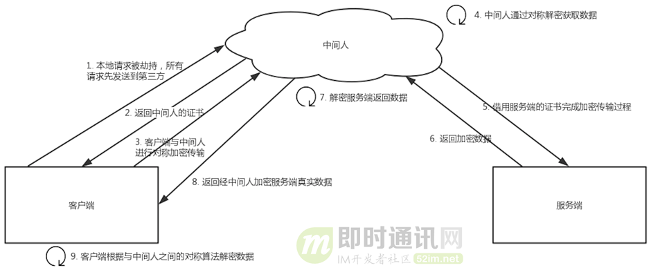
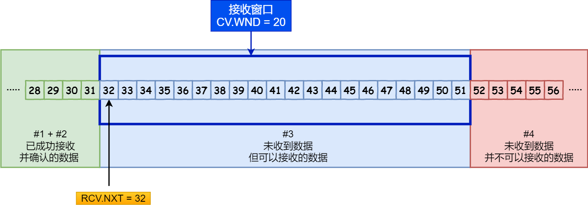
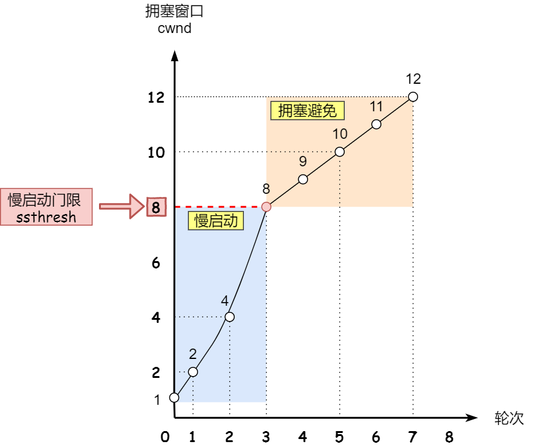
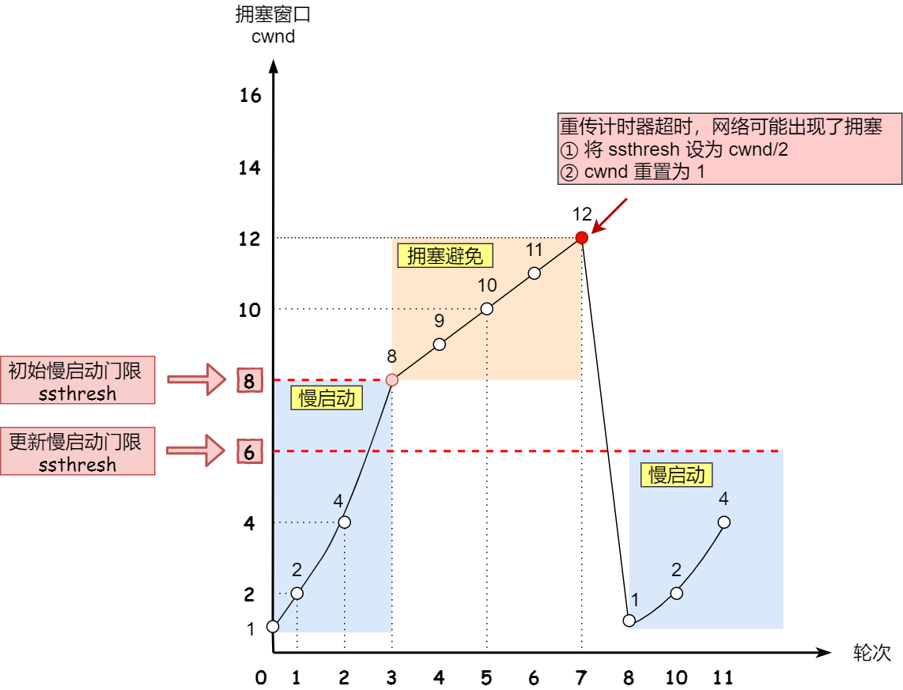

# 网络

## Http协议

### HTTP 0.9

- 仅有GET命令
- 仅能返回HTML格式

### HTTP 1.0

- 任何格式的内容都可以发送，互联网不仅可以传输文字，还能传输图像、视频、二进制文件。
- 除了GET，还引入POST命令和HEAD命令。
- HTTP请求和回应的格式变化，除了数据部分，每次通信都必须包括头信息（HTTP header）。
- 包括状态码（status code）、多字符集支持、多部分发送（multi-part type）、权限（authorization）、缓存（cache）、内容编码（content encoding）等。

#### 请求格式

下面是一个1.0版的HTTP请求的例子。

> ```http
> GET / HTTP/1.0
> User-Agent: Mozilla/5.0 (Macintosh; Intel Mac OS X 10_10_5)
> Accept: */*
> ```

#### 回应格式

```http
HTTP/1.0 200 OK 
Content-Type: text/plain
Content-Length: 137582
Expires: Thu, 05 Dec 1997 16:00:00 GMT
Last-Modified: Wed, 5 August 1996 15:55:28 GMT
Server: Apache 0.84

<html>
  <body>Hello World</body>
</html>
```

#### Content-Type 字段

关于字符的编码，1.0版规定，头信息必须是 ASCII 码，后面的数据可以是任何格式。因此，服务器回应的时候，必须告诉客户端，数据是什么格式，这就是`Content-Type`字段的作用。

> - text/plain
> - text/html
> - text/css
> - image/jpeg
> - image/png
> - image/svg+xml
> - audio/mp4
> - video/mp4
> - application/javascript
> - application/pdf
> - application/zip
> - application/atom+xml

这些数据类型总称为`MIME type`，每个值包括一级类型和二级类型，之间用斜杠分隔。

除了预定义的类型，厂商也可以自定义类型。

> ```http
> application/vnd.debian.binary-package
> ```

上面的类型表明，发送的是Debian系统的二进制数据包。

`MIME type`还可以在尾部使用分号，添加参数。

> ```http
> Content-Type: text/html; charset=utf-8
> ```

上面的类型表明，发送的是网页，而且编码是UTF-8。

客户端请求的时候，可以使用`Accept`字段声明自己可以接受哪些数据格式。

> ```http
> Accept: */*
> ```

上面代码中，客户端声明自己可以接受任何格式的数据。

`MIME type`不仅用在HTTP协议，还可以用在其他地方，比如HTML网页。

> ```html
> <meta http-equiv="Content-Type" content="text/html; charset=UTF-8" />
> <!-- 等同于 -->
> <meta charset="utf-8" /> 
> ```

#### Content-Encoding 字段

由于发送的数据可以是任何格式，因此可以把数据压缩后再发送。`Content-Encoding`字段说明数据的压缩方法。

> ```http
> Content-Encoding: gzip
> Content-Encoding: compress
> Content-Encoding: deflate
> ```

客户端在请求时，用`Accept-Encoding`字段说明自己可以接受哪些压缩方法。

> ```http
> Accept-Encoding: gzip, deflate
> ```

#### 缺点

HTTP/1.0 版的主要缺点是，每个TCP连接只能发送一个请求。发送数据完毕，连接就关闭，如果还要请求其他资源，就必须再新建一个连接。

TCP连接的新建成本很高，因为需要客户端和服务器三次握手，并且开始时发送速率较慢（slow start）。所以，HTTP 1.0版本的性能比较差。随着网页加载的外部资源越来越多，这个问题就愈发突出了。

为了解决这个问题，有些浏览器在请求时，用了一个非标准的`Connection`字段。

> ```http
> Connection: keep-alive
> ```

这个字段要求服务器不要关闭TCP连接，以便其他请求复用。服务器同样回应这个字段。

> ```http
> Connection: keep-alive
> ```

一个可以复用的TCP连接就建立了，直到客户端或服务器主动关闭连接。但是，这不是标准字段，不同实现的行为可能不一致，因此不是根本的解决办法。

### HTTP 1.1

- 引入持久连接，TCP连接默认不关闭，可以被多个请求复用，不用声明`Connection:keep-alive`。
- 客户端和服务端发现一段时间没有活动，可以主动关闭连接，规范做法是在客户端最后一个请求时，发送`Connection:close`。
- 对于同一个域名，大多数浏览器允许同时建立6个持久连接。

#### 管道机制

在同一个TCP连接里面，客户端可以同时发送多个请求。如：客户端需要请求两个资源，以前的做法是在同一个TCP连接里，先发送A请求，收到回应后发送B请求。管道机制允许浏览器同时发出A请求和B请求，但服务器还是按照顺序，先回应A请求，在回应B请求。

#### Content-Length字段

区分数据包属于哪一个回应，即声明本次回应的数据长度。Content-Length在请求方法为GET的时候不能使用，在请求方法为POST的时候需要使用，同时也常常出现在响应头中。

```http
Content-Length: 3495
```

如上表示本次回应长度为3495字节，后面的字节属于下一个回应。

在1.0版本中，`Content-Length`不是必须的，TCP关闭，表面收到数据包全了。

#### 分块传输编码

使用`Content-Length`字段的前提条件是，服务器发送回应之前，必须知道回应的数据长度。

对于一些很耗时的动态操作来说，这意味着，服务器要等到所有操作完成，才能发送数据，显然这样的效率不高。更好的处理方法是，产生一块数据，就发送一块，采用"流模式"（stream）取代"缓存模式"（buffer）。

1.1规定可以不使用Content-Length字段，使用分块传输编码（chunked transfer encoding），即请求或回应的头信息有`Transfer-Encoding`字段，表明回应将由数量未定的数据块组成。

```http
Transfer-Encoding: chunked

```

每个非空的数据块之前，会有一个16进制的数值，表示这个块的长度。最后是一个大小为0的块，就表示本次回应的数据发送完了。下面是一个例子。

```http
HTTP/1.1 200 OK
Content-Type: text/plain
Transfer-Encoding: chunked

25
This is the data in the first chunk

1C
and this is the second one

3
con

8
sequence

0
```

#### 其他功能

1.1版还新增了许多动词方法：`PUT`、`PATCH`、`HEAD`、 `OPTIONS`、`DELETE`。

另外，客户端请求的头信息新增了`Host`字段，用来指定服务器的域名。

> ```http
> Host: www.example.com
> ```

有了`Host`字段，就可以将请求发往同一台服务器上的不同网站，为虚拟主机的兴起打下了基础。

### HTTP 2

- HTTP/1.1 版的头信息肯定是文本（ASCII编码），数据体可以是文本，也可以是二进制。HTTP/2 则是一个彻底的二进制协议，头信息和数据体都是二进制，并且统称为"帧"（frame）：头信息帧和数据帧。
- 二进制协议的一个好处是，可以定义额外的帧。HTTP/2 定义了近十种帧，为将来的高级应用打好了基础。如果使用文本实现这种功能，解析数据将会变得非常麻烦，二进制解析则方便得多。

#### 多工

HTTP/2 复用TCP连接，在一个连接里，客户端和浏览器都可以同时发送多个请求或回应，而且不用按照顺序一一对应，这样就避免了"队头堵塞"。

举例来说，在一个TCP连接里面，服务器同时收到了A请求和B请求，于是先回应A请求，结果发现处理过程非常耗时，于是就发送A请求已经处理好的部分， 接着回应B请求，完成后，再发送A请求剩下的部分。

这样双向的、实时的通信，就叫做多工（Multiplexing）。

#### 数据流

因为 HTTP/2 的数据包是不按顺序发送的，同一个连接里面连续的数据包，可能属于不同的回应。因此，必须要对数据包做标记，指出它属于哪个回应。

HTTP/2 将每个请求或回应的所有数据包，称为一个数据流（stream）。每个数据流都有一个独一无二的编号。数据包发送的时候，都必须标记数据流ID，用来区分它属于哪个数据流。另外还规定，客户端发出的数据流，ID一律为奇数，服务器发出的，ID为偶数。

数据流发送到一半的时候，客户端和服务器都可以发送信号（`RST_STREAM`帧），取消这个数据流。1.1版取消数据流的唯一方法，就是关闭TCP连接。这就是说，HTTP/2 可以取消某一次请求，同时保证TCP连接还打开着，可以被其他请求使用。

客户端还可以指定数据流的优先级。优先级越高，服务器就会越早回应。

#### 头信息压缩

HTTP 协议不带有状态，每次请求都必须附上所有信息。所以，请求的很多字段都是重复的，比如`Cookie`和`User Agent`，一模一样的内容，每次请求都必须附带，这会浪费很多带宽，也影响速度。

HTTP/2 对这一点做了优化，引入了头信息压缩机制（header compression）。一方面，头信息使用`gzip`或`compress`压缩后再发送；另一方面，客户端和服务器同时维护一张头信息表，所有字段都会存入这个表，生成一个索引号，以后就不发送同样字段了，只发送索引号，这样就提高速度了。

#### 服务器推送

HTTP/2 允许服务器未经请求，主动向客户端发送资源，这叫做服务器推送（server push）。

常见场景是客户端请求一个网页，这个网页里面包含很多静态资源。正常情况下，客户端必须收到网页后，解析HTML源码，发现有静态资源，再发出静态资源请求。其实，服务器可以预期到客户端请求网页后，很可能会再请求静态资源，所以就主动把这些静态资源随着网页一起发给客户端了。

## Get和Post

- GET请求后退/刷新无害，POST后退/刷新则会导致重新提交数据。

- GET书签可被收藏、POST为书签不可收藏。

- GET能被缓存、POST不能被缓存。

- GET编码类型application/x-www-form-url、POST编码类型常见encodedapplication/x-www-form-urlencoded或multipart/form-data。

- GET历史参数保留在浏览器历史中、POST参数不会保存在浏览器历史中。

- GET对数据长度有限制（url限制2048个字符）、POST无限制。

- GET只允许ASCII字符、POST没有限制，也允许二进制数据。

## HTTP keep-alive和TCP keepalive的区别

TCP keepalive指的是TCP保活计时器（keepalive timer）。设想有这样的情况：客户已主动与服务器建立了TCP连接。但后来客户端的主机突然出故障。显然，服务器以后就不能再收到客户发来的数据。因此，应当有措施使服务器不要再白白等待下去。这就是使用保活计时器。服务器每收到一次客户的数据，就重新设置保活计时器，时间的设置通常是两小时。若两小时没有收到客户的数据，服务器就发送一个探测报文段，以后则每隔75秒发送一次。若一连发送10个探测报文段后仍无客户的响应，服务器就认为客户端出了故障，接着就关闭这个连接。

 ——*摘自谢希仁《计算机网络》*

## HTTPS

[https的交互过程](https://www.cnblogs.com/imstudy/p/12015889.html)


- 非对称加密的加解密效率是非常低的，而 http 的应用场景中通常端与端之间存在大量的交互，非对称加密的效率是无法接受的。
- 服务端保存了私钥，一对公私钥只能实现单向的加解密，所以 HTTPS 中内容传输加密采取的是对称加密，而不是非对称加密。

### CA 认证机构颁发证书

HTTP 协议被认为不安全是因为传输过程容易被监听者勾线监听、伪造服务器，而 HTTPS 协议主要解决的便是网络传输的安全性问题。

首先我们假设不存在认证机构，任何人都可以制作证书，这带来的安全风险便是经典的“中间人攻击”问题。



- 1）本地请求被劫持（如DNS劫持等），所有请求均发送到中间人的服务器；
- 2）中间人服务器返回中间人自己的证书；
- 3）客户端创建随机数，通过中间人证书的公钥对随机数加密后传送给中间人，然后凭随机数构造对称加密对传输内容进行加密传输；
- 4）中间人因为拥有客户端的随机数，可以通过对称加密算法进行内容解密；
- 5）中间人以客户端的请求内容再向正规网站发起请求；
- 6）因为中间人与服务器的通信过程是合法的，正规网站通过建立的安全通道返回加密后的数据；
- 7）中间人凭借与正规网站建立的对称加密算法对内容进行解密；
- 8）中间人通过与客户端建立的对称加密算法对正规内容返回的数据进行加密传输；
- 9）客户端通过与中间人建立的对称加密算法对返回结果数据进行解密。

### 验证证书的合法性

**浏览器发起 HTTPS 请求时，服务器会返回网站的 SSL 证书，浏览器需要对证书做以下验证：**

1）验证域名、有效期等信息是否正确：证书上都有包含这些信息，比较容易完成验证；

2）判断证书来源是否合法：每份签发证书都可以根据验证链查找到对应的根证书，操作系统、浏览器会在本地存储权威机构的根证书，利用本地根证书可以对对应机构签发证书完成来源验证（如下图所示）： 


3）判断证书是否被篡改：需要与 CA 服务器进行校验；

4）判断证书是否已吊销：通过CRL（Certificate Revocation List 证书注销列表）和 OCSP（Online Certificate Status Protocol 在线证书状态协议）实现，其中 OCSP 可用于第3步中以减少与 CA 服务器的交互，提高验证效率。

以上任意一步都满足的情况下浏览器才认为证书是合法的。

## TCP与UDP

- TCP/IP协议是一个协议簇。里面包括很多协议的，UDP只是其中的一个。
- TCP/IP协议集包括应用层,传输层，网络层，网络访问层。

### 应用层

1. 超文本传输协议（HTTP）:万维网的基本协议；
2. 文件传输（TFTP简单文件传输协议）；
3. 远程登录（Telnet），提供远程访问其它主机功能, 它允许用户登录internet主机，并在这台主机上执行命令；
4. 网络管理（SNMP简单网络管理协议），该协议提供了监控网络设备的方法， 以及配置管理,统计信息收集,性能管理及安全管理等；
5. 域名系统（DNS），该系统用于在internet中将域名及其公共广播的网络节点转换成IP地址。

### 网络层

1. Internet协议（IP）；
2. Internet控制信息协议（ICMP）；
3. 地址解析协议（ARP）；
4. 反向地址解析协议（RARP）。

### 网络访问层

网络访问层又称作主机到网络层（host-to-network），网络访问层的功能包括IP地址与物理地址硬件的映射， 以及将IP封装成帧.基于不同硬件类型的网络接口，网络访问层定义了和物理介质的连接. 当然我这里说得不够完善，TCP/IP协议本来就是一门学问，每一个分支都是一个很复杂的流程， 但我相信每位学习软件开发的同学都有必要去仔细了解一番。

### TCP（Transmission Control Protocol，传输控制协议）

面向连接协议，在收发数据前，必须和对方建立可靠连接。

- 第一次：SYN=1，seq=x
- 第二次：SYN=1，ACK=1，seq=y，ack=x+1
- 第三次：ACK=1，seq=x+1，ack=y+1

断开：

- 第一次：FIN=1，seq=u
- 第二次：ACK=1，seq=v，ack=u+1
- 第三次：FIN=1，ACK=1，seq=w，ack=u+1
- 第四次：ACK=1，seq=u+1，ack=w+1

#### TCP的包头结构

- 源端口：16位
- 目标端口：16位
- 序列号：32位
- 回应序号：32位
- TCP头长度：4位
- reserved：6位
- 控制代码：6位
- 窗口大小：16位
- 偏移量：16位
- 校验和：16位
- 选项（可选）：32位

TCP包头最小长度：20字节

### UDP**（User Data Protocol，用户数据报协议）**

- UDP是一个非连接的协议，传输数据之前源端和终端不建立连接， 当它想传送时就简单地去抓取来自应用程序的数据，并尽可能快地把它扔到网络上。 在发送端，UDP传送数据的速度仅仅是受应用程序生成数据的速度、 计算机的能力和传输带宽的限制； 在接收端，UDP把每个消息段放在队列中，应用程序每次从队列中读一个消息段。
- 由于传输数据不建立连接，因此也就不需要维护连接状态，包括收发状态等， 因此一台服务机可同时向多个客户机传输相同的消息。
- UDP信息包的标题很短，只有8个字节，相对于TCP的20个字节信息包的额外开销很小。
- 吞吐量不受拥挤控制算法的调节，只受应用软件生成数据的速率、传输带宽、 源端和终端主机性能的限制。
- UDP使用尽最大努力交付，即不保证可靠交付， 因此主机不需要维持复杂的链接状态表（这里面有许多参数）。
- UDP是面向报文的。发送方的UDP对应用程序交下来的报文， 在添加首部后就向下交付给IP层。既不拆分，也不合并，而是保留这些报文的边界， 因此，应用程序需要选择合适的报文大小。

#### UDP的包头结构

- 源端口：16位
- 目的端口：16位
- 长度：16位
- 校验和：16位

### TCP与UDP区别

- 基于连接与无连接
- TCP对系统资源要求较多
- UDP程序结构较简单
- 流模式与数据报模式
- TCP保证数据正确性，UDP可能丢包
- TCP保证数据顺序，UDP不保证

## DNS解析过程


- **第一步**，浏览器会检查缓存中有没有这个域名的对应解析IP，如果存在，返回IP地址解析完成。
- **第二步**，如果缓存中没有对应的解析IP，浏览器会查找本机操作系统中是否存在该解析IP。
- **第三步**，如果上面两步都不存在，我们的网络配置中会有“DNS服务器地址”这一项，操作系统会将请求的域名发送给这里设置的LDNS（本地区域名服务器）。
- **第四步**，如果第三步也没有查询到，就直接到Root Server 域名服务器请求解析。
- **第五步**，根域名服务器返回给本地域名服务器一个所查询的主域名服务器（gTLD Server）地址，**gTLD Server**：**国际顶级域名服务器**，共有13台左右包括（cn、com、org等）
- **第六步**，本地域名服务器（**Local DNS Server**）再想上一步返回的**gTLD Server**发送请求。
- **第七步**，**gTLD Server**返回查询的对应域名的**Name Server**主域名服务器地址，这个就是我们平时注册域名的服务器。
- **第八步**，**Name Server**会查询存储的域名与IP地址的映射关系表，连同一个**TTL值**返回给**DNS Server**域名解析服务器。主域名服务器接受到请求后查询自己的缓存，如果没有则进入下一级域名服务器进行查找，并重复该步骤直至找到正确纪录；
- **第九步**，返回该域名对应的**IP**和**TTL值**，由**Local DNS Server**来缓存，缓存时间由**TTL**值来控制。
- **第十步**，把解析的地址返回给用户，**TTL值**由浏览器缓存在本地系统，域名解析完成。

从客户端到本地DNS服务器是属于递归查询，而DNS服务器之间就是交互查询就是迭代查询。

DNS在进行区域传输的时候使用TCP协议，其它时候则使用UDP协议； 

DNS的规范规定了2种类型的DNS服务器，一个叫主DNS服务器，一个叫辅助DNS服务器。

为了防止DNS服务器由于各种软硬件故障导致停止DNS服务，建议在同一个网络中部属两台或两台以上的DNS服务器。其中一台作为主DNS服务器，其他的作为辅助DNS服务器。当主DNS服务器正常运行时，辅助DNS服务器只起备份作用。当主DNS服务器发生故障后，辅助DNS服务器立即启动承担DNS解析服务。

**DNS区域传输的时候使用TCP协议：**

> 辅域名服务器会定时（一般3小时）向主域名服务器进行查询以便了解数据是否有变动。如有变动，会执行一次区域传送，进行数据同步。区域传送使用TCP而不是UDP，因为数据同步传送的数据量比一个请求应答的数据量要多得多。

**域名解析时使用UDP协议：**

> 客户端向DNS服务器查询域名，一般返回的内容都不超过512字节，用UDP传输即可。不用经过三次握手，这样DNS服务器负载更低，响应更快。理论上说，客户端也可以指定向DNS服务器查询时用TCP，但事实上，很多DNS服务器进行配置的时候，仅支持UDP查询包。

## TCP粘包、拆包

[参考地址](https://www.cnblogs.com/xiaolincoding/p/12732052.html)

### TCP粘包、拆包原因

- 拆包：   
  - 应用程序写入的数据大于套接字缓冲区大小
  - MSS（最大报文长度）大小的TCP分段；当TCP报文长度-TCP头部长度>MSS的时候将发生拆包。

- 粘包：
  - 要发送的数据小于TCP发送缓冲区的大小，TCP将多次写入缓冲区的数据一次发送出去，将会发生粘包。
  - 接收数据端的应用层没有及时读取接收缓冲区中的数据，将发生粘包。

### 解决办法

- 发送端给每个数据包添加包首部，首部中应该至少包含数据包的长度，这样接收端在接收到数据后，通过读取包首部的长度字段，便知道每一个数据包的实际长度了。
- 发送端将每个数据包封装为固定长度（不够的可以通过补0填充），这样接收端每次从接收缓冲区中读取固定长度的数据就自然而然的把每个数据包拆分开来。
- 可以在数据包之间设置边界，如添加特殊符号，这样，接收端通过这个边界就可以将不同的数据包拆分开。

## TCP 重传、滑动窗口、流量控制、拥塞控制

### TCP重传

#### 超时重传

重传机制的其中一个方式，就是在发送数据时，设定一个定时器，当超过指定的时间后，没有收到对方的 `ACK` 确认应答报文，就会重发该数据，也就是我们常说的**超时重传**。

TCP 会在以下两种情况发生超时重传：

- 数据包丢失
- 确认应答丢失


#### 快速重传

TCP 还有另外一种**快速重传（Fast Retransmit）机制**，它**不以时间为驱动，而是以数据驱动重传**。


在上图，发送方发出了 1，2，3，4，5 份数据：

- 第一份 Seq1 先送到了，于是就 Ack 回 2；
- 结果 Seq2 因为某些原因没收到，Seq3 到达了，于是还是 Ack 回 2；
- 后面的 Seq4 和 Seq5 都到了，但还是 Ack 回 2，因为 Seq2 还是没有收到；
- **发送端收到了三个 Ack = 2 的确认，知道了 Seq2 还没有收到，就会在定时器过期之前，重传丢失的 Seq2。**
- 最后，收到了 Seq2，此时因为 Seq3，Seq4，Seq5 都收到了，于是 Ack 回 6 。

所以，快速重传的工作方式是当收到三个相同的 ACK 报文时，会在定时器过期之前，重传丢失的报文段。

快速重传机制只解决了一个问题，就是超时时间的问题，但是它依然面临着另外一个问题。就是**重传的时候，是重传之前的一个，还是重传所有的问题。**

比如对于上面的例子，是重传 Seq2 呢？还是重传 Seq2、Seq3、Seq4、Seq5 呢？因为发送端并不清楚这连续的三个 Ack 2 是谁传回来的。

根据 TCP 不同的实现，以上两种情况都是有可能的。可见，这是一把双刃剑。

为了解决不知道该重传哪些 TCP 报文，于是就有 `SACK` 方法。

#### SACK 方法

这种方式需要在 TCP 头部「选项」字段里加一个 `SACK` 的东西，它**可以将缓存的地图发送给发送方**，这样发送方就可以知道哪些数据收到了，哪些数据没收到，知道了这些信息，就可以**只重传丢失的数据**。

如下图，发送方收到了三次同样的 ACK 确认报文，于是就会触发快速重发机制，通过 `SACK` 信息发现只有 `200~299` 这段数据丢失，则重发时，就只选择了这个 TCP 段进行重复。


### 滑动窗口

TCP 是每发送一个数据，都要进行一次确认应答。当上一个数据包收到了应答了， 再发送下一个。这种方式的缺点是效率比较低的。

为解决这个问题，TCP 引入了**窗口**这个概念。即使在往返时间较长的情况下，它也不会降低网络通信的效率。

那么有了窗口，就可以指定窗口大小，窗口大小就是指**无需等待确认应答，而可以继续发送数据的最大值**。

窗口的实现实际上是操作系统开辟的一个缓存空间，发送方主机在等到确认应答返回之前，必须在缓冲区中保留已发送的数据。如果按期收到确认应答，此时数据就可以从缓存区清除。

假设窗口大小为 `3` 个 TCP 段，那么发送方就可以「连续发送」 `3` 个 TCP 段，并且中途若有 ACK 丢失，可以通过「下一个确认应答进行确认」。如下图：


图中的 ACK 600 确认应答报文丢失，也没关系，因为可以通过下一个确认应答进行确认，只要发送方收到了 ACK 700 确认应答，就意味着 700 之前的所有数据「接收方」都收到了。这个模式就叫**累计确认**或者**累计应答**。

TCP 头里有一个字段叫 `Window`，也就是窗口大小。

**这个字段是接收端告诉发送端自己还有多少缓冲区可以接收数据。于是发送端就可以根据这个接收端的处理能力来发送数据，而不会导致接收端处理不过来。**

TCP 滑动窗口方案使用三个指针来跟踪在四个传输类别中的每一个类别中的字节。其中两个指针是绝对指针（指特定的序列号），一个是相对指针（需要做偏移）：


- `SND.WND`：表示发送窗口的大小（大小是由接收方指定的）；
- `SND.UNA`：是一个绝对指针，它指向的是已发送但未收到确认的第一个字节的序列号，也就是 #2 的第一个字节。
- `SND.NXT`：也是一个绝对指针，它指向未发送但可发送范围的第一个字节的序列号，也就是 #3 的第一个字节。
- 指向 #4 的第一个字节是个相对指针，它需要 `SND.UNA` 指针加上 `SND.WND` 大小的偏移量，就可以指向 #4 的第一个字节了。

**可用窗口大 = SND.WND -（SND.NXT - SND.UNA）**

接收方的滑动窗口：

- \#1 + #2 是已成功接收并确认的数据（等待应用进程读取）；
- \#3 是未收到数据但可以接收的数据；
- \#4 未收到数据并不可以接收的数据；
- 

其中三个接收部分，使用两个指针进行划分:

- `RCV.WND`：表示接收窗口的大小，它会通告给发送方。
- `RCV.NXT`：是一个指针，它指向期望从发送方发送来的下一个数据字节的序列号，也就是 #3 的第一个字节。
- 指向 #4 的第一个字节是个相对指针，它需要 `RCV.NXT` 指针加上 `RCV.WND` 大小的偏移量，就可以指向 #4 的第一个字节了。

接收窗口的大小是**约等于**发送窗口的大小。

### 流量控制

如果一直无脑的发数据给对方，但对方处理不过来，那么就会导致触发重发机制，从而导致网络流量的无端的浪费。

**TCP 提供一种机制可以让「发送方」根据「接收方」的实际接收能力控制发送的数据量，这就是所谓的流量控制。**

丢包情况：

当服务端系统资源非常紧张的时候，操作系统可能会直接减少了接收缓冲区大小，这时应用程序又无法及时读取缓存数据，那么这时候就有严重的事情发生了，会出现数据包丢失的现象。


说明下每个过程：

1. 客户端发送 140 字节的数据，于是可用窗口减少到了 220。
2. **服务端因为现在非常的繁忙，操作系统于是就把接收缓存减少了 120 字节，当收到 140 字节数据后，又因为应用程序没有读取任何数据，所以 140 字节留在了缓冲区中，于是接收窗口大小从 360 收缩成了 100**，最后发送确认信息时，通告窗口大小给对方。
3. 此时客户端因为还没有收到服务端的通告窗口报文，所以不知道此时接收窗口收缩成了 100，客户端只会看自己的可用窗口还有 220，所以客户端就发送了 180 字节数据，于是可用窗口减少到 40。
4. 服务端收到了 180 字节数据时，**发现数据大小超过了接收窗口的大小，于是就把数据包丢失了。**
5. 客户端收到第 2 步时，服务端发送的确认报文和通告窗口报文，尝试减少发送窗口到 100，把窗口的右端向左收缩了 80，此时可用窗口的大小就会出现诡异的负值。

所以，如果发生了先减少缓存，再收缩窗口，就会出现丢包的现象。

**为了防止这种情况发生，TCP 规定是不允许同时减少缓存又收缩窗口的，而是采用先收缩窗口，过段时间再减少缓存，这样就可以避免了丢包情况。**

#### 窗口关闭

**如果窗口大小为 0 时，就会阻止发送方给接收方传递数据，直到窗口变为非 0 为止，这就是窗口关闭。**

为了解决这个问题，TCP 为每个连接设有一个持续定时器，**只要 TCP 连接一方收到对方的零窗口通知，就启动持续计时器。**

如果持续计时器超时，就会发送**窗口探测 ( Window probe ) 报文**，而对方在确认这个探测报文时，给出自己现在的接收窗口大小。


窗口探测

- 如果接收窗口仍然为 0，那么收到这个报文的一方就会重新启动持续计时器；
- 如果接收窗口不是 0，那么死锁的局面就可以被打破了。

窗口探测的次数一般为 3 次，每次大约 30-60 秒（不同的实现可能会不一样）。如果 3 次过后接收窗口还是 0 的话，有的 TCP 实现就会发 `RST` 报文来中断连接。

#### 糊涂窗口

**接收方腾出几个字节并告诉发送方现在有几个字节的窗口，而发送方会义无反顾地发送这几个字节，这就是糊涂窗口综合症**。

`TCP + IP` 头有 `40` 个字节，为了传输那几个字节的数据，要达上这么大的开销，太不经济。

要解决糊涂窗口综合症：

- 让接收方不通告小窗口给发送方：
  - 当「窗口大小」小于 min( MSS，缓存空间/2 ) ，也就是小于 MSS 与 1/2 缓存大小中的最小值时，就会向发送方通告窗口为 `0`，也就阻止了发送方再发数据过来。
  - 等到接收方处理了一些数据后，窗口大小 >= MSS，或者接收方缓存空间有一半可以使用，就可以把窗口打开让发送方发送数据过来。

- 让发送方避免发送小数据：

  - 使用 Nagle 算法，该算法的思路是延时处理，它满足以下两个条件中的一条才可以发送数据：
    - 要等到窗口大小 >= `MSS` 或是 数据大小 >= `MSS`
    - 收到之前发送数据的 `ack` 回包
  - 只要没满足上面条件中的一条，发送方一直在囤积数据，直到满足上面的发送条件。

  另外，Nagle 算法默认是打开的，如果对于一些需要小数据包交互的场景的程序，比如，telnet 或 ssh 这样的交互性比较强的程序，则需要关闭 Nagle 算法。

### 拥塞控制

**在网络出现拥堵时，如果继续发送大量数据包，可能会导致数据包时延、丢失等，这时 TCP 就会重传数据，但是一重传就会导致网络的负担更重，于是会导致更大的延迟以及更多的丢包，这个情况就会进入恶性循环被不断地放大….**

**拥塞窗口 cwnd**是发送方维护的一个的状态变量，它会根据**网络的拥塞程度动态变化的**。发送窗口 `swnd` 和接收窗口 `rwnd` 是约等于的关系，那么由于加入了拥塞窗口的概念后，此时发送窗口的值是swnd = min(cwnd, rwnd)，也就是拥塞窗口和接收窗口中的最小值。

拥塞窗口 `cwnd` 变化的规则：

- 只要网络中没有出现拥塞，`cwnd` 就会增大；
- 但网络中出现了拥塞，`cwnd` 就减少；

> 怎么知道当前网络是否出现了拥塞呢？

其实只要「发送方」没有在规定时间内接收到 ACK 应答报文，也就是**发生了超时重传，就会认为网络出现了用拥塞。**

> 拥塞控制有哪些控制算法？

拥塞控制主要是四个算法：

- [慢启动](#慢启动)
- [拥塞避免](#拥塞避免)
- [拥塞发生](#拥塞发生)
- [快速恢复](#快速恢复)

#### 慢启动

慢启动的算法记住一个规则就行：**当发送方每收到一个 ACK，拥塞窗口 cwnd 的大小就会加 1。**

这里假定拥塞窗口 `cwnd` 和发送窗口 `swnd` 相等，下面举个栗子：

- 连接建立完成后，一开始初始化 `cwnd = 1`，表示可以传一个 `MSS` 大小的数据。
- 当收到一个 ACK 确认应答后，cwnd 增加 1，于是一次能够发送 2 个
- 当收到 2 个的 ACK 确认应答后， cwnd 增加 2，于是就可以比之前多发2 个，所以这一次能够发送 4 个
- 当这 4 个的 ACK 确认到来的时候，每个确认 cwnd 增加 1， 4 个确认 cwnd 增加 4，于是就可以比之前多发 4 个，所以这一次能够发送 8 个。

慢启动门限 `ssthresh` （slow start threshold）状态变量。

- 当 `cwnd` < `ssthresh` 时，使用慢启动算法。
- 当 `cwnd` >= `ssthresh` 时，就会使用「拥塞避免算法」

#### 拥塞避免

一般来说 `ssthresh` 的大小是 `65535` 字节。进入拥塞避免算法后，它的规则是：**每当收到一个 ACK 时，cwnd 增加 1/cwnd。**

现假定 `ssthresh` 为 `8`：当 8 个 ACK 应答确认到来时，每个确认增加 1/8，8 个 ACK 确认 cwnd 一共增加 1，于是这一次能够发送 9 个 `MSS` 大小的数据，变成了**线性增长。**



所以，我们可以发现，拥塞避免算法就是将原本慢启动算法的指数增长变成了线性增长，还是增长阶段，但是增长速度缓慢了一些。

就这么一直增长着后，网络就会慢慢进入了拥塞的状况了，于是就会出现丢包现象，这时就需要对丢失的数据包进行重传。

当触发了重传机制，也就进入了「拥塞发生算法」。

#### 拥塞发生

当网络出现拥塞，也就是会发生数据包重传，重传机制主要有两种：

- 超时重传：
  - 当发生了「超时重传」，则就会使用拥塞发生算法。
  - 这个时候，ssthresh 和 cwnd 的值会发生变化：
    - `ssthresh` 设为 `cwnd/2`，
    - `cwnd` 重置为 `1`



- 快速重传
  - 还有更好的方式，前面我们讲过「快速重传算法」。当接收方发现丢了一个中间包的时候，发送三次前一个包的 ACK，于是发送端就会快速地重传，不必等待超时再重传。
  - TCP 认为这种情况不严重，因为大部分没丢，只丢了一小部分，则 `ssthresh` 和 `cwnd` 变化如下
    - `cwnd = cwnd/2` ，也就是设置为原来的一半;
    - `ssthresh = cwnd`;
    - 进入快速恢复算法

#### 快速恢复

快速重传和快速恢复算法一般同时使用，快速恢复算法是认为，你还能收到 3 个重复 ACK 说明网络也不那么糟糕，所以没有必要像 `RTO` 超时那么强烈。

正如前面所说，进入快速恢复之前，`cwnd` 和 `ssthresh` 已被更新了：

- `cwnd = cwnd/2` ，也就是设置为原来的一半;
- `ssthresh = cwnd`;

然后，进入快速恢复算法如下：

- 拥塞窗口 `cwnd = ssthresh + 3` （ 3 的意思是确认有 3 个数据包被收到了）；
- 重传丢失的数据包；
- 如果再收到重复的 ACK，那么 cwnd 增加 1；
- 如果收到新数据的 ACK 后，把 cwnd 设置为第一步中的 ssthresh 的值，原因是该 ACK 确认了新的数据，说明从 duplicated ACK 时的数据都已收到，该恢复过程已经结束，可以回到恢复之前的状态了，也即再次进入拥塞避免状态；


## Http响应状态码

[常见http响应状态码（status）](https://www.cnblogs.com/lyraLee/p/11588417.html)

- 100-199信息响应

- 200-299成功响应

- 300-399重定向消息
- 400-499 客户端错误响应
  - 400 Bad Request: 请求语法有问题，服务器无法识别。没有host请求头字段，或者设置了超过一个的host请求头字段。
  - 401 UnAuthorized: 客户端未授权该请求。缺乏有效的身份认证凭证，一般可能是未登陆。登陆后一般都解决问题。
  - 403 Forbidden: 服务器拒绝响应。权限不足。
  - 404 Not Found: URL无效或者URL有效但是没有资源。

- 500-599 服务器错误响应