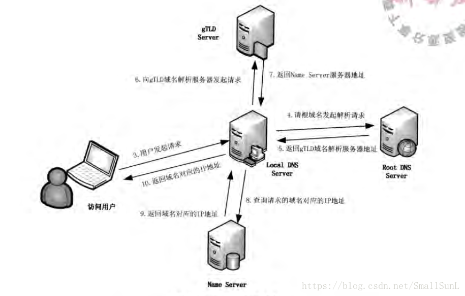

# 网络

## Http协议

### HTTP 0.9

- 仅有GET命令
- 仅能返回HTML格式

### HTTP 1.0

- 任何格式的内容都可以发送，互联网不仅可以传输文字，还能传输图像、视频、二进制文件。
- 除了GET，还引入POST命令和HEAD命令。
- HTTP请求和回应的格式变化，除了数据部分，每次通信都必须包括头信息（HTTP header）。
- 包括状态码（status code）、多字符集支持、多部分发送（multi-part type）、权限（authorization）、缓存（cache）、内容编码（content encoding）等。

#### 请求格式

下面是一个1.0版的HTTP请求的例子。

> ```http
> GET / HTTP/1.0
> User-Agent: Mozilla/5.0 (Macintosh; Intel Mac OS X 10_10_5)
> Accept: */*
> ```

#### 回应格式

```http
HTTP/1.0 200 OK 
Content-Type: text/plain
Content-Length: 137582
Expires: Thu, 05 Dec 1997 16:00:00 GMT
Last-Modified: Wed, 5 August 1996 15:55:28 GMT
Server: Apache 0.84

<html>
  <body>Hello World</body>
</html>
```

#### Content-Type 字段

关于字符的编码，1.0版规定，头信息必须是 ASCII 码，后面的数据可以是任何格式。因此，服务器回应的时候，必须告诉客户端，数据是什么格式，这就是`Content-Type`字段的作用。

> - text/plain
> - text/html
> - text/css
> - image/jpeg
> - image/png
> - image/svg+xml
> - audio/mp4
> - video/mp4
> - application/javascript
> - application/pdf
> - application/zip
> - application/atom+xml

这些数据类型总称为`MIME type`，每个值包括一级类型和二级类型，之间用斜杠分隔。

除了预定义的类型，厂商也可以自定义类型。

> ```http
> application/vnd.debian.binary-package
> ```

上面的类型表明，发送的是Debian系统的二进制数据包。

`MIME type`还可以在尾部使用分号，添加参数。

> ```http
> Content-Type: text/html; charset=utf-8
> ```

上面的类型表明，发送的是网页，而且编码是UTF-8。

客户端请求的时候，可以使用`Accept`字段声明自己可以接受哪些数据格式。

> ```http
> Accept: */*
> ```

上面代码中，客户端声明自己可以接受任何格式的数据。

`MIME type`不仅用在HTTP协议，还可以用在其他地方，比如HTML网页。

> ```html
> <meta http-equiv="Content-Type" content="text/html; charset=UTF-8" />
> <!-- 等同于 -->
> <meta charset="utf-8" /> 
> ```

#### Content-Encoding 字段

由于发送的数据可以是任何格式，因此可以把数据压缩后再发送。`Content-Encoding`字段说明数据的压缩方法。

> ```http
> Content-Encoding: gzip
> Content-Encoding: compress
> Content-Encoding: deflate
> ```

客户端在请求时，用`Accept-Encoding`字段说明自己可以接受哪些压缩方法。

> ```http
> Accept-Encoding: gzip, deflate
> ```

#### 缺点

HTTP/1.0 版的主要缺点是，每个TCP连接只能发送一个请求。发送数据完毕，连接就关闭，如果还要请求其他资源，就必须再新建一个连接。

TCP连接的新建成本很高，因为需要客户端和服务器三次握手，并且开始时发送速率较慢（slow start）。所以，HTTP 1.0版本的性能比较差。随着网页加载的外部资源越来越多，这个问题就愈发突出了。

为了解决这个问题，有些浏览器在请求时，用了一个非标准的`Connection`字段。

> ```http
> Connection: keep-alive
> ```

这个字段要求服务器不要关闭TCP连接，以便其他请求复用。服务器同样回应这个字段。

> ```http
> Connection: keep-alive
> ```

一个可以复用的TCP连接就建立了，直到客户端或服务器主动关闭连接。但是，这不是标准字段，不同实现的行为可能不一致，因此不是根本的解决办法。

### HTTP 1.1

- 引入持久连接，TCP连接默认不关闭，可以被多个请求复用，不用声明`Connection:keep-alice`。
- 客户端和服务端发现一段时间没有活动，可以主动关闭连接，规范做法是在客户端最后一个请求时，发送`Connection:close`。
- 对于同一个域名，大多数浏览器允许同时建立6个持久连接。

#### 管道机制

在同一个TCP连接里面，客户端可以同时发送多个请求。如：客户端需要请求两个资源，以前的做法是在同一个TCP连接里，先发送A请求，收到回应后发送B请求。管道机制允许浏览器同时发出A请求和B请求，但服务器还是按照顺序，先回应A请求，在回应B请求。

#### Content-Length字段

区分数据包属于哪一个回应，即声明本次回应的数据长度。Content-Length在请求方法为GET的时候不能使用，在请求方法为POST的时候需要使用，同时也常常出现在响应头中。

```http
Content-Length: 3495
```

如上表示本次回应长度未3495字节，后面的字节属于下一个回应。

在1.0版本中，`Content-Length`不是必须的，TCP关闭，表面收到数据包全了。

#### 分块传输编码

使用`Content-Length`字段的前提条件是，服务器发送回应之前，必须知道回应的数据长度。

对于一些很耗时的动态操作来说，这意味着，服务器要等到所有操作完成，才能发送数据，显然这样的效率不高。更好的处理方法是，产生一块数据，就发送一块，采用"流模式"（stream）取代"缓存模式"（buffer）。

1.1规定可以不使用Content-Length字段，使用分块传输编码（chunked transfer encoding），即请求或回应的头信息有`Transfer-Encoding`字段，表明回应将由数量未定的数据块组成。

```http
Transfer-Encoding: chunked

```

每个非空的数据块之前，会有一个16进制的数值，表示这个块的长度。最后是一个大小为0的块，就表示本次回应的数据发送完了。下面是一个例子。

```http
HTTP/1.1 200 OK
Content-Type: text/plain
Transfer-Encoding: chunked

25
This is the data in the first chunk

1C
and this is the second one

3
con

8
sequence

0
```

#### 其他功能

1.1版还新增了许多动词方法：`PUT`、`PATCH`、`HEAD`、 `OPTIONS`、`DELETE`。

另外，客户端请求的头信息新增了`Host`字段，用来指定服务器的域名。

> ```http
> Host: www.example.com
> ```

有了`Host`字段，就可以将请求发往同一台服务器上的不同网站，为虚拟主机的兴起打下了基础。

### HTTP 2

- HTTP/1.1 版的头信息肯定是文本（ASCII编码），数据体可以是文本，也可以是二进制。HTTP/2 则是一个彻底的二进制协议，头信息和数据体都是二进制，并且统称为"帧"（frame）：头信息帧和数据帧。
- 二进制协议的一个好处是，可以定义额外的帧。HTTP/2 定义了近十种帧，为将来的高级应用打好了基础。如果使用文本实现这种功能，解析数据将会变得非常麻烦，二进制解析则方便得多。

#### 多工

HTTP/2 复用TCP连接，在一个连接里，客户端和浏览器都可以同时发送多个请求或回应，而且不用按照顺序一一对应，这样就避免了"队头堵塞"。

举例来说，在一个TCP连接里面，服务器同时收到了A请求和B请求，于是先回应A请求，结果发现处理过程非常耗时，于是就发送A请求已经处理好的部分， 接着回应B请求，完成后，再发送A请求剩下的部分。

这样双向的、实时的通信，就叫做多工（Multiplexing）。

#### 数据流

因为 HTTP/2 的数据包是不按顺序发送的，同一个连接里面连续的数据包，可能属于不同的回应。因此，必须要对数据包做标记，指出它属于哪个回应。

HTTP/2 将每个请求或回应的所有数据包，称为一个数据流（stream）。每个数据流都有一个独一无二的编号。数据包发送的时候，都必须标记数据流ID，用来区分它属于哪个数据流。另外还规定，客户端发出的数据流，ID一律为奇数，服务器发出的，ID为偶数。

数据流发送到一半的时候，客户端和服务器都可以发送信号（`RST_STREAM`帧），取消这个数据流。1.1版取消数据流的唯一方法，就是关闭TCP连接。这就是说，HTTP/2 可以取消某一次请求，同时保证TCP连接还打开着，可以被其他请求使用。

客户端还可以指定数据流的优先级。优先级越高，服务器就会越早回应。

#### 头信息压缩

HTTP 协议不带有状态，每次请求都必须附上所有信息。所以，请求的很多字段都是重复的，比如`Cookie`和`User Agent`，一模一样的内容，每次请求都必须附带，这会浪费很多带宽，也影响速度。

HTTP/2 对这一点做了优化，引入了头信息压缩机制（header compression）。一方面，头信息使用`gzip`或`compress`压缩后再发送；另一方面，客户端和服务器同时维护一张头信息表，所有字段都会存入这个表，生成一个索引号，以后就不发送同样字段了，只发送索引号，这样就提高速度了。

#### 服务器推送

HTTP/2 允许服务器未经请求，主动向客户端发送资源，这叫做服务器推送（server push）。

常见场景是客户端请求一个网页，这个网页里面包含很多静态资源。正常情况下，客户端必须收到网页后，解析HTML源码，发现有静态资源，再发出静态资源请求。其实，服务器可以预期到客户端请求网页后，很可能会再请求静态资源，所以就主动把这些静态资源随着网页一起发给客户端了。

## HTTP keep-alive和TCP keepalive的区别

TCP keepalive指的是TCP保活计时器（keepalive timer）。设想有这样的情况：客户已主动与服务器建立了TCP连接。但后来客户端的主机突然出故障。显然，服务器以后就不能再收到客户发来的数据。因此，应当有措施使服务器不要再白白等待下去。这就是使用保活计时器。服务器每收到一次客户的数据，就重新设置保活计时器，时间的设置通常是两小时。若两小时没有收到客户的数据，服务器就发送一个探测报文段，以后则每隔75秒发送一次。若一连发送10个探测报文段后仍无客户的响应，服务器就认为客户端出了故障，接着就关闭这个连接。

 ——*摘自谢希仁《计算机网络》*

## TCP与UDP

- TCP/IP协议是一个协议簇。里面包括很多协议的，UDP只是其中的一个。
- TCP/IP协议集包括应用层,传输层，网络层，网络访问层。

### 应用层

1. 超文本传输协议（HTTP）:万维网的基本协议；
2. 文件传输（TFTP简单文件传输协议）；
3. 远程登录（Telnet），提供远程访问其它主机功能, 它允许用户登录internet主机，并在这台主机上执行命令；
4. 网络管理（SNMP简单网络管理协议），该协议提供了监控网络设备的方法， 以及配置管理,统计信息收集,性能管理及安全管理等；
5. 域名系统（DNS），该系统用于在internet中将域名及其公共广播的网络节点转换成IP地址。

### 网络层

1. Internet协议（IP）；
2. Internet控制信息协议（ICMP）；
3. 地址解析协议（ARP）；
4. 反向地址解析协议（RARP）。

### 网络访问层

网络访问层又称作主机到网络层（host-to-network），网络访问层的功能包括IP地址与物理地址硬件的映射， 以及将IP封装成帧.基于不同硬件类型的网络接口，网络访问层定义了和物理介质的连接. 当然我这里说得不够完善，TCP/IP协议本来就是一门学问，每一个分支都是一个很复杂的流程， 但我相信每位学习软件开发的同学都有必要去仔细了解一番。

### TCP（Transmission Control Protocol，传输控制协议）

面向连接协议，在收发数据前，必须和对方建立可靠连接。

- 第一次：SYN=1，seq=x
- 第二次：SYN=1，ACK=1，seq=y，ack=x+1
- 第三次：ACK=1，seq=x+1，ack=y+1

断开：

- 第一次：FIN=1，seq=u
- 第二次：ACK=1，seq=v，ack=u+1
- 第三次：FIN=1，ACK=1，seq=w，ack=u+1
- 第四次：ACK=1，seq=u+1，ack=w+1

#### TCP的包头结构

- 源端口：16位
- 目标端口：16位
- 序列号：32位
- 回应序号：32位
- TCP头长度：4位
- reserved：6位
- 控制代码：6位
- 窗口大小：16位
- 偏移量：16位
- 校验和：16位
- 选项（可选）：32位

TCP包头最小长度：20字节

### UDP**（User Data Protocol，用户数据报协议）**

- UDP是一个非连接的协议，传输数据之前源端和终端不建立连接， 当它想传送时就简单地去抓取来自应用程序的数据，并尽可能快地把它扔到网络上。 在发送端，UDP传送数据的速度仅仅是受应用程序生成数据的速度、 计算机的能力和传输带宽的限制； 在接收端，UDP把每个消息段放在队列中，应用程序每次从队列中读一个消息段。
- 由于传输数据不建立连接，因此也就不需要维护连接状态，包括收发状态等， 因此一台服务机可同时向多个客户机传输相同的消息。
- UDP信息包的标题很短，只有8个字节，相对于TCP的20个字节信息包的额外开销很小。
- 吞吐量不受拥挤控制算法的调节，只受应用软件生成数据的速率、传输带宽、 源端和终端主机性能的限制。
- UDP使用尽最大努力交付，即不保证可靠交付， 因此主机不需要维持复杂的链接状态表（这里面有许多参数）。
- UDP是面向报文的。发送方的UDP对应用程序交下来的报文， 在添加首部后就向下交付给IP层。既不拆分，也不合并，而是保留这些报文的边界， 因此，应用程序需要选择合适的报文大小。

#### UDP的包头结构

- 源端口：16位
- 目的端口：16位
- 长度：16位
- 校验和：16位

### TCP与UDP区别

- 基于连接与无连接
- TCP对系统资源要求较多
- UDP程序结构较简单
- 流模式与数据报模式
- TCP保证数据正确性，UDP可能丢包
- TCP保证数据顺序，UDP不保证

## DNS解析过程



- **第一步**，浏览器会检查缓存中有没有这个域名的对应解析IP，如果存在，返回IP地址解析完成。
- **第二步**，如果缓存中没有对应的解析IP，浏览器会查找本机操作系统中是否存在该解析IP。
- **第三步**，如果上面两步都不存在，我们的网络配置中会有“DNS服务器地址”这一项，操作系统会将请求的域名发送给这里设置的LDNS（本地区域名服务器）。
- **第四步**，如果第三步也没有查询到，就直接到Root Server 域名服务器请求解析。
- **第五步**，根域名服务器返回给本地域名服务器一个所查询的主域名服务器（gTLD Server）地址，**gTLD Server**：**国际顶级域名服务器**，共有13台左右包括（cn、com、org等）
- **第六步**，本地域名服务器（**Local DNS Server**）再想上一步返回的**gTLD Server**发送请求。
- **第七步**，**gTLD Server**返回查询的对应域名的**Name Server**主域名服务器地址，这个就是我们平时注册域名的服务器。
- **第八步**，**Name Server**会查询存储的域名与IP地址的映射关系表，连同一个**TTL值**返回给**DNS Server**域名解析服务器。主域名服务器接受到请求后查询自己的缓存，如果没有则进入下一级域名服务器进行查找，并重复该步骤直至找到正确纪录；
- **第九步**，返回该域名对应的**IP**和**TTL值**，由**Local DNS Server**来缓存，缓存时间由**TTL**值来控制。
- **第十步**，把解析的地址返回给用户，**TTL值**由浏览器缓存在本地系统，域名解析完成。