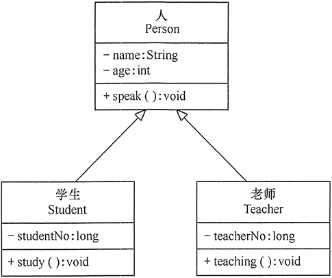
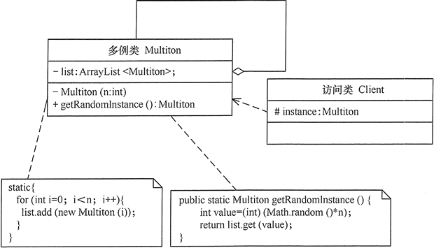
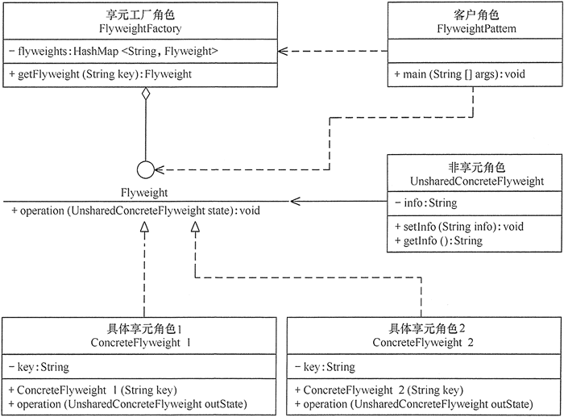
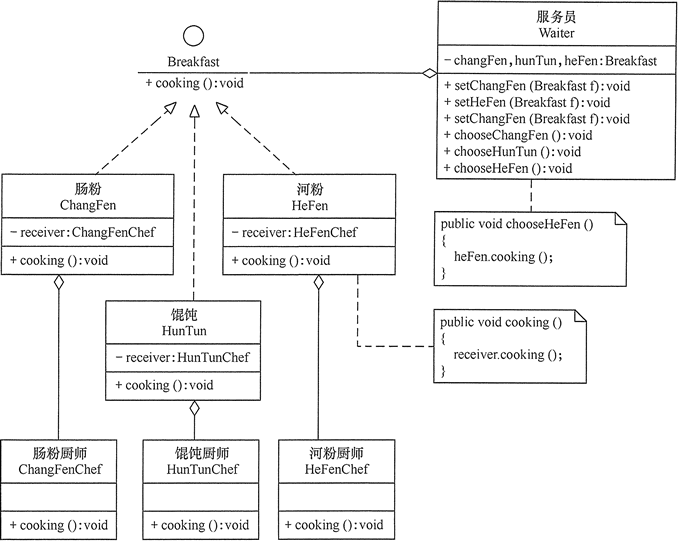
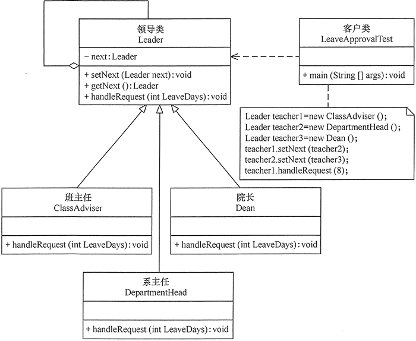
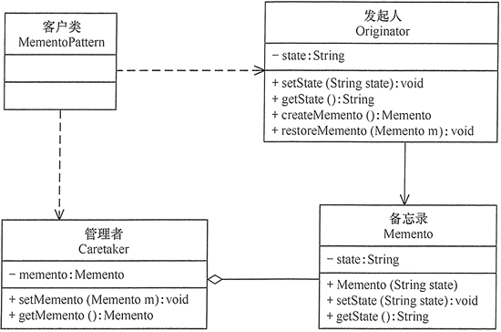

# 设计模式

[设计模式](http://c.biancheng.net/design_pattern/)

## UML中的类图与类图间的关系

### 依赖关系

依赖（Dependency）关系是一种使用关系，它是对象之间耦合度最弱的一种关联方式，是临时性的关联。在代码中，某个类的方法通过局部变量、方法的参数或者对静态方法的调用来访问另一个类（被依赖类）中的某些方法来完成一些职责。

在 UML 类图中，依赖关系使用带箭头的虚线来表示，箭头从使用类指向被依赖的类。图 4 所示是人与手机的关系图，人通过手机的语音传送方法打电话。


### 关联关系

关联（Association）关系是对象之间的一种引用关系，用于表示一类对象与另一类对象之间的联系，如老师和学生、师傅和徒弟、丈夫和妻子等。关联关系是类与类之间最常用的一种关系，分为一般关联关系、聚合关系和组合关系。我们先介绍一般关联。

关联可以是双向的，也可以是单向的。在 UML 类图中，双向的关联可以用带两个箭头或者没有箭头的实线来表示，单向的关联用带一个箭头的实线来表示，箭头从使用类指向被关联的类。也可以在关联线的两端标注角色名，代表两种不同的角色。

在代码中通常将一个类的对象作为另一个类的成员变量来实现关联关系。图 5 所示是老师和学生的关系图，每个老师可以教多个学生，每个学生也可向多个老师学，他们是双向关联。


### 聚合关系

聚合（Aggregation）关系是关联关系的一种，是强关联关系，是整体和部分之间的关系，是 has-a 的关系。

聚合关系也是通过成员对象来实现的，其中成员对象是整体对象的一部分，但是成员对象可以脱离整体对象而独立存在。例如，学校与老师的关系，学校包含老师，但如果学校停办了，老师依然存在。

在 UML 类图中，聚合关系可以用带空心菱形的实线来表示，菱形指向整体。图 6 所示是大学和教师的关系图。


### 组合关系

组合（Composition）关系也是关联关系的一种，也表示类之间的整体与部分的关系，但它是一种更强烈的聚合关系，是 cxmtains-a 关系。

在组合关系中，整体对象可以控制部分对象的生命周期，一旦整体对象不存在，部分对象也将不存在，部分对象不能脱离整体对象而存在。例如，头和嘴的关系，没有了头，嘴也就不存在了。

在 UML 类图中，组合关系用带实心菱形的实线来表示，菱形指向整体。


### 泛化关系

泛化（Generalization）关系是对象之间耦合度最大的一种关系，表示一般与特殊的关系，是父类与子类之间的关系，是一种继承关系，是 is-a 的关系。

在 UML 类图中，泛化关系用带空心三角箭头的实线来表示，箭头从子类指向父类。在代码实现时，使用面向对象的继承机制来实现泛化关系。



### 实现关系

实现（Realization）关系是接口与实现类之间的关系。在这种关系中，类实现了接口，类中的操作实现了接口中所声明的所有的抽象操作。

在 UML 类图中，实现关系使用带空心三角箭头的虚线来表示，箭头从实现类指向接口。


## 设计模型

[创建型模式](#创建型模式的特点和分类)

[结构型模式](#结构型模式概述)

### 创建型模式的特点和分类

创建型模式的主要关注点是“怎样创建对象？”，它的主要特点是“将对象的创建与使用分离”。这样可以降低系统的耦合度，使用者不需要关注对象的创建细节，对象的创建由相关的工厂来完成。就像我们去商场购买商品时，不需要知道商品是怎么生产出来一样，因为它们由专门的厂商生产。

创建模式分为以下几种：

- [单例（Singleton）模式](#单例模式)：某个类只能生成一个实例，该类提供了一个全局访问点供外部获取该实例，其拓展是有限多例模式。
- [原型（Prototype）模式](#原型模式)：将一个对象作为原型，通过对其进行复制而克隆出多个和原型类似的新实例。
- [工厂方法（FactoryMethod）模式](#工厂方法模式)：定义一个用于创建产品的接口，由子类决定生产什么产品。
- [抽象工厂（AbstractFactory）模式](#抽象工厂模式)：提供一个创建产品族的接口，其每个子类可以生产一系列相关的产品。
- [建造者（Builder）模式](#建造者模式)：将一个复杂对象分解成多个相对简单的部分，然后根据不同需要分别创建它们，最后构建成该复杂对象。

以上 5 种创建型模式，除了[工厂方法模式](#工厂方法模式)属于类创建型模式，其他的全部属于对象创建型模式

### 单例模式

单例（Singleton）模式的定义：指一个类只有一个实例，且该类能自行创建这个实例的一种模式。单例类有3个特点：

- 单例类只有一个实例对象。
- 该单例对象必须由单例类自行创建。
- 单例类对外提供一个访问该单例的全局访问点。

#### 单例模式的结构

- 单例类：包含一个实例且能自行创建这个实例的类。
- 访问类：使用单例的类。

```java
public class LazySingleton{
    private static volatile LazySingleton instance = null;
    private LazySingleton(){}//private 避免类在外部被实例化
    
    //饿汉式
    public static LazySingleton getInstance(){
        instance = new LazySingleton();
        return instance;
    }
    
    /** 懒汉式，加锁。
    public static synchronized LazySingleton getInstance(){
        if(instance == null){
            instance = new LazySingleton();
        }
        return instance;
    }
    */
    
    /** 效率高，对象不为空的时候，不用加锁；
    public static LazySingleton getInstance(){
        if(null == instance){
            synchronized(LazySingleton.class){
        	    if(null == instance){
                    instance = new LazySingleton();
                }
        	}
        }
        return instance;
    }
    */
    
}
```

#### 单例模式的拓展

单例模式可拓展为有限的多例模式，这种模式可生成有限个实例并保存在ArmyList中。



### 原型模式

用一个已经创建的实例作为原型，通过复制该原型对象来创建一个和原型相同或相似的新对象。在这里，原型实例指定了要创建的对象的种类。用这种方式创建对象非常高效，根本无须知道对象创建的细节。

原型模式包含以下主要角色。

1. 抽象原型类：规定了具体原型对象必须实现的接口。

2. 具体原型类：实现抽象原型类的 clone() 方法，它是可被复制的对象。

3. 访问类：使用具体原型类中的 clone() 方法来复制新的对象。

   

### 工厂方法模式

定义一个创建产品对象的工厂接口，将产品对象的实际创建工作推迟到具体子工厂类当中。这满足创建型模式中所要求的“创建与使用相分离”的特点。

工厂方法模式的主要优点有：

- 用户只需要知道具体工厂的名称就可得到所要的产品，无须知道产品的具体创建过程；
- 在系统增加新的产品时只需要添加具体产品类和对应的具体工厂类，无须对原工厂进行任何修改，满足开闭原则；

其缺点是：每增加一个产品就要增加一个具体产品类和一个对应的具体工厂类，这增加了系统的复杂度。

工厂方法的主要角色：

1. 抽象工厂（Abstract Factory）：提供了创建产品的接口，调用者通过它访问具体工厂的工厂方法 newProduct() 来创建产品。
2. 具体工厂（ConcreteFactory）：主要是实现抽象工厂中的抽象方法，完成具体产品的创建。
3. 抽象产品（Product）：定义了产品的规范，描述了产品的主要特性和功能。
4. 具体产品（ConcreteProduct）：实现了抽象产品角色所定义的接口，由具体工厂来创建，它同具体工厂之间一一对应。
5. 

### 抽象工厂模式

是一种为访问类提供一个创建一组相关或相互依赖对象的接口，且访问类无须指定所要产品的具体类就能得到同族的不同等级的产品的模式结构。

抽象工厂模式是工厂方法模式的升级版本，工厂方法模式只生产一个等级的产品，而抽象工厂模式可生产多个等级的产品。

使用抽象工厂模式一般要满足以下条件。

- 系统中有多个产品族，每个具体工厂创建同一族但属于不同等级结构的产品。
- 系统一次只可能消费其中某一族产品，即同族的产品一起使用。

抽象工厂模式除了具有工厂方法模式的优点外，其他主要优点如下。

- 可以在类的内部对产品族中相关联的多等级产品共同管理，而不必专门引入多个新的类来进行管理。
- 当增加一个新的产品族时不需要修改原代码，满足开闭原则。

其缺点是：当产品族中需要增加一个新的产品时，所有的工厂类都需要进行修改。

抽象工厂模式的主要角色如下。

1. 抽象工厂（Abstract Factory）：提供了创建产品的接口，它包含多个创建产品的方法 newProduct()，可以创建多个不同等级的产品。

2. 具体工厂（Concrete Factory）：主要是实现抽象工厂中的多个抽象方法，完成具体产品的创建。

3. 抽象产品（Product）：定义了产品的规范，描述了产品的主要特性和功能，抽象工厂模式有多个抽象产品。

4. 具体产品（ConcreteProduct）：实现了抽象产品角色所定义的接口，由具体工厂来创建，它 同具体工厂之间是多对一的关系。

   

### 建造者模式

将一个复杂对象的构造与它的表示分离，使同样的构建过程可以创建不同的表示，这样的设计模式被称为建造者模式。它是将一个复杂的对象分解为多个简单的对象，然后一步一步构建而成。它将变与不变相分离，即产品的组成部分是不变的，但每一部分是可以灵活选择的。

该模式的主要优点如下：

1. 各个具体的建造者相互独立，有利于系统的扩展。
2. 客户端不必知道产品内部组成的细节，便于控制细节风险。

其缺点如下：

1. 产品的组成部分必须相同，这限制了其使用范围。
2. 如果产品的内部变化复杂，该模式会增加很多的建造者类。

建造者（Builder）模式和工厂模式的关注点不同：建造者模式注重零部件的组装过程，而[工厂方法模式](#工厂方法模式)更注重零部件的创建过程，但两者可以结合使用。


### 结构型模式概述

结构型模式描述如何将类或对象按某种布局组成更大的结构。它分为类结构型模式和对象结构型模式，前者采用继承机制来组织接口和类，后者釆用组合或聚合来组合对象。

由于组合关系或聚合关系比继承关系耦合度低，满足“合成复用原则”，所以对象结构型模式比类结构型模式具有更大的灵活性。

结构型模式分为以下 7 种：

1. [代理（Proxy）模式](#代理模式)：为某对象提供一种代理以控制对该对象的访问。即客户端通过代理间接地访问该对象，从而限制、增强或修改该对象的一些特性。
2. [适配器（Adapter）模式](#适配器模式)：将一个类的接口转换成客户希望的另外一个接口，使得原本由于接口不兼容而不能一起工作的那些类能一起工作。
3. [桥接（Bridge）模式](#桥接模式)：将抽象与实现分离，使它们可以独立变化。它是用组合关系代替继承关系来实现的，从而降低了抽象和实现这两个可变维度的耦合度。
4. [装饰（Decorator）模式](#装饰模式)：动态地给对象增加一些职责，即增加其额外的功能。
5. [外观（Facade）模式](#外观模式)：为多个复杂的子系统提供一个一致的接口，使这些子系统更加容易被访问。
6. [享元（Flyweight）模式](#亨元模式)：运用共享技术来有效地支持大量细粒度对象的复用。
7. [组合（Composite）模式](#组合模式)：将对象组合成树状层次结构，使用户对单个对象和组合对象具有一致的访问性。

以上 7 种结构型模式，除了[适配器模式](#适配器模式)分为类结构型模式和对象结构型模式两种，其他的全部属于对象结构型模式，下面我们会分别、详细地介绍它们的特点、结构与应用。

### 代理模式

#### 静态代理

由于某些原因需要给某对象提供一个代理以控制对该对象的访问。这时，访问对象不适合或者不能直接引用目标对象，代理对象作为访问对象和目标对象之间的中介。

代理模式的主要优点有：

- 代理模式在客户端与目标对象之间起到一个中介作用和保护目标对象的作用；
- 代理对象可以扩展目标对象的功能；
- 代理模式能将客户端与目标对象分离，在一定程度上降低了系统的耦合度；

其主要缺点是：

- 在客户端和目标对象之间增加一个代理对象，会造成请求处理速度变慢；
- 增加了系统的复杂度；


```java
package proxy;
public class ProxyTest
{
    public static void main(String[] args)
    {
        Proxy proxy=new Proxy();
        proxy.Request();
    }
}
//抽象主题
interface Subject
{
    void Request();
}
//真实主题
class RealSubject implements Subject
{
    public void Request()
    {
        System.out.println("访问真实主题方法...");
    }
}
//代理
class Proxy implements Subject
{
    private RealSubject realSubject;
    public void Request()
    {
        if (realSubject==null)
        {
            realSubject=new RealSubject();
        }
        preRequest();
        realSubject.Request();
        postRequest();
    }
    public void preRequest()
    {
        System.out.println("访问真实主题之前的预处理。");
    }
    public void postRequest()
    {
        System.out.println("访问真实主题之后的后续处理。");
    }
}

```

#### 动态代理

在前面介绍的代理模式中，代理类中包含了对真实主题的引用，这种方式存在两个缺点。

1. 真实主题与代理主题一一对应，增加真实主题也要增加代理。
2. 设计代理以前真实主题必须事先存在，不太灵活。采用动态代理模式可以解决以上问题，如 [Spring](http://c.biancheng.net/spring/)AOP，其结构图如图 4 所示


### 适配器模式

将一个类的接口转换成客户希望的另外一个接口，使得原本由于接口不兼容而不能一起工作的那些类能一起工作。适配器模式分为类结构型模式和对象结构型模式两种，前者类之间的耦合度比后者高，且要求程序员了解现有组件库中的相关组件的内部结构，所以应用相对较少些。

该模式的主要优点如下。

- 客户端通过适配器可以透明地调用目标接口。
- 复用了现存的类，程序员不需要修改原有代码而重用现有的适配者类。
- 将目标类和适配者类解耦，解决了目标类和适配者类接口不一致的问题。

类适配器：


对象适配器：


#### 拓展

适配器模式（Adapter）可扩展为双向适配器模式，双向适配器类既可以把适配者接口转换成目标接口，也可以把目标接口转换成适配者接口。


### 桥接模式

将抽象与实现分离，使它们可以独立变化。它是用组合关系代替继承关系来实现，从而降低了抽象和实现这两个可变维度的耦合度。桥接（Bridge）模式的优点是：

- 由于抽象与实现分离，所以扩展能力强；
- 其实现细节对客户透明。


缺点是：由于聚合关系建立在抽象层，要求开发者针对抽象化进行设计与编程，这增加了系统的理解与设计难度。


### 装饰模式

通常情况下，扩展一个类的功能会使用继承方式来实现。但继承具有静态特征，耦合度高，并且随着扩展功能的增多，子类会很膨胀。如果使用组合关系来创建一个包装对象（即装饰对象）来包裹真实对象，并在保持真实对象的类结构不变的前提下，为其提供额外的功能，这就是装饰模式的目标。

装饰模式主要包含以下角色。

1. 抽象构件（Component）角色：定义一个抽象接口以规范准备接收附加责任的对象。
2. 具体构件（Concrete  Component）角色：实现抽象构件，通过装饰角色为其添加一些职责。
3. 抽象装饰（Decorator）角色：继承抽象构件，并包含具体构件的实例，可以通过其子类扩展具体构件的功能。
4. 具体装饰（ConcreteDecorator）角色：实现抽象装饰的相关方法，并给具体构件对象添加附加的责任。


### 外观模式

是一种通过为多个复杂的子系统提供一个一致的接口，而使这些子系统更加容易被访问的模式。该模式对外有一个统一接口，外部应用程序不用关心内部子系统的具体的细节，这样会大大降低应用程序的复杂度，提高了程序的可维护性。

外观（Facade）模式是“迪米特法则”的典型应用，它有以下主要优点。

1. 降低了子系统与客户端之间的耦合度，使得子系统的变化不会影响调用它的客户类。
2. 对客户屏蔽了子系统组件，减少了客户处理的对象数目，并使得子系统使用起来更加容易。
3. 降低了大型软件系统中的编译依赖性，简化了系统在不同平台之间的移植过程，因为编译一个子系统不会影响其他的子系统，也不会影响外观对象。

外观（Facade）模式的主要缺点如下。

1. 不能很好地限制客户使用子系统类。
2. 增加新的子系统可能需要修改外观类或客户端的源代码，违背了“开闭原则”。

外观（Facade）模式包含以下主要角色。

1. 外观（Facade）角色：为多个子系统对外提供一个共同的接口。
2. 子系统（Sub System）角色：实现系统的部分功能，客户可以通过外观角色访问它。
3. 客户（Client）角色：通过一个外观角色访问各个子系统的功能。


### 亨元模式

运用共享技术来有效地支持大量细粒度对象的复用。它通过共享已经存在的对象来大幅度减少需要创建的对象数量、避免大量相似类的开销，从而提高系统资源的利用率。

享元模式的主要优点是：相同对象只要保存一份，这降低了系统中对象的数量，从而降低了系统中细粒度对象给内存带来的压力。

其主要缺点是：

1. 为了使对象可以共享，需要将一些不能共享的状态外部化，这将增加程序的复杂性。
2. 读取享元模式的外部状态会使得运行时间稍微变长。

享元模式的主要角色有如下。

1. 抽象享元角色（Flyweight）:是所有的具体享元类的基类，为具体享元规范需要实现的公共接口，非享元的外部状态以参数的形式通过方法传入。
2. 具体享元（Concrete Flyweight）角色：实现抽象享元角色中所规定的接口。
3. 非享元（Unsharable Flyweight)角色：是不可以共享的外部状态，它以参数的形式注入具体享元的相关方法中。
4. 享元工厂（Flyweight Factory）角色：负责创建和管理享元角色。当客户对象请求一个享元对象时，享元工厂检査系统中是否存在符合要求的享元对象，如果存在则提供给客户；如果不存在的话，则创建一个新的享元对象。

图中的 UnsharedConcreteFlyweight 是非享元角色，里面包含了非共享的外部状态信息 info；而 Flyweight 是抽象享元角色，里面包含了享元方法 operation(UnsharedConcreteFlyweight state)，非享元的外部状态以参数的形式通过该方法传入；ConcreteFlyweight 是具体享元角色，包含了关键字 key，它实现了抽象享元接口；FlyweightFactory 是享元工厂角色，它逝关键字 key 来管理具体享元；客户角色通过享元工厂获取具体享元，并访问具体享元的相关方法。



### 组合模式

有时又叫作部分-整体模式，它是一种将对象组合成树状的层次结构的模式，用来表示“部分-整体”的关系，使用户对单个对象和组合对象具有一致的访问性。

组合模式的主要优点有：

1. 组合模式使得客户端代码可以一致地处理单个对象和组合对象，无须关心自己处理的是单个对象，还是组合对象，这简化了客户端代码；
2. 更容易在组合体内加入新的对象，客户端不会因为加入了新的对象而更改源代码，满足“开闭原则”；

其主要缺点是：

1. 设计较复杂，客户端需要花更多时间理清类之间的层次关系；
2. 不容易限制容器中的构件；
3. 不容易用继承的方法来增加构件的新功能；

组合模式包含以下主要角色。

1. 抽象构件（Component）角色：它的主要作用是为树叶构件和树枝构件声明公共接口，并实现它们的默认行为。在透明式的组合模式中抽象构件还声明访问和管理子类的接口；在安全式的组合模式中不声明访问和管理子类的接口，管理工作由树枝构件完成。
2. 树叶构件（Leaf）角色：是组合中的叶节点对象，它没有子节点，用于实现抽象构件角色中 声明的公共接口。
3. 树枝构件（Composite）角色：是组合中的分支节点对象，它有子节点。它实现了抽象构件角色中声明的接口，它的主要作用是存储和管理子部件，通常包含 Add()、Remove()、GetChild() 等方法。

- 透明方式：在该方式中，由于抽象构件声明了所有子类中的全部方法，所以客户端无须区别树叶对象和树枝对象，对客户端来说是透明的。但其缺点是：树叶构件本来没有 Add()、Remove() 及 GetChild() 方法，却要实现它们（空实现或抛异常），这样会带来一些安全性问题。


- 安全方式：在该方式中，将管理子构件的方法移到树枝构件中，抽象构件和树叶构件没有对子对象的管理方法，这样就避免了上一种方式的安全性问题，但由于叶子和分支有不同的接口，客户端在调用时要知道树叶对象和树枝对象的存在，所以失去了透明性。


### 行为模式概述

行为型模式用于描述程序在运行时复杂的流程控制，即描述多个类或对象之间怎样相互协作共同完成单个对象都无法单独完成的任务，它涉及算法与对象间职责的分配。

行为型模式分为类行为模式和对象行为模式，前者采用继承机制来在类间分派行为，后者采用组合或聚合在对象间分配行为。由于组合关系或聚合关系比继承关系耦合度低，满足“合成复用原则”，所以对象行为模式比类行为模式具有更大的灵活性。

行为型模式是 GoF [设计模式](http://c.biancheng.net/design_pattern/)中最为庞大的一类，它包含以下 11 种模式。

1. [模板方法（Template Method）模式](#模板方法模式)：定义一个操作中的算法骨架，将算法的一些步骤延迟到子类中，使得子类在可以不改变该算法结构的情况下重定义该算法的某些特定步骤。
2. [策略（Strategy）模式](#策略模式)：定义了一系列算法，并将每个算法封装起来，使它们可以相互替换，且算法的改变不会影响使用算法的客户。
3. [命令（Command）模式](#命令模式)：将一个请求封装为一个对象，使发出请求的责任和执行请求的责任分割开。
4. [职责链（Chain of Responsibility）模式](#责任链模式)：把请求从链中的一个对象传到下一个对象，直到请求被响应为止。通过这种方式去除对象之间的耦合。
5. [状态（State）模式](#状态模式)：允许一个对象在其内部状态发生改变时改变其行为能力。
6. [观察者（Observer）模式](#观察者模式)：多个对象间存在一对多关系，当一个对象发生改变时，把这种改变通知给其他多个对象，从而影响其他对象的行为。
7. [中介者（Mediator）模式](#中介者模式)：定义一个中介对象来简化原有对象之间的交互关系，降低系统中对象间的耦合度，使原有对象之间不必相互了解。
8. [迭代器（Iterator）模式](#迭代器模式)：提供一种方法来顺序访问聚合对象中的一系列数据，而不暴露聚合对象的内部表示。
9. [访问者（Visitor）模式](#访问者模式)：在不改变集合元素的前提下，为一个集合中的每个元素提供多种访问方式，即每个元素有多个访问者对象访问。
10. [备忘录（Memento）模式](#备忘录模式)：在不破坏封装性的前提下，获取并保存一个对象的内部状态，以便以后恢复它。
11. [解释器（Interpreter）模式](#解释器模式)：提供如何定义语言的文法，以及对语言句子的解释方法，即解释器。

以上 11 种行为型模式，除了[模板方法模式](#模板方法模式)和[解释器模式](#监视器模式)是类行为型模式，其他的全部属于对象行为型模式。

### 模板方法模式

定义一个操作中的算法骨架，而将算法的一些步骤延迟到子类中，使得子类可以不改变该算法结构的情况下重定义该算法的某些特定步骤。它是一种类行为型模式。

该模式的主要优点如下。

1. 它封装了不变部分，扩展可变部分。它把认为是不变部分的算法封装到父类中实现，而把可变部分算法由子类继承实现，便于子类继续扩展。
2. 它在父类中提取了公共的部分代码，便于代码复用。
3. 部分方法是由子类实现的，因此子类可以通过扩展方式增加相应的功能，符合开闭原则。

该模式的主要缺点如下。

1. 对每个不同的实现都需要定义一个子类，这会导致类的个数增加，系统更加庞大，设计也更加抽象。
2. 父类中的抽象方法由子类实现，子类执行的结果会影响父类的结果，这导致一种反向的控制结构，它提高了代码阅读的难度。

模板方法模式包含以下主要角色。

(1) 抽象类（Abstract Class）：负责给出一个算法的轮廓和骨架。它由一个模板方法和若干个基本方法构成。这些方法的定义如下。

① 模板方法：定义了算法的骨架，按某种顺序调用其包含的基本方法。

② 基本方法：是整个算法中的一个步骤，包含以下几种类型。

- 抽象方法：在抽象类中申明，由具体子类实现。
- 具体方法：在抽象类中已经实现，在具体子类中可以继承或重写它。
- 钩子方法：在抽象类中已经实现，包括用于判断的逻辑方法和需要子类重写的空方法两种。

(2) 具体子类（Concrete Class）：实现抽象类中所定义的抽象方法和钩子方法，它们是一个顶级逻辑的一个组成步骤。


### 策略模式

该模式定义了一系列算法，并将每个算法封装起来，使它们可以相互替换，且算法的变化不会影响使用算法的客户。策略模式属于对象行为模式，它通过对算法进行封装，把使用算法的责任和算法的实现分割开来，并委派给不同的对象对这些算法进行管理。

策略模式的主要优点如下。

1. 多重条件语句不易维护，而使用策略模式可以避免使用多重条件语句。
2. 策略模式提供了一系列的可供重用的算法族，恰当使用继承可以把算法族的公共代码转移到父类里面，从而避免重复的代码。
3. 策略模式可以提供相同行为的不同实现，客户可以根据不同时间或空间要求选择不同的。
4. 策略模式提供了对开闭原则的完美支持，可以在不修改原代码的情况下，灵活增加新算法。
5. 策略模式把算法的使用放到环境类中，而算法的实现移到具体策略类中，实现了二者的分离。

其主要缺点如下。

1. 客户端必须理解所有策略算法的区别，以便适时选择恰当的算法类。
2. 策略模式造成很多的策略类。

策略模式是准备一组算法，并将这组算法封装到一系列的策略类里面，作为一个抽象策略类的子类。策略模式的重心不是如何实现算法，而是如何组织这些算法，从而让程序结构更加灵活，具有更好的维护性和扩展性，现在我们来分析其基本结构和实现方法。


### 命令模式

将一个请求封装为一个对象，使发出请求的责任和执行请求的责任分割开。这样两者之间通过命令对象进行沟通，这样方便将命令对象进行储存、传递、调用、增加与管理。

命令模式的主要优点如下。

1. 降低系统的耦合度。命令模式能将调用操作的对象与实现该操作的对象解耦。
2. 增加或删除命令非常方便。采用命令模式增加与删除命令不会影响其他类，它满足“开闭原则”，对扩展比较灵活。
3. 可以实现宏命令。命令模式可以与[组合模式](#组合模式)结合，将多个命令装配成一个组合命令，即宏命令。
4. 方便实现 Undo 和 Redo 操作。命令模式可以与后面介绍的[备忘录模式](#备忘录模式)结合，实现命令的撤销与恢复。


其缺点是：可能产生大量具体命令类。因为计对每一个具体操作都需要设计一个具体命令类，这将增加系统的复杂性。

命令模式包含以下主要角色。

1. 抽象命令类（Command）角色：声明执行命令的接口，拥有执行命令的抽象方法 execute()。
2. 具体命令角色（Concrete  Command）角色：是抽象命令类的具体实现类，它拥有接收者对象，并通过调用接收者的功能来完成命令要执行的操作。
3. 实现者/接收者（Receiver）角色：执行命令功能的相关操作，是具体命令对象业务的真正实现者。
4. 调用者/请求者（Invoker）角色：是请求的发送者，它通常拥有很多的命令对象，并通过访问命令对象来执行相关请求，它不直接访问接收者。


实例：



### 责任链模式

为了避免请求发送者与多个请求处理者耦合在一起，将所有请求的处理者通过前一对象记住其下一个对象的引用而连成一条链；当有请求发生时，可将请求沿着这条链传递，直到有对象处理它为止。

在责任链模式中，客户只需要将请求发送到责任链上即可，无须关心请求的处理细节和请求的传递过程，所以责任链将请求的发送者和请求的处理者解耦了。

责任链模式是一种对象行为型模式，其主要优点如下。

1. 降低了对象之间的耦合度。该模式使得一个对象无须知道到底是哪一个对象处理其请求以及链的结构，发送者和接收者也无须拥有对方的明确信息。
2. 增强了系统的可扩展性。可以根据需要增加新的请求处理类，满足开闭原则。
3. 增强了给对象指派职责的灵活性。当工作流程发生变化，可以动态地改变链内的成员或者调动它们的次序，也可动态地新增或者删除责任。
4. 责任链简化了对象之间的连接。每个对象只需保持一个指向其后继者的引用，不需保持其他所有处理者的引用，这避免了使用众多的 if 或者 if···else 语句。
5. 责任分担。每个类只需要处理自己该处理的工作，不该处理的传递给下一个对象完成，明确各类的责任范围，符合类的单一职责原则。

其主要缺点如下。

1. 不能保证每个请求一定被处理。由于一个请求没有明确的接收者，所以不能保证它一定会被处理，该请求可能一直传到链的末端都得不到处理。
2. 对比较长的职责链，请求的处理可能涉及多个处理对象，系统性能将受到一定影响。
3. 职责链建立的合理性要靠客户端来保证，增加了客户端的复杂性，可能会由于职责链的错误设置而导致系统出错，如可能会造成循环调用。

职责链模式主要包含以下角色。

1. 抽象处理者（Handler）角色：定义一个处理请求的接口，包含抽象处理方法和一个后继连接。
2. 具体处理者（Concrete Handler）角色：实现抽象处理者的处理方法，判断能否处理本次请求，如果可以处理请求则处理，否则将该请求转给它的后继者。
3. 客户类（Client）角色：创建处理链，并向链头的具体处理者对象提交请求，它不关心处理细节和请求的传递过程。



### 状态模式

对有状态的对象，把复杂的“判断逻辑”提取到不同的状态对象中，允许状态对象在其内部状态发生改变时改变其行为。

状态模式是一种对象行为型模式，其主要优点如下。

1. 状态模式将与特定状态相关的行为局部化到一个状态中，并且将不同状态的行为分割开来，满足“单一职责原则”。
2. 减少对象间的相互依赖。将不同的状态引入独立的对象中会使得状态转换变得更加明确，且减少对象间的相互依赖。
3. 有利于程序的扩展。通过定义新的子类很容易地增加新的状态和转换。

状态模式的主要缺点如下。

1. 状态模式的使用必然会增加系统的类与对象的个数。
2. 状态模式的结构与实现都较为复杂，如果使用不当会导致程序结构和代码的混乱。

状态模式把受环境改变的对象行为包装在不同的状态对象里，其意图是让一个对象在其内部状态改变的时候，其行为也随之改变。现在我们来分析其基本结构和实现方法。

状态模式包含以下主要角色。

1. 环境（Context）角色：也称为上下文，它定义了客户感兴趣的接口，维护一个当前状态，并将与状态相关的操作委托给当前状态对象来处理。
2. 抽象状态（State）角色：定义一个接口，用以封装环境对象中的特定状态所对应的行为。
3. 具体状态（Concrete  State）角色：实现抽象状态所对应的行为。


### 观察者模式

指多个对象间存在一对多的依赖关系，当一个对象的状态发生改变时，所有依赖于它的对象都得到通知并被自动更新。这种模式有时又称作发布-订阅模式、模型-视图模式，它是对象行为型模式。

观察者模式是一种对象行为型模式，其主要优点如下。

1. 降低了目标与观察者之间的耦合关系，两者之间是抽象耦合关系。
2. 目标与观察者之间建立了一套触发机制。

它的主要缺点如下。

1. 目标与观察者之间的依赖关系并没有完全解除，而且有可能出现循环引用。
2. 当观察者对象很多时，通知的发布会花费很多时间，影响程序的效率。

实现观察者模式时要注意具体目标对象和具体观察者对象之间不能直接调用，否则将使两者之间紧密耦合起来，这违反了面向对象的设计原则。

观察者模式的主要角色如下。

1. 抽象主题（Subject）角色：也叫抽象目标类，它提供了一个用于保存观察者对象的聚集类和增加、删除观察者对象的方法，以及通知所有观察者的抽象方法。
2. 具体主题（Concrete  Subject）角色：也叫具体目标类，它实现抽象目标中的通知方法，当具体主题的内部状态发生改变时，通知所有注册过的观察者对象。
3. 抽象观察者（Observer）角色：它是一个抽象类或接口，它包含了一个更新自己的抽象方法，当接到具体主题的更改通知时被调用。
4. 具体观察者（Concrete Observer）角色：实现抽象观察者中定义的抽象方法，以便在得到目标的更改通知时更新自身的状态。


### 中介者模式

定义一个中介对象来封装一系列对象之间的交互，使原有对象之间的耦合松散，且可以独立地改变它们之间的交互。中介者模式又叫调停模式，它是迪米特法则的典型应用。

中介者模式是一种对象行为型模式，其主要优点如下。

1. 降低了对象之间的耦合性，使得对象易于独立地被复用。
2. 将对象间的一对多关联转变为一对一的关联，提高系统的灵活性，使得系统易于维护和扩展。

其主要缺点是：当同事类太多时，中介者的职责将很大，它会变得复杂而庞大，以至于系统难以维护。

中介者模式包含以下主要角色。

1. 抽象中介者（Mediator）角色：它是中介者的接口，提供了同事对象注册与转发同事对象信息的抽象方法。
2. 具体中介者（ConcreteMediator）角色：实现中介者接口，定义一个 List 来管理同事对象，协调各个同事角色之间的交互关系，因此它依赖于同事角色。
3. 抽象同事类（Colleague）角色：定义同事类的接口，保存中介者对象，提供同事对象交互的抽象方法，实现所有相互影响的同事类的公共功能。
4. 具体同事类（Concrete Colleague）角色：是抽象同事类的实现者，当需要与其他同事对象交互时，由中介者对象负责后续的交互。


### 迭代器模式

提供一个对象来顺序访问聚合对象中的一系列数据，而不暴露聚合对象的内部表示。迭代器模式是一种对象行为型模式，其主要优点如下。

1. 访问一个聚合对象的内容而无须暴露它的内部表示。
2. 遍历任务交由迭代器完成，这简化了聚合类。
3. 它支持以不同方式遍历一个聚合，甚至可以自定义迭代器的子类以支持新的遍历。
4. 增加新的聚合类和迭代器类都很方便，无须修改原有代码。
5. 封装性良好，为遍历不同的聚合结构提供一个统一的接口。

其主要缺点是：增加了类的个数，这在一定程度上增加了系统的复杂性。

迭代器模式是通过将聚合对象的遍历行为分离出来，抽象成迭代器类来实现的，其目的是在不暴露聚合对象的内部结构的情况下，让外部代码透明地访问聚合的内部数据。现在我们来分析其基本结构与实现方法。

迭代器模式主要包含以下角色。

1. 抽象聚合（Aggregate）角色：定义存储、添加、删除聚合对象以及创建迭代器对象的接口。

2. 具体聚合（ConcreteAggregate）角色：实现抽象聚合类，返回一个具体迭代器的实例。

3. 抽象迭代器（Iterator）角色：定义访问和遍历聚合元素的接口，通常包含 hasNext()、first()、next() 等方法。

4. 具体迭代器（Concretelterator）角色：实现抽象迭代器接口中所定义的方法，完成对聚合对象的遍历，记录遍历的当前位置。

   

```java
package iterator;
import java.util.*;
public class IteratorPattern
{
    public static void main(String[] args)
    {
        Aggregate ag=new ConcreteAggregate(); 
        ag.add("中山大学"); 
        ag.add("华南理工"); 
        ag.add("韶关学院");
        System.out.print("聚合的内容有：");
        Iterator it=ag.getIterator(); 
        while(it.hasNext())
        { 
            Object ob=it.next(); 
            System.out.print(ob.toString()+"\t"); 
        }
        Object ob=it.first();
        System.out.println("\nFirst："+ob.toString());
    }
}
//抽象聚合
interface Aggregate
{ 
    public void add(Object obj); 
    public void remove(Object obj); 
    public Iterator getIterator(); 
}
//具体聚合
class ConcreteAggregate implements Aggregate
{ 
    private List<Object> list=new ArrayList<Object>(); 
    public void add(Object obj)
    { 
        list.add(obj); 
    }
    public void remove(Object obj)
    { 
        list.remove(obj); 
    }
    public Iterator getIterator()
    { 
        return(new ConcreteIterator(list)); 
    }     
}
//抽象迭代器
interface Iterator
{
    Object first();
    Object next();
    boolean hasNext();
}
//具体迭代器
class ConcreteIterator implements Iterator
{ 
    private List<Object> list=null; 
    private int index=-1; 
    public ConcreteIterator(List<Object> list)
    { 
        this.list=list; 
    } 
    public boolean hasNext()
    { 
        if(index<list.size()-1)
        { 
            return true;
        }
        else
        {
            return false;
        }
    }
    public Object first()
    {
        index=0;
        Object obj=list.get(index);;
        return obj;
    }
    public Object next()
    { 
        Object obj=null; 
        if(this.hasNext())
        { 
            obj=list.get(++index); 
        } 
        return obj; 
    }   
}
```

### 访问者模式

将作用于某种数据结构中的各元素的操作分离出来封装成独立的类，使其在不改变数据结构的前提下可以添加作用于这些元素的新的操作，为数据结构中的每个元素提供多种访问方式。它将对数据的操作与数据结构进行分离，是行为类模式中最复杂的一种模式。

访问者（Visitor）模式是一种对象行为型模式，其主要优点如下。

1. 扩展性好。能够在不修改对象结构中的元素的情况下，为对象结构中的元素添加新的功能。
2. 复用性好。可以通过访问者来定义整个对象结构通用的功能，从而提高系统的复用程度。
3. 灵活性好。访问者模式将数据结构与作用于结构上的操作解耦，使得操作集合可相对自由地演化而不影响系统的数据结构。
4. 符合单一职责原则。访问者模式把相关的行为封装在一起，构成一个访问者，使每一个访问者的功能都比较单一。

访问者（Visitor）模式的主要缺点如下。

1. 增加新的元素类很困难。在访问者模式中，每增加一个新的元素类，都要在每一个具体访问者类中增加相应的具体操作，这违背了“开闭原则”。
2. 破坏封装。访问者模式中具体元素对访问者公布细节，这破坏了对象的封装性。
3. 违反了依赖倒置原则。访问者模式依赖了具体类，而没有依赖抽象类。

访问者（Visitor）模式实现的关键是如何将作用于元素的操作分离出来封装成独立的类，其基本结构与实现方法如下。

访问者模式包含以下主要角色。

1. 抽象访问者（Visitor）角色：定义一个访问具体元素的接口，为每个具体元素类对应一个访问操作 visit() ，该操作中的参数类型标识了被访问的具体元素。
2. 具体访问者（ConcreteVisitor）角色：实现抽象访问者角色中声明的各个访问操作，确定访问者访问一个元素时该做什么。
3. 抽象元素（Element）角色：声明一个包含接受操作 accept() 的接口，被接受的访问者对象作为 accept() 方法的参数。
4. 具体元素（ConcreteElement）角色：实现抽象元素角色提供的 accept() 操作，其方法体通常都是 visitor.visit(this) ，另外具体元素中可能还包含本身业务逻辑的相关操作。
5. 对象结构（Object Structure）角色：是一个包含元素角色的容器，提供让访问者对象遍历容器中的所有元素的方法，通常由 List、Set、Map 等聚合类实现。


### 备忘录模式

在不破坏封装性的前提下，捕获一个对象的内部状态，并在该对象之外保存这个状态，以便以后当需要时能将该对象恢复到原先保存的状态。该模式又叫快照模式。

备忘录模式是一种对象行为型模式，其主要优点如下。

- 提供了一种可以恢复状态的机制。当用户需要时能够比较方便地将数据恢复到某个历史的状态。
- 实现了内部状态的封装。除了创建它的发起人之外，其他对象都不能够访问这些状态信息。
- 简化了发起人类。发起人不需要管理和保存其内部状态的各个备份，所有状态信息都保存在备忘录中，并由管理者进行管理，这符合单一职责原则。

其主要缺点是：资源消耗大。如果要保存的内部状态信息过多或者特别频繁，将会占用比较大的内存资源。

备忘录模式的主要角色如下。

1. 发起人（Originator）角色：记录当前时刻的内部状态信息，提供创建备忘录和恢复备忘录数据的功能，实现其他业务功能，它可以访问备忘录里的所有信息。
2. 备忘录（Memento）角色：负责存储发起人的内部状态，在需要的时候提供这些内部状态给发起人。
3. 管理者（Caretaker）角色：对备忘录进行管理，提供保存与获取备忘录的功能，但其不能对备忘录的内容进行访问与修改。



### 解释器模式

给分析对象定义一个语言，并定义该语言的文法表示，再设计一个解析器来解释语言中的句子。也就是说，用编译语言的方式来分析应用中的实例。这种模式实现了文法表达式处理的接口，该接口解释一个特定的上下文。

解释器模式是一种类行为型模式，其主要优点如下。

1. 扩展性好。由于在解释器模式中使用类来表示语言的文法规则，因此可以通过继承等机制来改变或扩展文法。
2. 容易实现。在语法树中的每个表达式节点类都是相似的，所以实现其文法较为容易。

解释器模式的主要缺点如下。

1. 执行效率较低。解释器模式中通常使用大量的循环和递归调用，当要解释的句子较复杂时，其运行速度很慢，且代码的调试过程也比较麻烦。
2. 会引起类膨胀。解释器模式中的每条规则至少需要定义一个类，当包含的文法规则很多时，类的个数将急剧增加，导致系统难以管理与维护。
3. 可应用的场景比较少。在软件开发中，需要定义语言文法的应用实例非常少，所以这种模式很少被使用到。

