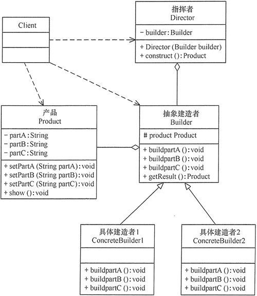

# 设计模式

## UML中的类图与类图间的关系

### 依赖关系

依赖（Dependency）关系是一种使用关系，它是对象之间耦合度最弱的一种关联方式，是临时性的关联。在代码中，某个类的方法通过局部变量、方法的参数或者对静态方法的调用来访问另一个类（被依赖类）中的某些方法来完成一些职责。

在 UML 类图中，依赖关系使用带箭头的虚线来表示，箭头从使用类指向被依赖的类。图 4 所示是人与手机的关系图，人通过手机的语音传送方法打电话。


### 关联关系

关联（Association）关系是对象之间的一种引用关系，用于表示一类对象与另一类对象之间的联系，如老师和学生、师傅和徒弟、丈夫和妻子等。关联关系是类与类之间最常用的一种关系，分为一般关联关系、聚合关系和组合关系。我们先介绍一般关联。

关联可以是双向的，也可以是单向的。在 UML 类图中，双向的关联可以用带两个箭头或者没有箭头的实线来表示，单向的关联用带一个箭头的实线来表示，箭头从使用类指向被关联的类。也可以在关联线的两端标注角色名，代表两种不同的角色。

在代码中通常将一个类的对象作为另一个类的成员变量来实现关联关系。图 5 所示是老师和学生的关系图，每个老师可以教多个学生，每个学生也可向多个老师学，他们是双向关联。


### 聚合关系

聚合（Aggregation）关系是关联关系的一种，是强关联关系，是整体和部分之间的关系，是 has-a 的关系。

聚合关系也是通过成员对象来实现的，其中成员对象是整体对象的一部分，但是成员对象可以脱离整体对象而独立存在。例如，学校与老师的关系，学校包含老师，但如果学校停办了，老师依然存在。

在 UML 类图中，聚合关系可以用带空心菱形的实线来表示，菱形指向整体。图 6 所示是大学和教师的关系图。


### 组合关系

组合（Composition）关系也是关联关系的一种，也表示类之间的整体与部分的关系，但它是一种更强烈的聚合关系，是 cxmtains-a 关系。

在组合关系中，整体对象可以控制部分对象的生命周期，一旦整体对象不存在，部分对象也将不存在，部分对象不能脱离整体对象而存在。例如，头和嘴的关系，没有了头，嘴也就不存在了。

在 UML 类图中，组合关系用带实心菱形的实线来表示，菱形指向整体。


### 泛化关系

泛化（Generalization）关系是对象之间耦合度最大的一种关系，表示一般与特殊的关系，是父类与子类之间的关系，是一种继承关系，是 is-a 的关系。

在 UML 类图中，泛化关系用带空心三角箭头的实线来表示，箭头从子类指向父类。在代码实现时，使用面向对象的继承机制来实现泛化关系。


### 实现关系

实现（Realization）关系是接口与实现类之间的关系。在这种关系中，类实现了接口，类中的操作实现了接口中所声明的所有的抽象操作。

在 UML 类图中，实现关系使用带空心三角箭头的虚线来表示，箭头从实现类指向接口。


## 设计模型

[创建型模式](###创建型模式的特点和分类)

[结构型模式](###结构型模式概述)

### 创建型模式的特点和分类

创建型模式的主要关注点是“怎样创建对象？”，它的主要特点是“将对象的创建与使用分离”。这样可以降低系统的耦合度，使用者不需要关注对象的创建细节，对象的创建由相关的工厂来完成。就像我们去商场购买商品时，不需要知道商品是怎么生产出来一样，因为它们由专门的厂商生产。

创建模式分为以下几种：

- [单例（Singleton）模式](###单例模式)：某个类只能生成一个实例，该类提供了一个全局访问点供外部获取该实例，其拓展是有限多例模式。
- [原型（Prototype）模式](###原型模式)：将一个对象作为原型，通过对其进行复制而克隆出多个和原型类似的新实例。
- [工厂方法（FactoryMethod）模式](###工厂方法模式)：定义一个用于创建产品的接口，由子类决定生产什么产品。
- [抽象工厂（AbstractFactory）模式](###抽象工厂模式)：提供一个创建产品族的接口，其每个子类可以生产一系列相关的产品。
- [建造者（Builder）模式](###建造者模式)：将一个复杂对象分解成多个相对简单的部分，然后根据不同需要分别创建它们，最后构建成该复杂对象。

以上 5 种创建型模式，除了[工厂方法模式](http://c.biancheng.net/view/1348.html)属于类创建型模式，其他的全部属于对象创建型模式

### 单例模式

单例（Singleton）模式的定义：指一个类只有一个实例，且该类能自行创建这个实例的一种模式。单例类有3个特点：

- 单例类只有一个实例对象。
- 该单例对象必须由单例类自行创建。
- 单例类对外提供一个访问该单例的全局访问点。

#### 单例模式的结构

- 单例类：包含一个实例且能自行创建这个实例的类。
- 访问类：使用单例的类。

```java
public class LazySingleton{
    private static volatile LazySingleton instance = null;
    private LazySingleton(){}//private 避免类在外部被实例化
    
    //饿汉式
    public static LazySingleton getInstance(){
        instance = new LazySingleton();
        return instance;
    }
    
    /** 懒汉式，加锁。
    public static synchronized LazySingleton getInstance(){
        if(instance == null){
            instance = new LazySingleton();
        }
        return instance;
    }
    */
    
    /** 效率高，对象不为空的时候，不用加锁；
    public static LazySingleton getInstance(){
        if(null == instance){
            synchronized(LazySingleton.class){
        	    if(null == instance){
                    instance = new LazySingleton();
                }
        	}
        }
        return instance;
    }
    */
    
}
```

#### 单例模式的拓展

单例模式可拓展为有限的多例模式，这种模式可生成有限个实例并保存在ArmyList中。


### 原型模式

用一个已经创建的实例作为原型，通过复制该原型对象来创建一个和原型相同或相似的新对象。在这里，原型实例指定了要创建的对象的种类。用这种方式创建对象非常高效，根本无须知道对象创建的细节。

原型模式包含以下主要角色。

1. 抽象原型类：规定了具体原型对象必须实现的接口。

2. 具体原型类：实现抽象原型类的 clone() 方法，它是可被复制的对象。

3. 访问类：使用具体原型类中的 clone() 方法来复制新的对象。

   

### 工厂方法模式

定义一个创建产品对象的工厂接口，将产品对象的实际创建工作推迟到具体子工厂类当中。这满足创建型模式中所要求的“创建与使用相分离”的特点。

工厂方法模式的主要优点有：

- 用户只需要知道具体工厂的名称就可得到所要的产品，无须知道产品的具体创建过程；
- 在系统增加新的产品时只需要添加具体产品类和对应的具体工厂类，无须对原工厂进行任何修改，满足开闭原则；

其缺点是：每增加一个产品就要增加一个具体产品类和一个对应的具体工厂类，这增加了系统的复杂度。

工厂方法的主要角色：

1. 抽象工厂（Abstract Factory）：提供了创建产品的接口，调用者通过它访问具体工厂的工厂方法 newProduct() 来创建产品。
2. 具体工厂（ConcreteFactory）：主要是实现抽象工厂中的抽象方法，完成具体产品的创建。
3. 抽象产品（Product）：定义了产品的规范，描述了产品的主要特性和功能。
4. 具体产品（ConcreteProduct）：实现了抽象产品角色所定义的接口，由具体工厂来创建，它同具体工厂之间一一对应。
5. 

### 抽象工厂模式

是一种为访问类提供一个创建一组相关或相互依赖对象的接口，且访问类无须指定所要产品的具体类就能得到同族的不同等级的产品的模式结构。

抽象工厂模式是工厂方法模式的升级版本，工厂方法模式只生产一个等级的产品，而抽象工厂模式可生产多个等级的产品。

使用抽象工厂模式一般要满足以下条件。

- 系统中有多个产品族，每个具体工厂创建同一族但属于不同等级结构的产品。
- 系统一次只可能消费其中某一族产品，即同族的产品一起使用。

抽象工厂模式除了具有工厂方法模式的优点外，其他主要优点如下。

- 可以在类的内部对产品族中相关联的多等级产品共同管理，而不必专门引入多个新的类来进行管理。
- 当增加一个新的产品族时不需要修改原代码，满足开闭原则。

其缺点是：当产品族中需要增加一个新的产品时，所有的工厂类都需要进行修改。

抽象工厂模式的主要角色如下。

1. 抽象工厂（Abstract Factory）：提供了创建产品的接口，它包含多个创建产品的方法 newProduct()，可以创建多个不同等级的产品。

2. 具体工厂（Concrete Factory）：主要是实现抽象工厂中的多个抽象方法，完成具体产品的创建。

3. 抽象产品（Product）：定义了产品的规范，描述了产品的主要特性和功能，抽象工厂模式有多个抽象产品。

4. 具体产品（ConcreteProduct）：实现了抽象产品角色所定义的接口，由具体工厂来创建，它 同具体工厂之间是多对一的关系。

   

### 建造者模式

将一个复杂对象的构造与它的表示分离，使同样的构建过程可以创建不同的表示，这样的设计模式被称为建造者模式。它是将一个复杂的对象分解为多个简单的对象，然后一步一步构建而成。它将变与不变相分离，即产品的组成部分是不变的，但每一部分是可以灵活选择的。

该模式的主要优点如下：

1. 各个具体的建造者相互独立，有利于系统的扩展。
2. 客户端不必知道产品内部组成的细节，便于控制细节风险。

其缺点如下：

1. 产品的组成部分必须相同，这限制了其使用范围。
2. 如果产品的内部变化复杂，该模式会增加很多的建造者类。

建造者（Builder）模式和工厂模式的关注点不同：建造者模式注重零部件的组装过程，而[工厂方法模式](###工厂方法模式)更注重零部件的创建过程，但两者可以结合使用。



### 结构型模式概述

结构型模式描述如何将类或对象按某种布局组成更大的结构。它分为类结构型模式和对象结构型模式，前者采用继承机制来组织接口和类，后者釆用组合或聚合来组合对象。

由于组合关系或聚合关系比继承关系耦合度低，满足“合成复用原则”，所以对象结构型模式比类结构型模式具有更大的灵活性。

结构型模式分为以下 7 种：

1. [代理（Proxy）模式](###代理模式)：为某对象提供一种代理以控制对该对象的访问。即客户端通过代理间接地访问该对象，从而限制、增强或修改该对象的一些特性。
2. [适配器（Adapter）模式](###适配器模式)：将一个类的接口转换成客户希望的另外一个接口，使得原本由于接口不兼容而不能一起工作的那些类能一起工作。
3. [桥接（Bridge）模式](###桥接模式)：将抽象与实现分离，使它们可以独立变化。它是用组合关系代替继承关系来实现的，从而降低了抽象和实现这两个可变维度的耦合度。
4. [装饰（Decorator）模式](###装饰模式)：动态地给对象增加一些职责，即增加其额外的功能。
5. [外观（Facade）模式](###外观模式)：为多个复杂的子系统提供一个一致的接口，使这些子系统更加容易被访问。
6. [享元（Flyweight）模式](###亨元模式)：运用共享技术来有效地支持大量细粒度对象的复用。
7. [组合（Composite）模式](###组合模式)：将对象组合成树状层次结构，使用户对单个对象和组合对象具有一致的访问性。

以上 7 种结构型模式，除了[适配器模式](###适配器模式)分为类结构型模式和对象结构型模式两种，其他的全部属于对象结构型模式，下面我们会分别、详细地介绍它们的特点、结构与应用。

### 代理模式

#### 静态代理

由于某些原因需要给某对象提供一个代理以控制对该对象的访问。这时，访问对象不适合或者不能直接引用目标对象，代理对象作为访问对象和目标对象之间的中介。

代理模式的主要优点有：

- 代理模式在客户端与目标对象之间起到一个中介作用和保护目标对象的作用；
- 代理对象可以扩展目标对象的功能；
- 代理模式能将客户端与目标对象分离，在一定程度上降低了系统的耦合度；

其主要缺点是：

- 在客户端和目标对象之间增加一个代理对象，会造成请求处理速度变慢；
- 增加了系统的复杂度；


```java
package proxy;
public class ProxyTest
{
    public static void main(String[] args)
    {
        Proxy proxy=new Proxy();
        proxy.Request();
    }
}
//抽象主题
interface Subject
{
    void Request();
}
//真实主题
class RealSubject implements Subject
{
    public void Request()
    {
        System.out.println("访问真实主题方法...");
    }
}
//代理
class Proxy implements Subject
{
    private RealSubject realSubject;
    public void Request()
    {
        if (realSubject==null)
        {
            realSubject=new RealSubject();
        }
        preRequest();
        realSubject.Request();
        postRequest();
    }
    public void preRequest()
    {
        System.out.println("访问真实主题之前的预处理。");
    }
    public void postRequest()
    {
        System.out.println("访问真实主题之后的后续处理。");
    }
}

```

#### 动态代理

在前面介绍的代理模式中，代理类中包含了对真实主题的引用，这种方式存在两个缺点。

1. 真实主题与代理主题一一对应，增加真实主题也要增加代理。
2. 设计代理以前真实主题必须事先存在，不太灵活。采用动态代理模式可以解决以上问题，如 [Spring](http://c.biancheng.net/spring/)AOP，其结构图如图 4 所示


### 适配器模式

将一个类的接口转换成客户希望的另外一个接口，使得原本由于接口不兼容而不能一起工作的那些类能一起工作。适配器模式分为类结构型模式和对象结构型模式两种，前者类之间的耦合度比后者高，且要求程序员了解现有组件库中的相关组件的内部结构，所以应用相对较少些。

该模式的主要优点如下。

- 客户端通过适配器可以透明地调用目标接口。
- 复用了现存的类，程序员不需要修改原有代码而重用现有的适配者类。
- 将目标类和适配者类解耦，解决了目标类和适配者类接口不一致的问题。